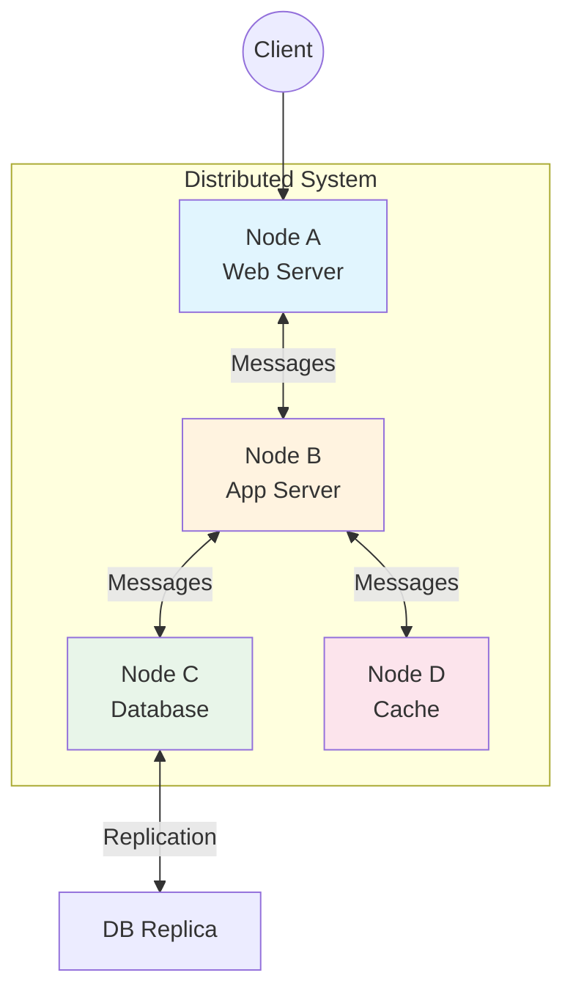
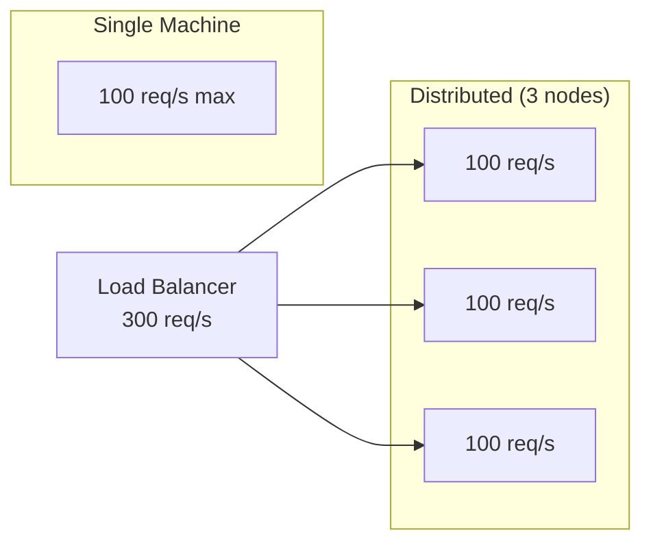
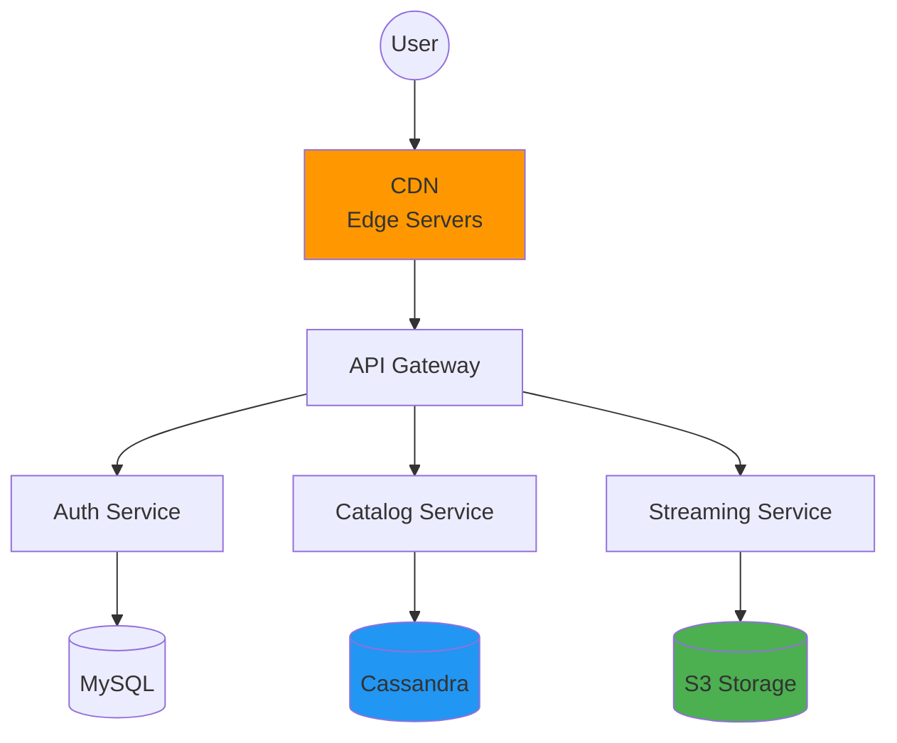

# What is a Distributed System?

> "A distributed system is a system whose components are located on different networked computers, which communicate and coordinate their actions by passing messages to one another." — Coulouris et al.

---

## 🏗️ Architecture Overview

---

## 🔑 Key Components

| Component | Description | Example |
|-----------|-------------|---------|
| **Nodes** | Individual machines running software | Web servers, databases |
| **Network** | Communication medium between nodes | TCP/IP, HTTP, gRPC |
| **Messages** | Data exchanged between nodes | API calls, events |
| **Coordination** | Logic to keep nodes in sync | Leader election, consensus |

---

## 💪 Why Use Distributed Systems?

### 1. **Performance**
Single machines have physical limits. Distributed systems achieve higher throughput by parallelizing work.

### 2. **Scalability**
- **Vertical Scaling**: Add more resources (CPU, RAM) to one machine — has limits
- **Horizontal Scaling**: Add more machines — virtually unlimited

### 3. **Availability**
Redundancy ensures the system survives failures.

> **Five-nines (99.999%)** = Only 5.26 minutes downtime/year

---

## 🌍 Real-World Example: Netflix

**Why Netflix is distributed:**
- 200+ million subscribers globally
- Thousands of servers across regions
- No single point of failure
- Content served from nearest edge location

---

## ⚠️ The Trade-offs

| Benefit | Challenge |
|---------|-----------|
| Higher performance | Network latency |
| Better availability | Partial failures |
| Elastic scalability | Data consistency |
| Geographic distribution | Coordination overhead |

---

## 🔥 Real-World Incident: Single Point of Failure

### Facebook Outage (October 2021)
- **What happened**: DNS servers became unreachable due to a configuration change
- **Impact**: 6+ hours of global outage affecting 3.5 billion users
- **Lesson**: Even with distributed systems, centralized dependencies (like DNS) can be SPOFs

---

## ✅ Key Takeaways

1. **Distributed systems** = multiple computers working as one logical system
2. **Three main benefits**: Performance, Scalability, Availability
3. **Core mechanism**: Message passing between nodes
4. **Trade-off**: Complexity increases significantly
5. **Real systems**: Netflix, Google, Amazon all rely on distributed architecture

---

## 📚 Further Reading
- [Distributed Systems for Fun and Profit](http://book.mixu.net/distsys/)
- [Designing Data-Intensive Applications](https://dataintensive.net/)

---

[← Back to Module](./README.md) | [Next: Fallacies of Distributed Computing →](./02-fallacies-of-distributed-computing.md)
