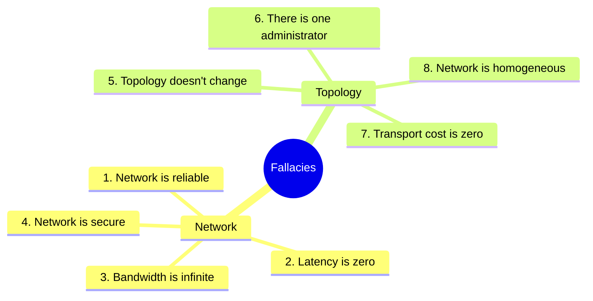
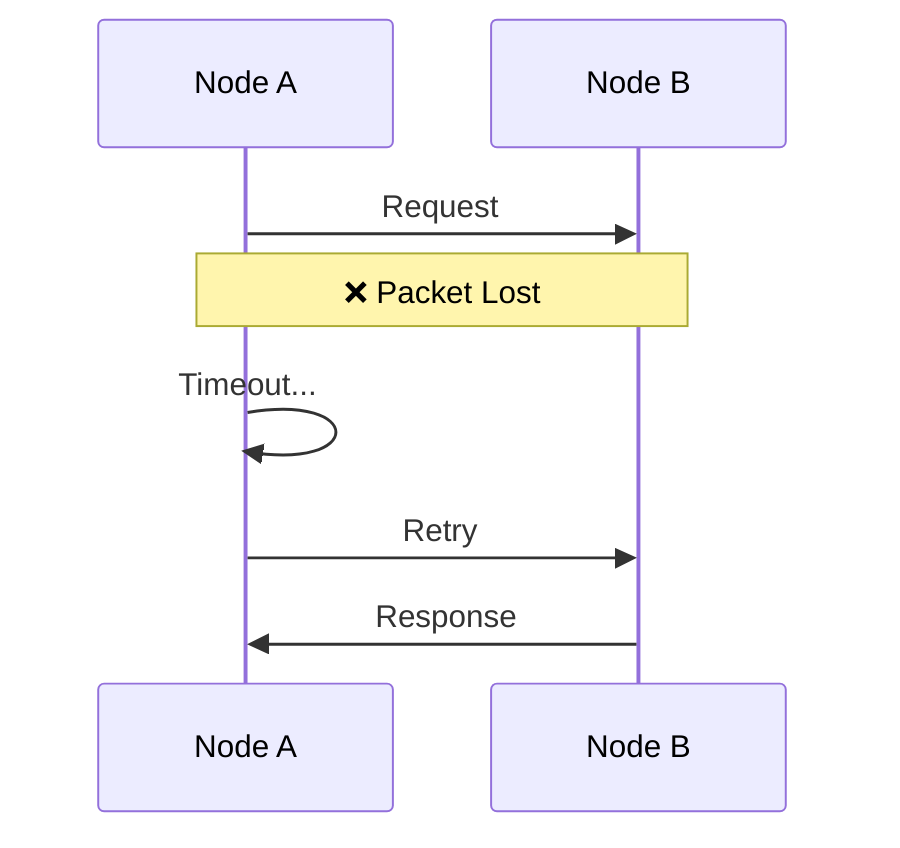
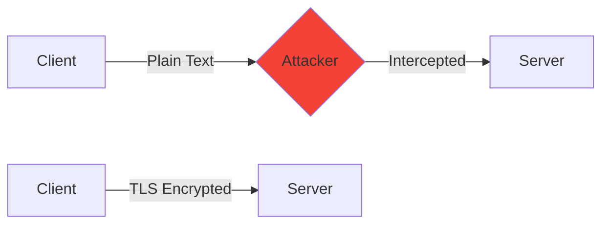

# Fallacies of Distributed Computing

> "Essentially everyone, when they first build a distributed application, makes the following eight assumptions. All prove to be false in the long run." — L. Peter Deutsch, Sun Microsystems

---

## 🎭 The 8 Fallacies



---

## 📋 Fallacy Details

### 1. ❌ The Network is Reliable

**Reality**: Networks fail all the time.



**Real-World Impact**:
- **AWS US-East-1 (2017)**: Network issues caused S3 outage affecting thousands of websites
- Packet loss of just 0.1% can cause significant performance degradation

**Solution**: Design for failure with retries, timeouts, and circuit breakers.

---

### 2. ❌ Latency is Zero

**Reality**: Round-trip times vary dramatically.

| Location | Typical Latency |
|----------|-----------------|
| Same datacenter | 0.5 ms |
| Cross-region (US) | 40-80 ms |
| Cross-continent | 100-200 ms |
| With packet loss | 500+ ms |


**Real-World Impact**:
- **High-Frequency Trading**: Firms spend millions to reduce latency by microseconds
- **Google**: Found that 500ms delay reduced traffic by 20%

---

### 3. ❌ Bandwidth is Infinite

**Reality**: Bandwidth is finite and expensive.

**Example**: Moving 1 PB of data
- Over 1 Gbps network = ~3 months
- AWS Snowmobile (physical truck) = ~10 days

**Real-World Impact**:
- **Netflix**: Uses ~15% of total US internet bandwidth
- **CDNs exist** because sending data globally is expensive

---

### 4. ❌ The Network is Secure

**Reality**: Any data crossing a network can be intercepted.



**Real-World Incidents**:
- **Equifax (2017)**: 147 million records stolen due to unpatched vulnerability
- **BGP Hijacking**: Traffic rerouted through malicious networks

**Solution**: Always use TLS, zero-trust architecture.

---

### 5. ❌ Topology Doesn't Change

**Reality**: Network topology changes constantly.

- Servers are added/removed
- Routes change due to failures
- Cloud VMs are ephemeral
- Kubernetes pods are created/destroyed

**Real-World Impact**:
- **Auto-scaling**: AWS adds/removes instances dynamically
- **Service Mesh**: Tools like Istio handle constant topology changes

---

### 6. ❌ There is One Administrator

**Reality**: Multiple teams, vendors, and organizations manage the network.

- Your company's network team
- Cloud provider (AWS, GCP)
- ISPs
- CDN providers
- Third-party APIs

---

### 7. ❌ Transport Cost is Zero

**Reality**: Data transfer costs money.

| Provider | Egress Cost |
|----------|-------------|
| AWS | $0.09/GB (to internet) |
| GCP | $0.08-0.12/GB |
| Azure | $0.05-0.08/GB |

**Real-World Impact**:
- **1 PB egress on AWS** = ~$90,000/month
- Companies optimize architectures to minimize cross-region traffic

---

### 8. ❌ The Network is Homogeneous

**Reality**: Networks are heterogeneous.

- Different hardware vendors
- Different protocols
- Different speeds
- Different configurations

---

## 🕐 Bonus: The Global Clock Fallacy

> "Distributed systems have a global clock which we can use to identify when events happen."

**Reality**: Each node has its own clock running at a different rate.

```mermaid
graph TB
    subgraph "Node A Clock"
        A1[10:00:00.000]
    end
    subgraph "Node B Clock"
        B1[10:00:00.050]
    end
    subgraph "Node C Clock"
        C1[09:59:59.980]
    end
    
    Note[Same "moment" in time<br/>but different readings]
```

**Real-World Solution**:
- **Google Spanner**: Uses GPS + atomic clocks (TrueTime API) to bound clock uncertainty
- **Logical Clocks**: Lamport clocks, Vector clocks for ordering events

---

## 🔥 Real-World Incident: Knight Capital (2012)

**What happened**:
- Software deployment went wrong
- Old code on one server + new code on others
- Systems assumed homogeneous network behavior

**Impact**:
- Lost $440 million in 45 minutes
- Company had to be sold

**Lesson**: Never assume consistency across distributed nodes.

---

## ✅ Key Takeaways

| Fallacy | Reality | Solution |
|---------|---------|----------|
| Network is reliable | Packets get lost | Retries, idempotency |
| Latency is zero | 10s to 100s of ms | Async operations, caching |
| Bandwidth is infinite | Limited and costly | Compression, CDNs |
| Network is secure | Always hostile | TLS, zero-trust |
| Topology is static | Constantly changing | Service discovery |
| One administrator | Many stakeholders | Clear boundaries |
| Transport is free | Significant cost | Optimize data flow |
| Network is homogeneous | Highly varied | Standard protocols |

---

[← Previous: What is a Distributed System](./01-what-is-distributed-system.md) | [Next: System Models →](./03-system-models.md)
