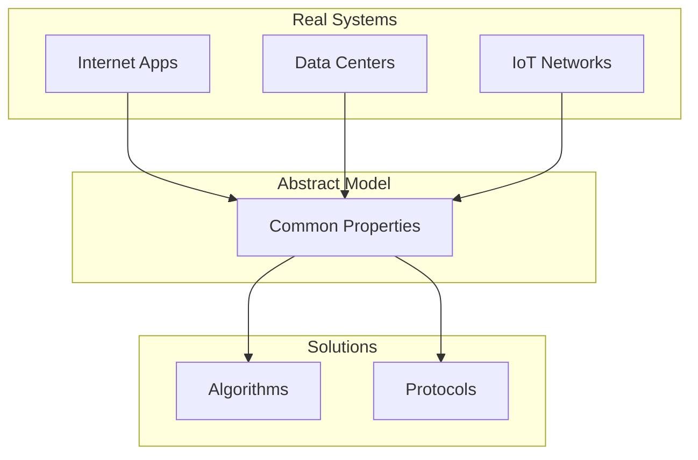
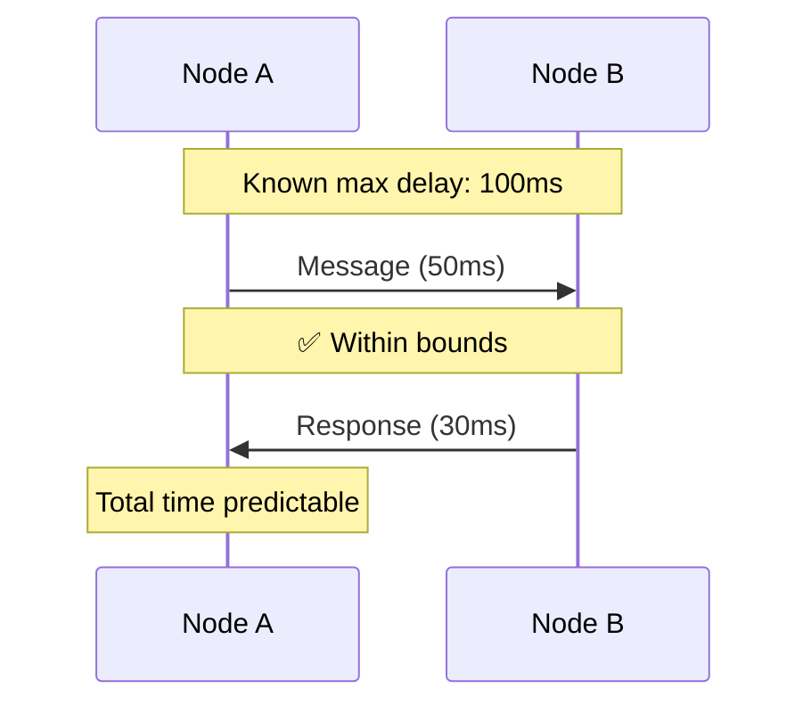
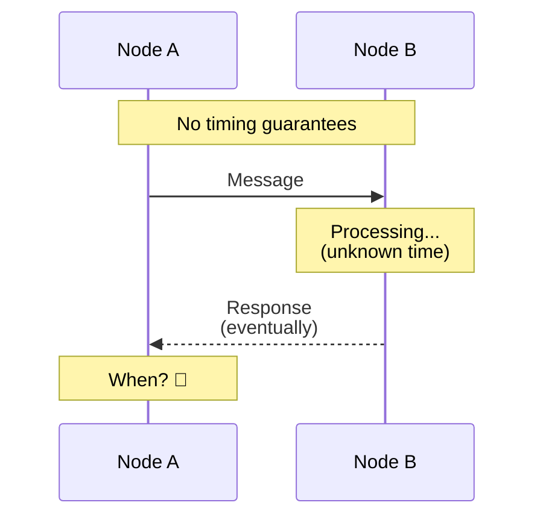
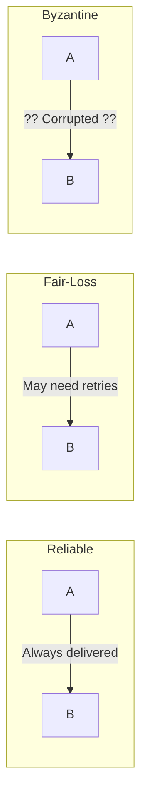
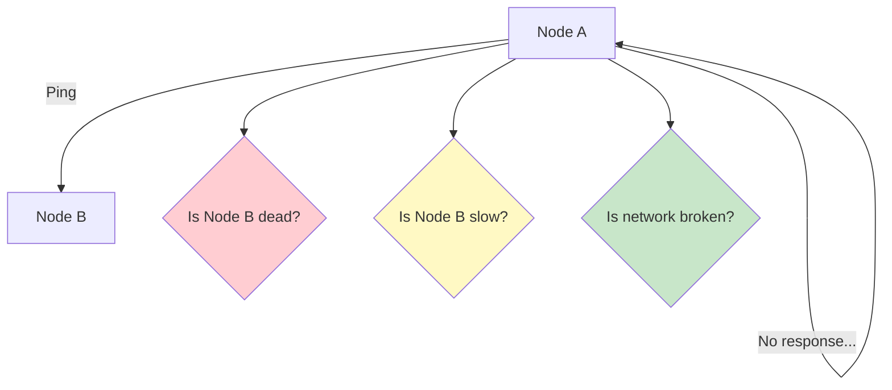
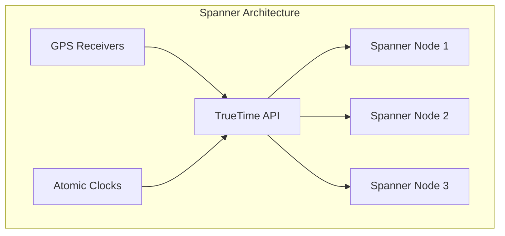

# System Models

> Defining properties that distributed systems must satisfy to reason about correctness.

---

## 🎯 Why System Models Matter

Real-world distributed systems vary dramatically. To solve problems generically, we need **abstract models** that define the properties a system must satisfy.

---

## ⏱️ Timing Models

### 1. Synchronous System

All nodes have accurate clocks and known bounds on message delay.

**Properties**:
- ✅ Known upper bound on message delay
- ✅ Known upper bound on processing time
- ✅ Accurate synchronized clocks
- ✅ Execution in lock-step rounds

**Examples**: Tightly coupled clusters, real-time systems

---

### 2. Asynchronous System

No timing guarantees whatsoever. Messages can take arbitrarily long.

**Properties**:
- ❌ No bound on message delay
- ❌ No bound on processing time
- ❌ No synchronized clocks
- ❌ Nodes run at independent rates

**Examples**: The Internet, most cloud systems

---

### Comparison

| Property | Synchronous | Asynchronous |
|----------|-------------|--------------|
| Message delay | Bounded | Unbounded |
| Clock sync | Yes | No |
| Easier to reason about | ✅ Yes | ❌ No |
| Realistic for Internet | ❌ No | ✅ Yes |

> **Most algorithms in this course assume the asynchronous model** because it's closer to real-world systems like the Internet.

---

## 🌐 Network Models

### Reliable Network
- Messages are eventually delivered
- No message loss
- **Rare in practice**

### Fair-Loss Network
- Messages may be lost
- If you keep retrying, message eventually gets through
- **More realistic**

### Arbitrary/Byzantine Network
- Messages can be lost, duplicated, or corrupted
- Network may behave maliciously
- **Most pessimistic**

---

## 🔧 Challenges in Asynchronous Systems

### Network Asynchrony
Messages can be delayed indefinitely, making it hard to distinguish between:
- A slow node
- A dead node
- A network partition

### Partial Failures
Only some components fail while others continue operating.

### Concurrency
Multiple operations happen simultaneously with no global ordering.

---

## 🏢 Real-World: Google Spanner

Google Spanner bridges synchronous and asynchronous models:

- Uses **GPS + atomic clocks** to achieve tight clock synchronization
- **TrueTime API** returns a time interval, not a single point
- Allows **external consistency** (stronger than linearizability)

---

## ✅ Key Takeaways

1. **Synchronous systems** have timing guarantees — easier to reason about but unrealistic for Internet
2. **Asynchronous systems** have no timing guarantees — realistic but harder to build
3. Most distributed systems algorithms assume **asynchronous model**
4. In async systems, **impossible to distinguish slow nodes from dead ones**
5. **Timeouts** are artificial bounds we impose, not actual limits

---

[← Previous: Fallacies](./02-fallacies-of-distributed-computing.md) | [Next: Types of Failures →](./04-types-of-failures.md)
