# Types of Failures

> Understanding failure modes is crucial for designing fault-tolerant distributed systems.

---

## 🎯 Failure Categories

---

## 1. 🛑 Fail-Stop Failure

A node **halts permanently** and other nodes **can detect** it.

```mermaid
sequenceDiagram
    participant A as Node A
    participant B as Node B
    participant M as Monitor
    
    A->>B: Heartbeat
    B->>A: I'm alive
    A->>B: Heartbeat
    Note over B: ❌ CRASH
    B--xA: (No response)
    M->>B: Health check
    B--xM: Connection refused
    M->>A: Node B is DEAD
```

**Properties**:
- Node stops completely
- Failure is **detectable** (connection refused, process dead)
- **Easiest** to handle

**Example**: Server crash that closes all TCP connections

---

## 2. 💀 Crash Failure

A node **halts silently** — other nodes **cannot easily detect** it.

```mermaid
sequenceDiagram
    participant A as Node A
    participant B as Node B
    
    A->>B: Request
    Note over B: ❌ CRASH
    A->>A: Waiting...
    A->>A: Still waiting...
    A->>A: Timeout! Is B dead<br/>or just slow?
```

**Properties**:
- Node stops completely
- Failure is **NOT immediately detectable**
- Must use **timeouts** to suspect failure
- Can't distinguish from slow node

**Example**: Process frozen, JVM garbage collection pause

---

## 3. 📭 Omission Failure

A node **fails to respond** to some requests while partially operating.

```mermaid
sequenceDiagram
    participant A as Node A
    participant B as Node B
    
    A->>B: Request 1
    B->>A: Response 1 ✅
    A->>B: Request 2
    Note over B: Dropped!
    A->>B: Request 3
    B->>A: Response 3 ✅
    A->>A: Where's Response 2? 🤔
```

**Types**:
- **Send omission**: Node fails to send messages
- **Receive omission**: Node fails to receive messages

**Example**: 
- Network congestion dropping packets
- Full message queue dropping new messages
- Overloaded server dropping requests

---

## 4. 🎭 Byzantine Failure

A node exhibits **arbitrary, potentially malicious** behavior.

**Behaviors**:
- ❌ Send different values to different nodes
- ❌ Lie about its state
- ❌ Pretend to be another node
- ❌ Do nothing when it should act
- ❌ Act when it should do nothing

**Causes**:
- Malicious actors/hackers
- Software bugs
- Memory corruption
- Hardware malfunctions

---

## 🔥 Real-World Incidents

### Amazon S3 Outage (2017) — Cascading Crash Failures

**What happened**:
1. Engineer ran command to remove a few servers
2. Typo caused removal of **too many servers**
3. Critical subsystems crashed
4. Recovery took 5+ hours

**Failure Type**: Crash failure leading to cascade

**Lesson**: Safeguards against removing too many nodes

---

### Byzantine Failure in Bitcoin

**Byzantine Fault Tolerance (BFT)**:
- Bitcoin assumes up to 1/3 of miners could be malicious
- Consensus still works with honest majority
- Proof-of-work makes attacks expensive

---

## ⏱️ Failure Detection

### The Timeout Dilemma

```mermaid
graph LR
    subgraph "Short Timeout"
        ST1[Fast detection ✅]
        ST2[False positives ❌]
    end
    
    subgraph "Long Timeout"
        LT1[Slower detection ❌]
        LT2[Fewer false positives ✅]
    end
```

### Failure Detector Properties

| Property | Description |
|----------|-------------|
| **Completeness** | % of actual failures detected |
| **Accuracy** | % of detections that are correct |

> **Perfect failure detector** = 100% completeness + 100% accuracy  
> **Reality**: Impossible in asynchronous systems

---

## 📊 Comparison Table

| Failure Type | Detectable? | Severity | Example |
|--------------|-------------|----------|---------|
| Fail-stop | ✅ Yes | Low | Clean shutdown |
| Crash | ⚠️ Via timeout | Medium | Process hang |
| Omission | ⚠️ Via timeout | Medium | Packet loss |
| Byzantine | ❌ Hardest | High | Malicious actor |

---

## ✅ Key Takeaways

1. **Fail-stop** is the easiest — node dies and we know it
2. **Crash failures** are silent — must use timeouts
3. **Omission failures** mean partial availability
4. **Byzantine failures** require complex algorithms (PBFT, Raft with checks)
5. **Timeouts** are the main tool but have trade-offs
6. **Most systems assume crash failures** — Byzantine is expensive to handle

---

[← Previous: System Models](./03-system-models.md) | [Next: Correctness - Safety & Liveness →](./05-correctness-safety-liveness.md)
