# Correctness: Safety and Liveness

> Defining what it means for a distributed system to behave correctly.

---

## 🎯 Two Types of Properties

```mermaid
graph TB
    subgraph "Correctness"
        S[Safety<br/>"Nothing bad happens"]
        L[Liveness<br/>"Something good eventually happens"]
    end
    
    S --- Balance((Trade-off))
    L --- Balance
    
    style S fill:#c8e6c9
    style L fill:#bbdefb
```

---

## 🛡️ Safety Properties

> **"Something bad never happens"**

Safety properties define what a system must **NOT** do.

### Examples

| System | Safety Property |
|--------|-----------------|
| Bank transfer | Money is never lost or created |
| Mutex/Lock | Two processes never hold lock simultaneously |
| Database | Data is never corrupted |
| Oven | Temperature never exceeds maximum |

```mermaid
graph LR
    subgraph "Thermostat Safety"
        T[Temperature] -->|Must stay| R[< 300°F]
        V[Violation] -->|If| X[T >= 300°F]
    end
    
    style V fill:#f44336,color:#fff
```



### Characteristics
- If violated, **can point to exact moment** it was violated
- Once violated, **cannot be undone**
- Typically about **consistency** and **integrity**

---

## 🚀 Liveness Properties

> **"Something good eventually happens"**

Liveness properties define what a system **MUST** eventually do.

### Examples

| System | Liveness Property |
|--------|-------------------|
| Request processing | Every request eventually gets a response |
| Leader election | A leader is eventually elected |
| Oven | Temperature eventually reaches target |
| Mutex/Lock | A waiting process eventually gets the lock |

```mermaid
sequenceDiagram
    participant P as Process
    participant S as System
    
    P->>S: Request lock
    Note over S: Processing...
    Note over S: Still processing...
    S->>P: Lock granted ✅
    Note over P,S: Liveness satisfied<br/>(eventually happened)
```



### Characteristics
- **Cannot be violated** in finite time (could still happen later)
- About **progress** and **termination**
- Often about **availability**

---

## ⚖️ The Trade-off


### Real Example: Distributed Lock


---

## 🔬 FLP Impossibility

One of the most important results in distributed systems:

> **In an asynchronous system with even one faulty process, no consensus algorithm can guarantee both safety AND liveness.**

This means we **must** make trade-offs!

---

## 🏢 Real-World Examples

### Banking System
- **Safety**: Account balance never goes negative (no overdraft)
- **Liveness**: Transactions eventually complete

**When network issues occur**:
- Banks often prioritize **safety** (reject transaction) over **liveness** (process anyway)

### Distributed Database


---

## 📋 Summary Table

| Aspect | Safety | Liveness |
|--------|--------|----------|
| Definition | Bad thing never happens | Good thing eventually happens |
| Violation | Instant and permanent | Only if it never happens |
| Relates to | Consistency, correctness | Availability, progress |
| Example | No data loss | Request completes |

---

## ✅ Key Takeaways

1. **Safety** = Nothing bad happens (data integrity, consistency)
2. **Liveness** = Something good eventually happens (progress, availability)
3. **Impossible** to guarantee both in async systems with failures
4. **CAP theorem** is about this trade-off
5. **Choose based on use case**: Financial = safety, Social feed = liveness

---

[← Previous: Types of Failures](./04-types-of-failures.md) | [Next: Stateless vs Stateful →](./06-stateless-vs-stateful.md)
