# Stateless vs Stateful Systems

> One of the most important architectural decisions in distributed systems.

---

## 🎯 Definitions


---

## 🔄 Stateless Systems

> Results depend **only** on the input provided — no memory of past interactions.

### Examples

```mermaid
graph LR
    subgraph "Stateless Examples"
        A[Calculator API<br/>add(2, 3) = 5]
        B[Image Resizer<br/>resize(img, 100x100)]
        C[Currency Converter<br/>convert(100, USD, EUR)]
    end
```

### Characteristics
| Aspect | Benefit |
|--------|---------|
| Scaling | Add/remove instances freely |
| Load balancing | Any instance can handle any request |
| Failure recovery | Just spin up new instance |
| Testing | Same input = same output |

### Real-World: AWS Lambda


---

## 💾 Stateful Systems

> Results depend on **stored state** that persists across requests.

### Examples

```mermaid
graph LR
    subgraph "Stateful Examples"
        A[Database<br/>SELECT * FROM users]
        B[Shopping Cart<br/>getCart(userId)]
        C[Game Server<br/>getPlayerPosition(playerId)]
    end
```

### Characteristics
| Aspect | Challenge |
|--------|-----------|
| Scaling | Must partition/replicate data |
| Load balancing | Requests must route to correct node |
| Failure recovery | Must restore state from backups |
| Consistency | Must keep replicas in sync |

### Real-World: Redis Cluster

```mermaid
graph TB
    subgraph "Redis Cluster"
        R1[Redis Node 1<br/>Keys A-M]
        R2[Redis Node 2<br/>Keys N-Z]
    end
    
    C1[Client] -->|Get "apple"| R1
    C2[Client] -->|Get "zebra"| R2
    
    Note[Requests routed<br/>based on key!]
    
    style Note fill:#fff9c4
```

---

## 📊 Comparison

```mermaid
graph LR
    subgraph "Stateless"
        SL1[Easy to scale ✅]
        SL2[Simple failover ✅]
        SL3[Any instance works ✅]
    end
    
    subgraph "Stateful"
        SF1[Complex scaling ⚠️]
        SF2[Need data recovery ⚠️]
        SF3[Careful routing needed ⚠️]
    end
```



| Dimension | Stateless | Stateful |
|-----------|-----------|----------|
| Scalability | Easy (just add nodes) | Hard (shard/replicate) |
| Load Balancing | Round-robin works | Need consistent routing |
| Fault Tolerance | Trivial | Complex |
| Data Dependencies | External only | Internal state |
| Examples | API Gateway, CDN | Database, Cache |

---

## 🏗️ Best Practice: Separate Concerns


**Key Insight**: Push state to specialized stateful systems (databases, caches) and keep application servers stateless.

---

## 🔥 Real-World: Netflix Architecture


**Why this works**:
- API servers can be scaled independently
- Stateful systems have specialized scaling strategies
- Clear boundary between business logic and data

---

## ⚠️ Common Pitfall: Accidental State

```python
# ❌ BAD: Stateful (in-memory counter)
request_count = 0

def handle_request():
    global request_count
    request_count += 1  # State in memory!
    return process()

# ✅ GOOD: Stateless (external counter)
def handle_request():
    redis.incr("request_count")  # State in Redis
    return process()
```

---

## ✅ Key Takeaways

1. **Stateless systems** are easier to scale, load balance, and recover
2. **Stateful systems** require careful data management
3. **Best practice**: Keep app servers stateless, push state to specialized systems
4. **Avoid accidental state** like in-memory caches or counters
5. **Most distributed challenges** arise from managing stateful components

---

[← Previous: Safety & Liveness](./05-correctness-safety-liveness.md) | [Next: Exactly-Once Semantics →](./07-exactly-once-semantics.md)
