# Exactly-Once Semantics

> One of the most misunderstood concepts in distributed systems.

---

## 🎯 The Problem

In distributed systems, messages can be:
- **Lost** — never delivered
- **Duplicated** — delivered multiple times
- **Delayed** — arrive out of order

```mermaid
sequenceDiagram
    participant S as Sender
    participant N as Network
    participant R as Receiver
    
    S->>N: Message 1
    N--xR: ❌ Lost
    S->>S: No ACK, retry...
    S->>N: Message 1 (retry)
    N->>R: Message 1 ✅
    R->>N: ACK
    N--xS: ❌ ACK Lost
    S->>S: No ACK, retry again...
    S->>N: Message 1 (retry)
    N->>R: Message 1 (duplicate!)
```



---

## 📬 Delivery Semantics


---

## 1️⃣ At-Most-Once

> Send message once, don't retry if it fails.


**Use Cases**:
- Metrics/logging (missing a few is OK)
- Real-time gaming (old data is useless)
- Live video streaming

**Pros**: Simple, no duplicates  
**Cons**: May lose messages

---

## 2️⃣ At-Least-Once

> Keep retrying until you get acknowledgment.


**Use Cases**:
- Most messaging systems (Kafka, RabbitMQ)
- API calls with retries
- Webhook deliveries

**Pros**: Message definitely delivered  
**Cons**: May have duplicates

---

## 💫 Exactly-Once: A Myth?

> **True exactly-once delivery is impossible** in distributed systems.

Why? Because we cannot distinguish between:
1. Message lost
2. Message delivered but ACK lost
3. Receiver crashed after processing

**However**, we can achieve **exactly-once processing** with these techniques:

---

## ✨ Achieving Exactly-Once Processing

### Approach 1: Idempotent Operations

An operation is **idempotent** if applying it multiple times has the same effect as applying it once.


**Example**:
```python
# ❌ NOT idempotent
def transfer_money(from_acc, to_acc, amount):
    from_acc.balance -= amount
    to_acc.balance += amount

# ✅ Idempotent (with transaction ID)
def transfer_money(transaction_id, from_acc, to_acc, amount):
    if already_processed(transaction_id):
        return  # Skip duplicate
    from_acc.balance -= amount
    to_acc.balance += amount
    mark_processed(transaction_id)
```

---

### Approach 2: Deduplication

Store message IDs and skip duplicates.

```mermaid
sequenceDiagram
    participant S as Sender
    participant R as Receiver
    participant DB as Processed IDs
    
    S->>R: Message (ID: abc123)
    R->>DB: Is abc123 processed?
    DB->>R: No
    R->>R: Process message
    R->>DB: Mark abc123 processed
    R->>S: ACK
    
    Note over S: ACK lost, retry
    
    S->>R: Message (ID: abc123)
    R->>DB: Is abc123 processed?
    DB->>R: Yes ✅
    R->>S: ACK (skip processing)
```



---

## 🔥 Real-World: Stripe Idempotency

Stripe uses **Idempotency Keys** to prevent duplicate charges:

```mermaid
sequenceDiagram
    participant C as Client
    participant S as Stripe
    participant DB as Stripe DB
    
    C->>S: POST /charges<br/>Idempotency-Key: abc123
    S->>DB: Check abc123
    DB->>S: Not found
    S->>S: Process charge
    S->>DB: Store abc123 → result
    S->>C: 200 OK
    
    Note over C: Timeout, retry
    
    C->>S: POST /charges<br/>Idempotency-Key: abc123
    S->>DB: Check abc123
    DB->>S: Found! Return cached result
    S->>C: 200 OK (same result)
```



**Key Insight**: Client provides idempotency key, Stripe stores results keyed by it.

---

## 📊 Comparison Table

| Semantic | Guarantees | Duplicates? | Message Loss? | Use Case |
|----------|------------|-------------|---------------|----------|
| At-most-once | 0 or 1 delivery | ❌ No | ✅ Possible | Metrics |
| At-least-once | 1+ deliveries | ✅ Possible | ❌ No | Most apps |
| Exactly-once* | 1 processing | ❌ No | ❌ No | Payments |

*Requires idempotency or deduplication

---

## 🏢 Real-World Systems

| System | Default | Exactly-Once Support |
|--------|---------|---------------------|
| Kafka | At-least-once | Yes (EOS transactions) |
| RabbitMQ | At-least-once | Via message dedup |
| AWS SQS | At-least-once | Yes (with FIFO queues) |
| gRPC | At-most-once | Via client retries + idempotency |

---

## ✅ Key Takeaways

1. **True exactly-once delivery is impossible** — this is a fundamental limitation
2. **Exactly-once processing is achievable** via idempotency or deduplication
3. **At-least-once + idempotency** = practical exactly-once
4. **Always design for duplicates** in distributed systems
5. **Idempotency keys** are your friend (see Stripe pattern)

---

[← Previous: Stateless vs Stateful](./06-stateless-vs-stateful.md) | [Back to Module →](./README.md)
