# Partitioning Strategies

> Splitting data across multiple nodes to achieve scalability.

---

## 🎯 Why Partition?

```mermaid
graph TB
    subgraph "Without Partitioning"
        S1[Single Node<br/>1TB Data<br/>⚠️ Limit reached]
    end
    
    subgraph "With Partitioning"
        P1[Node 1<br/>333GB]
        P2[Node 2<br/>333GB]
        P3[Node 3<br/>333GB]
    end
    
    S1 -.->|Split| P1
    S1 -.->|Split| P2
    S1 -.->|Split| P3
```



**Benefits**:
- **Scalability**: Handle more data than fits on one machine
- **Performance**: Parallel processing across nodes
- **Cost**: Use commodity hardware instead of expensive servers

---

## 📊 Two Types of Partitioning

```mermaid
graph LR
    subgraph "Original Table"
        O[ID | Name | Email | Age]
    end
    
    O -->|Vertical| V1[ID | Name]
    O -->|Vertical| V2[ID | Email | Age]
    
    O -->|Horizontal| H1[Rows 1-1000]
    O -->|Horizontal| H2[Rows 1001-2000]
```

---

## 1️⃣ Vertical Partitioning

> Split table by **columns** — different attributes on different nodes.

```mermaid
graph TB
    subgraph "Original Users Table"
        OT[id | name | email | avatar_blob | preferences_json]
    end
    
    subgraph "After Vertical Partitioning"
        T1[Core Service<br/>id | name | email]
        T2[Media Service<br/>id | avatar_blob]
        T3[Settings Service<br/>id | preferences_json]
    end
    
    OT --> T1
    OT --> T2
    OT --> T3
```

### Use Cases
- **Separate hot and cold data**: Frequently accessed vs rarely accessed columns
- **Different storage needs**: BLOBs in object storage, structured data in RDBMS
- **Microservices**: Each service owns its data

### Real-World Example: E-commerce


### Pros & Cons

| Pros | Cons |
|------|------|
| ✅ Optimize storage per column type | ❌ JOINs become expensive network calls |
| ✅ Independently scale each partition | ❌ Increases system complexity |
| ✅ Better caching (smaller row size) | ❌ Transactions across partitions are hard |

---

## 2️⃣ Horizontal Partitioning (Sharding)

> Split table by **rows** — different records on different nodes.


### Choosing a Partition Key

The **partition key** determines which shard stores each row.


**Good Partition Keys**:
| Key | Why Good |
|-----|----------|
| `user_id` | Evenly distributed, queries usually include it |
| `tenant_id` | Multi-tenant apps, isolates customer data |
| `region` | Geographic queries, data locality |

**Bad Partition Keys**:
| Key | Why Bad |
|-----|---------|
| `created_at` | Hot spots (all new data in one shard) |
| `country` | Uneven (most users in few countries) |
| `status` | Very few values, poor distribution |

---

## 🔥 Real-World: Instagram Sharding

Instagram sharded their PostgreSQL database by user_id:


**Key Decisions**:
- Partition key: `user_id` (most queries are user-centric)
- Generated IDs include shard ID for routing
- Cross-shard queries minimized by design

---

## ⚠️ Challenges of Sharding

### 1. Cross-Shard Queries


### 2. Cross-Shard Transactions


### 3. Rebalancing

When adding/removing shards, data must move:


---

## 📊 Comparison Summary

| Aspect | Vertical | Horizontal |
|--------|----------|------------|
| Split by | Columns | Rows |
| Use case | Different data types/access patterns | Scale beyond single node |
| Complexity | Moderate | High |
| Data locality | Same row still on one node | May need cross-shard queries |
| Examples | Microservices | Sharded databases |

---

## ✅ Key Takeaways

1. **Vertical partitioning** splits by columns — good for microservices
2. **Horizontal partitioning (sharding)** splits by rows — needed for scale
3. **Partition key choice is critical** — determines data distribution
4. **Sharding introduces complexity**: cross-shard queries, transactions, rebalancing
5. **Design your data model for your partition key** (denormalization helps)

---

[← Back to Module](./README.md) | [Next: Partitioning Algorithms →](./02-partitioning-algorithms.md)
