# Partitioning Algorithms

> Choosing the right algorithm for distributing data across nodes.

---

## 📋 Overview

---

## 1️⃣ Range Partitioning

> Assign continuous ranges of keys to each partition.

```mermaid
graph TB
    subgraph "Range Partitioned Database"
        M[Metadata Service<br/>A-F → Node 1<br/>G-N → Node 2<br/>O-Z → Node 3]
        
        N1[Node 1<br/>Users A-F]
        N2[Node 2<br/>Users G-N]
        N3[Node 3<br/>Users O-Z]
    end
    
    Q[Query: Find 'Alice'] --> M
    M --> N1
```

### How It Works
1. Define key ranges for each partition
2. Maintain a mapping: range → node
3. Route queries based on key lookup

### Advantages ✅
- **Range queries are efficient**: Find all users 'A' to 'D' hits one node
- **Easy to understand**: Intuitive mapping
- **Dynamic splitting**: Split a range when it gets too big

### Disadvantages ❌
- **Hot spots**: Sequential writes cluster on one partition
- **Uneven distribution**: Some ranges may have more data
- **Mapping overhead**: Must store and sync range metadata

### Real-World: HBase & Google BigTable

**Auto-splitting**: When a region gets too large, HBase automatically splits it.

---

## 2️⃣ Hash Partitioning

> Apply hash function to key, use modulo to find partition.

**Formula**: `partition = hash(key) % num_partitions`

### Advantages ✅
- **Even distribution**: Hash spreads data uniformly
- **No metadata needed**: Calculate partition at runtime
- **Prevents hot spots**: Sequential keys spread out

### Disadvantages ❌
- **Range queries impossible**: Adjacent keys on different nodes
- **Rebalancing nightmare**: Changing N moves most data

### The Rebalancing Problem

```mermaid
graph TB
    subgraph "Before: 4 Nodes"
        B1[hash % 4 = 0 → Node 0]
        B2[hash % 4 = 1 → Node 1]
        B3[hash % 4 = 2 → Node 2]
        B4[hash % 4 = 3 → Node 3]
    end
    
    subgraph "After: 5 Nodes (disaster!)"
        A1[hash % 5 = 0 → Node 0]
        A2[hash % 5 = 1 → Node 1]
        A3[hash % 5 = 2 → Node 2]
        A4[hash % 5 = 3 → Node 3]
        A5[hash % 5 = 4 → Node 4]
    end
    
    Note[~80% of keys<br/>change partition!]
    
    style Note fill:#ffcdd2
```

---

## 3️⃣ Consistent Hashing

> Minimize data movement when nodes are added/removed.

### The Hash Ring

```mermaid
graph TB
    subgraph "Hash Ring [0-360]"
        R((Ring))
        
        N1["Node A @ 45°"]
        N2["Node B @ 135°"]
        N3["Node C @ 270°"]
        
        K1["Key 1 @ 30°<br/>→ Node A"]
        K2["Key 2 @ 100°<br/>→ Node B"]
        K3["Key 3 @ 200°<br/>→ Node C"]
    end
```

### How It Works

1. Hash nodes to positions on a ring (0 to 2^32 or 0 to 360)
2. Hash each key to the same ring
3. Key belongs to **first node clockwise** from its position

### Adding a Node (Minimal Movement!)

```mermaid
graph TB
    subgraph "Before: 3 Nodes"
        BA[Node A: 45°]
        BB[Node B: 135°]
        BC[Node C: 270°]
    end
    
    subgraph "After: Add Node D at 180°"
        AA[Node A: 45°]
        AB[Node B: 135°]
        AD[Node D: 180° NEW]
        AC[Node C: 270°]
    end
    
    Note["Only keys 136°-180°<br/>move from C → D!"]
    
    style Note fill:#c8e6c9
```

**Only ~1/N of keys move** on average (vs ~80% with hash mod N).

### Virtual Nodes (Vnodes)

Problem: Random node positions can cause uneven distribution.

Solution: Each physical node gets multiple positions on the ring.

```mermaid
graph TB
    subgraph "Virtual Nodes"
        PN1[Physical Node A]
        PN2[Physical Node B]
        
        V1[Vnode A1 @ 30°]
        V2[Vnode A2 @ 150°]
        V3[Vnode A3 @ 290°]
        
        V4[Vnode B1 @ 90°]
        V5[Vnode B2 @ 200°]
        V6[Vnode B3 @ 340°]
        
        PN1 --> V1
        PN1 --> V2
        PN1 --> V3
        
        PN2 --> V4
        PN2 --> V5
        PN2 --> V6
    end
```

**Benefits**:
- Better load distribution
- When node fails, its load spreads to multiple nodes
- Heterogeneous nodes can have proportional vnodes

---

## 🔥 Real-World: Amazon DynamoDB

**Key Design Decisions**:
- Consistent hashing for partition assignment
- Virtual nodes for even distribution
- Replicas on consecutive nodes in ring
- Gossip protocol for membership

---

## 📊 Algorithm Comparison

| Feature | Range | Hash Mod N | Consistent Hashing |
|---------|-------|------------|-------------------|
| Range queries | ✅ Efficient | ❌ Scatter-gather | ❌ Scatter-gather |
| Data distribution | ⚠️ Can be uneven | ✅ Even | ⚠️ Even with vnodes |
| Adding/removing nodes | ⚠️ Rebalance ranges | ❌ Most data moves | ✅ Minimal movement |
| Metadata overhead | ⚠️ Range mapping | ✅ None | ⚠️ Ring positions |
| Complexity | Low | Low | Medium |

---

## 🏢 Which Systems Use What?

| System | Algorithm | Notes |
|--------|-----------|-------|
| HBase, BigTable | Range | For sorted access, auto-split |
| Redis Cluster | Hash slots (16384) | Fixed slots, manual assign |
| Cassandra | Consistent hashing + vnodes | Murmur3 hash |
| DynamoDB | Consistent hashing | With virtual nodes |
| MongoDB | Range or Hash | Configurable per collection |

---

## ✅ Key Takeaways

1. **Range partitioning** is best for ordered/range queries but risks hot spots
2. **Hash partitioning** distributes evenly but makes adding nodes painful
3. **Consistent hashing** minimizes data movement (~1/N on node changes)
4. **Virtual nodes** solve uneven distribution in consistent hashing
5. **Choose based on access patterns**: Range queries? Use range. Random access? Use hashing.

---

[← Previous: Partitioning Strategies](./01-partitioning-strategies.md) | [Next: Replication Fundamentals →](./03-replication-fundamentals.md)
