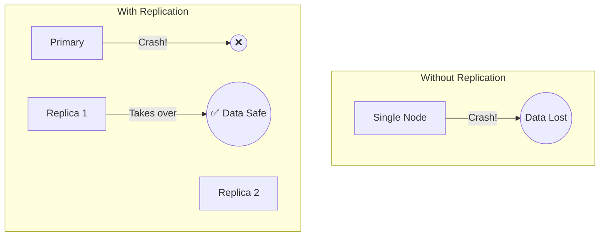
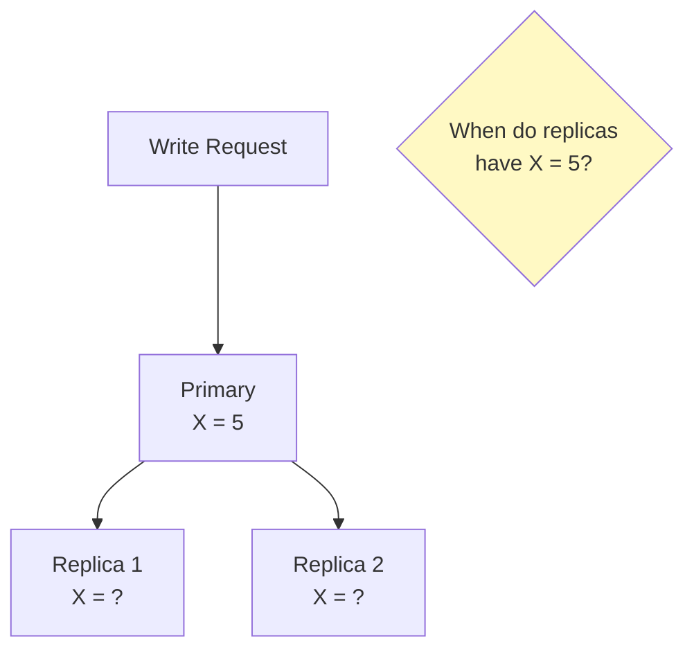
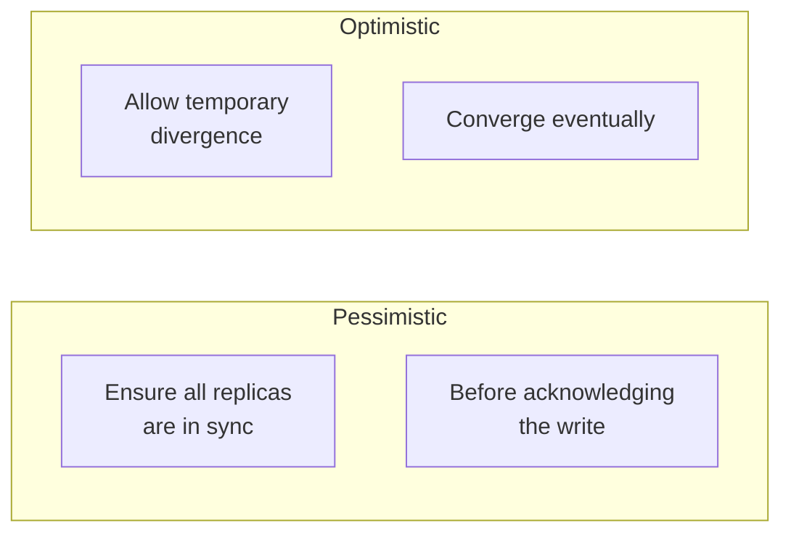
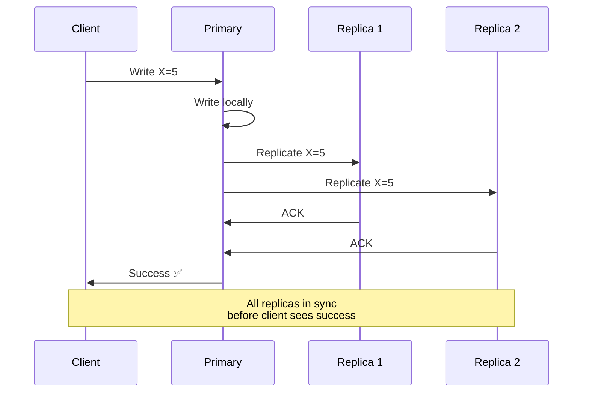
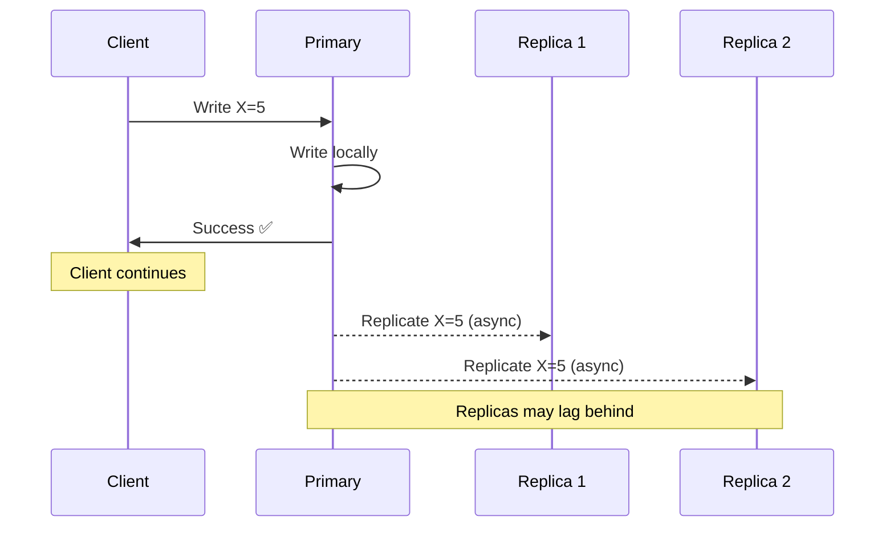
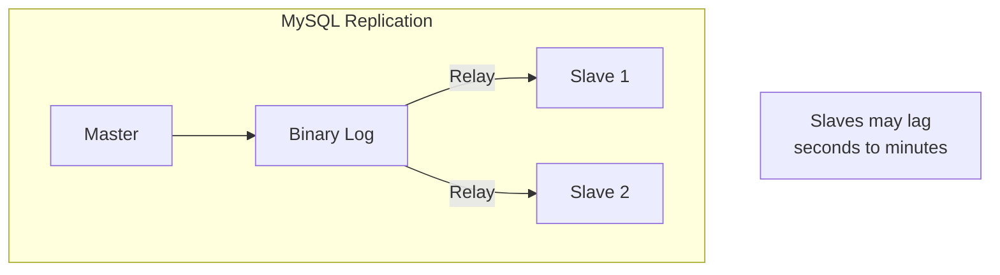
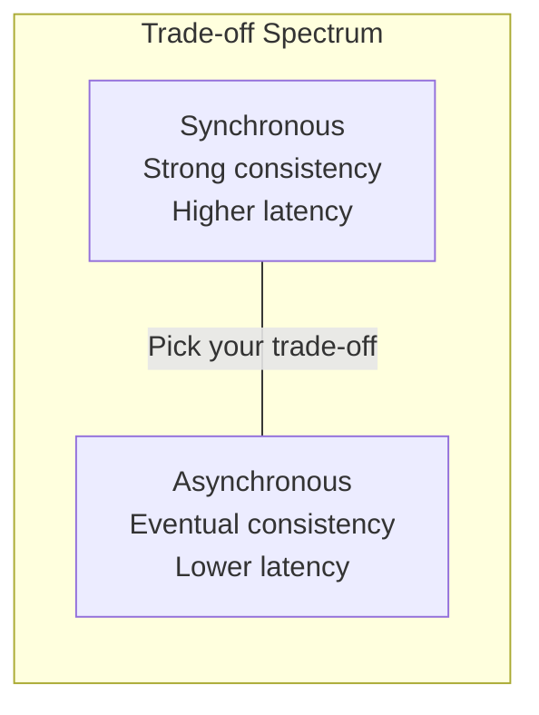
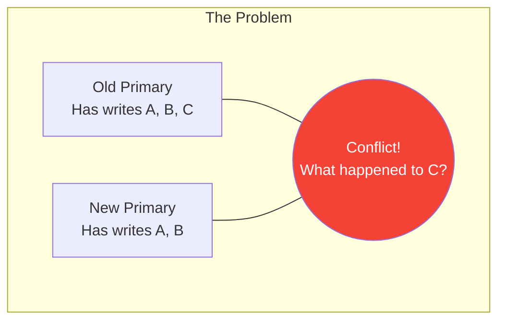
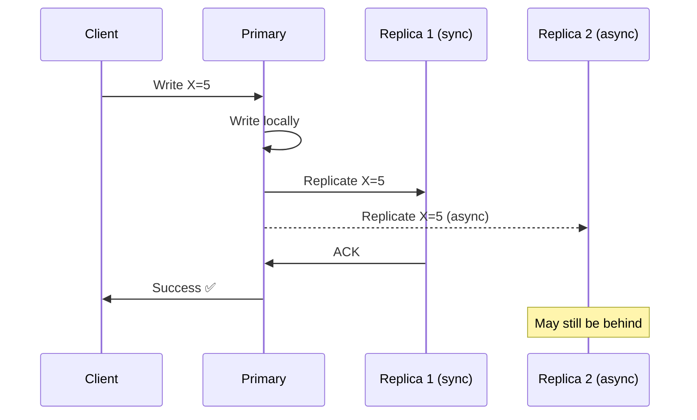

# Replication Fundamentals

> Storing copies of data on multiple nodes for availability and durability.

---

## 🎯 Why Replicate?



**Benefits**:

| Benefit | Description |
|---------|-------------|
| **Availability** | System continues if nodes fail |
| **Durability** | Data survives hardware failures |
| **Performance** | Read from nearest replica |
| **Geo-distribution** | Serve users from local region |

---

## 🔄 The Core Challenge



**The fundamental question**: How and when do we propagate updates to replicas?

---

## 📊 Two Replication Strategies



---

## 1️⃣ Pessimistic (Synchronous) Replication

> All replicas are updated **before** acknowledging write to client.



### Characteristics

| Aspect | Description |
|--------|-------------|
| Consistency | ✅ Strong — read any replica, get latest |
| Durability | ✅ High — survives any single failure |
| Latency | ❌ Higher — wait for slowest replica |
| Availability | ❌ Lower — any replica down blocks writes |

### Real-World: PostgreSQL Synchronous Replication

```sql
-- Configure synchronous replication
synchronous_standby_names = 'replica1, replica2'
synchronous_commit = on
```

---

## 2️⃣ Optimistic (Asynchronous) Replication

> Write acknowledged **immediately**, replicate in background.



### Characteristics

| Aspect | Description |
|--------|-------------|
| Consistency | ⚠️ Eventual — replicas may return stale data |
| Durability | ⚠️ Risk — data loss if primary fails before replication |
| Latency | ✅ Low — no waiting for replicas |
| Availability | ✅ High — replica issues don't block writes |

### Real-World: MySQL Async Replication



---

## ⚖️ Comparison



| Property | Synchronous | Asynchronous |
|----------|-------------|--------------|
| Consistency | Strong | Eventual |
| Write latency | Higher | Lower |
| Durability | Higher | Lower |
| Availability | Lower (needs quorum) | Higher |
| Complexity | Higher | Lower |

---

## 🔥 Real-World Incident: GitHub 2018 Outage

**What happened**:

1. Network partition isolated primary MySQL
2. Cluster promoted a replica to primary
3. Old primary came back — had writes not yet replicated!
4. Data divergence between two "primaries"

**Impact**: 24 hours of degraded service, some data loss

**Lesson**: Async replication means potential data loss during failover.



---

## 🎚️ Semi-Synchronous: A Middle Ground

Some systems offer "semi-synchronous" replication:



**At least one replica** confirms synchronously, others async.

---

## ✅ Key Takeaways

1. **Pessimistic replication** = Strong consistency, higher latency, lower availability
2. **Optimistic replication** = Eventual consistency, lower latency, risk of data loss
3. **Semi-synchronous** = Compromise between the two
4. **All replication has trade-offs** — no free lunch!
5. **GitHub incident** shows real-world impact of async replication

---

[← Previous: Partitioning Algorithms](./02-partitioning-algorithms.md) | [Next: Primary-Backup Replication →](./04-primary-backup-replication.md)
