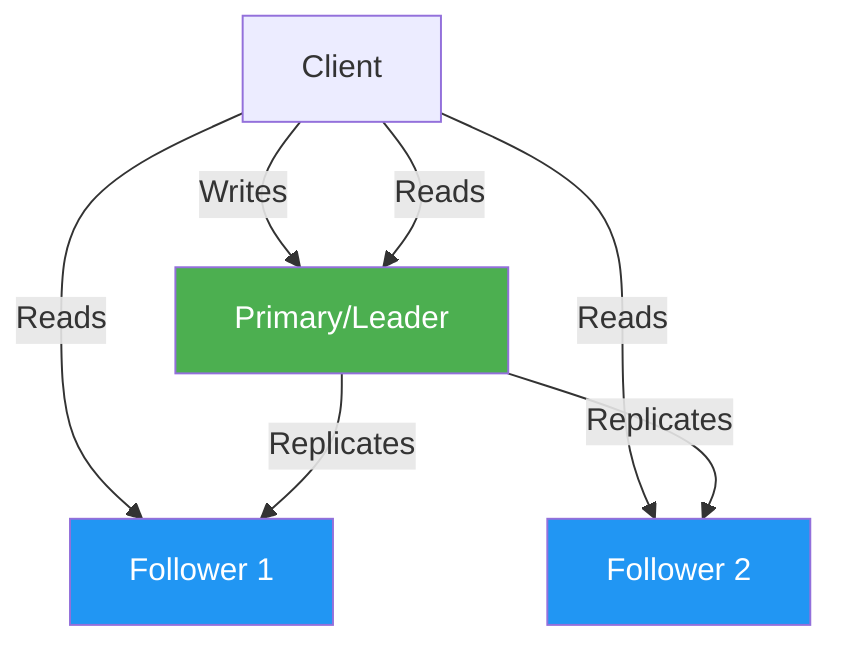
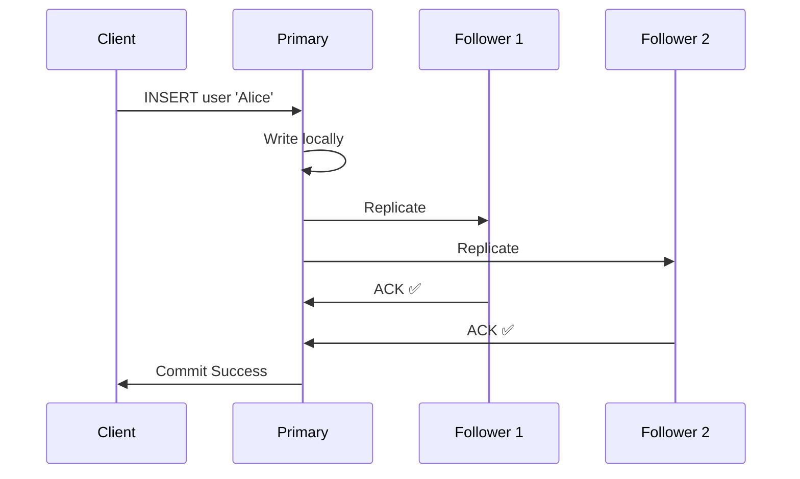
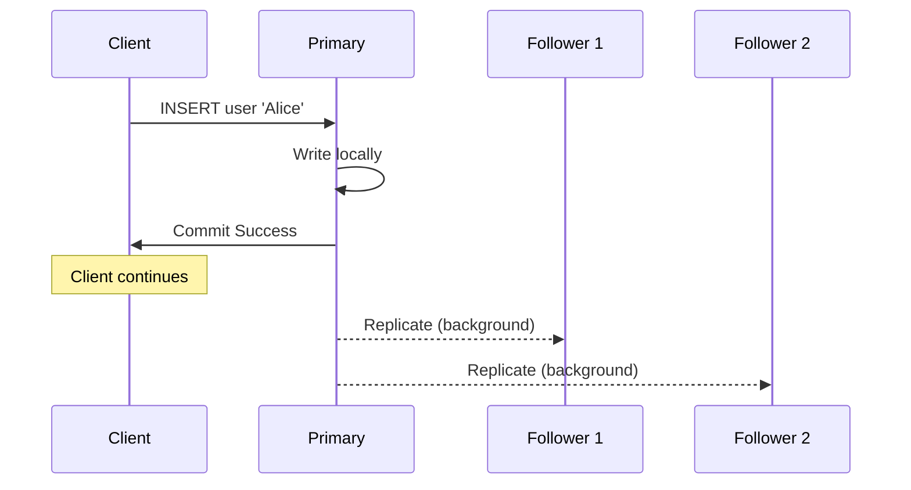
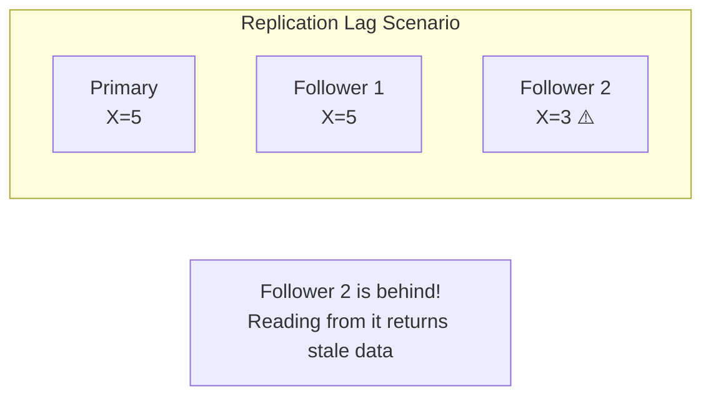
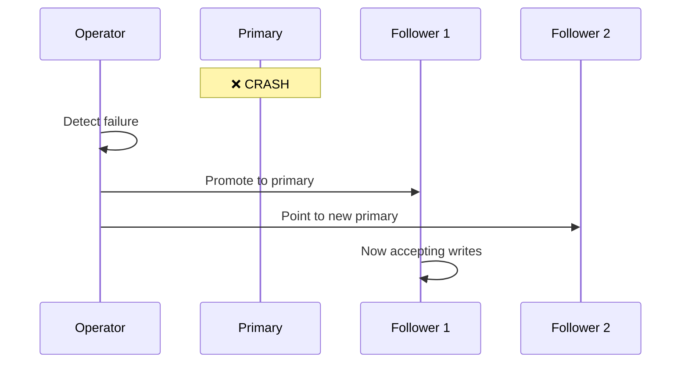
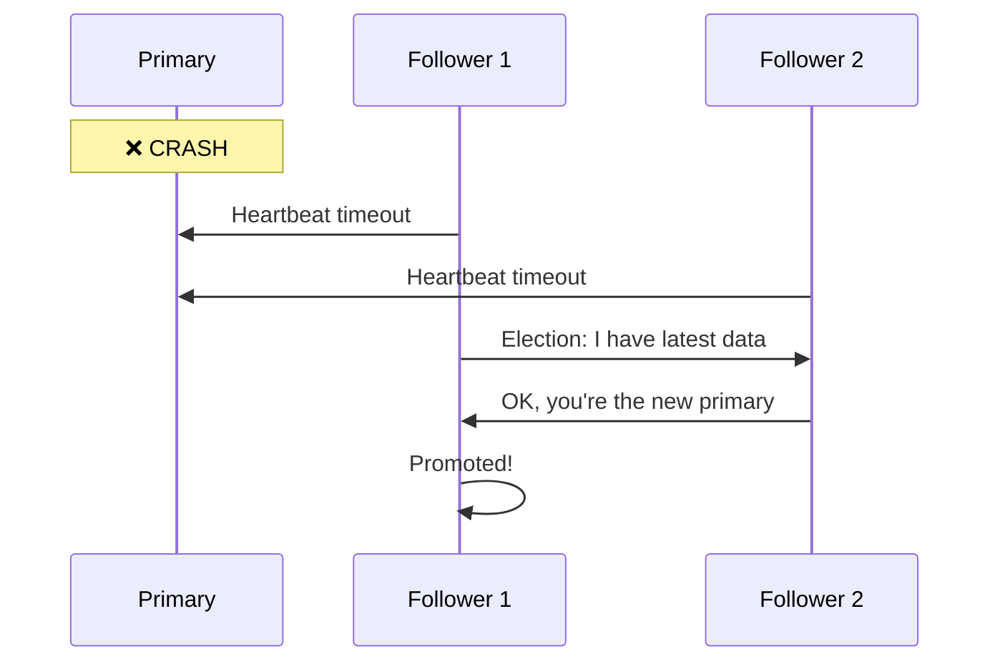
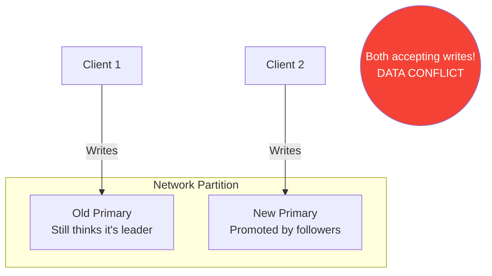
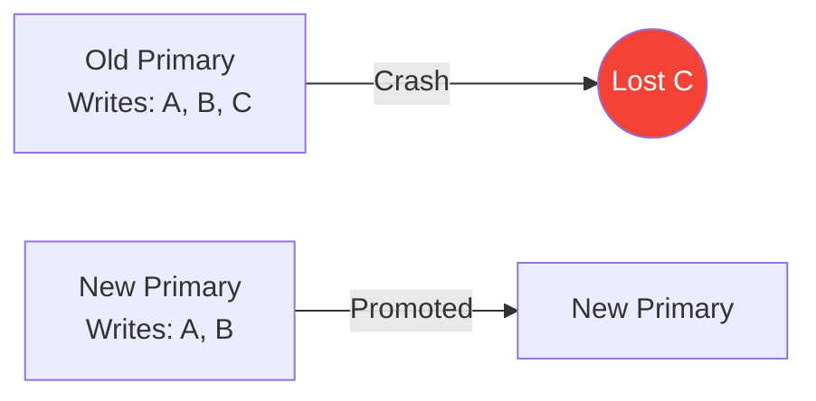
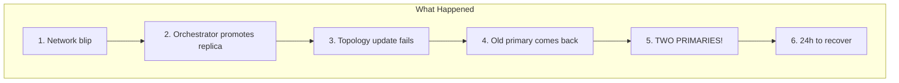

# Primary-Backup Replication

> The most common replication pattern: one leader handles writes, followers handle reads.

---

## 🎯 Architecture

**Also known as**: Leader-Follower, Master-Slave, Single-Master

---

## 🔄 Replication Modes

### Synchronous Replication

**Properties**:
- ✅ Strong consistency (all replicas in sync)
- ✅ No data loss on primary failure
- ❌ Higher latency (wait for all ACKs)
- ❌ Availability drops if any replica is slow/down

### Asynchronous Replication

**Properties**:
- ✅ Lower latency
- ✅ Higher availability
- ❌ Followers may lag (replication lag)
- ❌ Data loss possible if primary fails

---

## 📊 Replication Lag

**Causes**:
- Network latency
- Follower overload
- Long-running queries on followers
- Large transactions

**Real-World Issue**: User writes, then reads from follower → doesn't see their own write!

---

## 🔄 Failover

When the primary fails, a follower must take over.

### Manual Failover

**Pros**: Safe, controlled  
**Cons**: Downtime during manual intervention

### Automated Failover

**Pros**: Fast recovery  
**Cons**: Risk of split-brain, data loss

---

## ⚠️ Failover Challenges

### 1. Split-Brain

**Solution**: Fencing tokens, STONITH (Shoot The Other Node In The Head)

### 2. Data Loss with Async Replication

If primary crashes before replicating recent writes → those writes are lost.

---

## 🔥 Real-World: GitHub 2018 Outage (Detailed)

**Root Cause**: 
- Orchestrator (automated failover tool) promoted a read replica
- Original primary came back online
- Both accepting writes → data divergence

**Lessons**:
1. Test failover procedures regularly
2. Have clear fencing mechanisms
3. Understand your replication lag SLA

---

## 🏢 Real Systems

| System | Replication Type | Failover |
|--------|------------------|----------|
| PostgreSQL | Streaming (sync/async) | Manual or Patroni |
| MySQL | Binlog (async default) | MHA, Orchestrator |
| MongoDB | OpLog (sync or async) | Automatic with replica sets |
| Redis | Async by default | Sentinel for auto-failover |

---

## ✅ Key Takeaways

1. **Single leader** handles all writes → serializes operations
2. **Sync replication** = no data loss but higher latency
3. **Async replication** = lower latency but possible data loss
4. **Replication lag** can cause stale reads
5. **Failover** is complex — split-brain is a real risk
6. **Most databases** use this pattern (PostgreSQL, MySQL, MongoDB)

---

[← Previous: Replication Fundamentals](./03-replication-fundamentals.md) | [Next: Multi-Primary Replication →](./05-multi-primary-replication.md)
