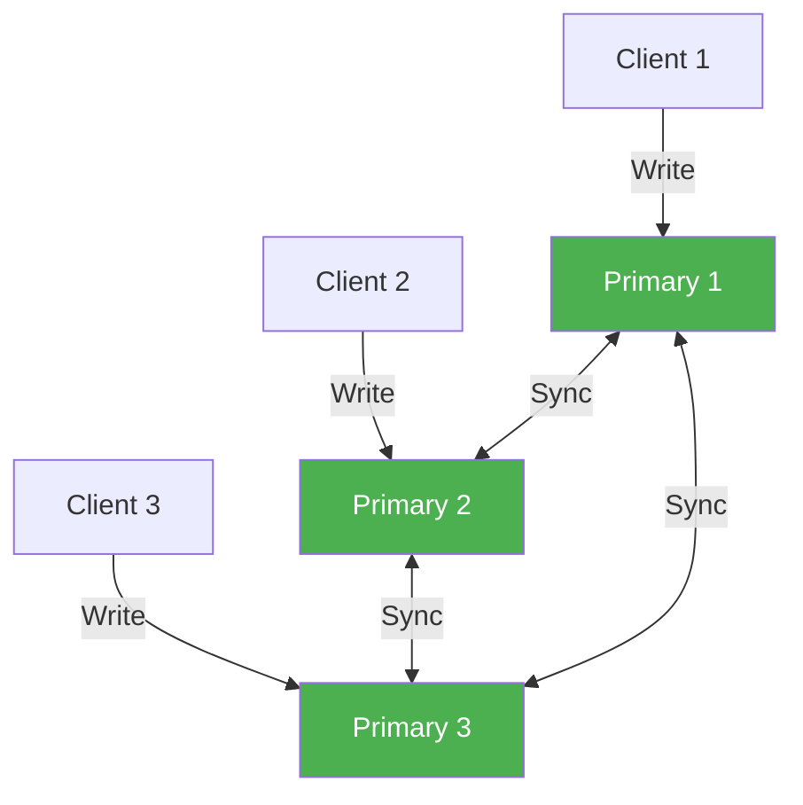
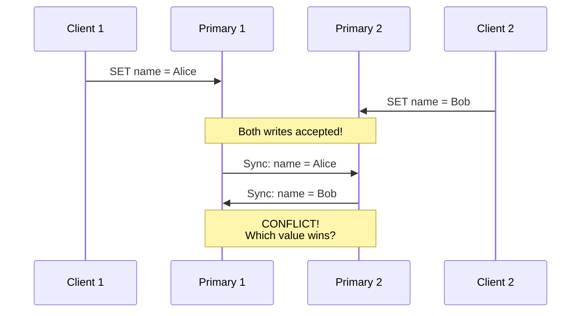
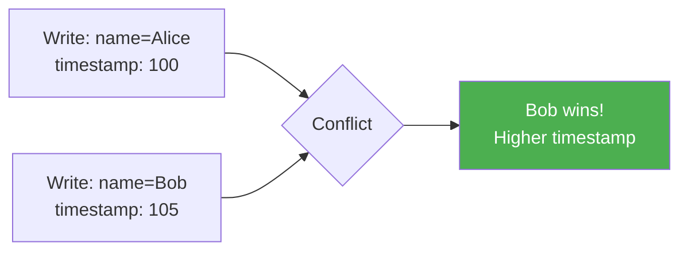
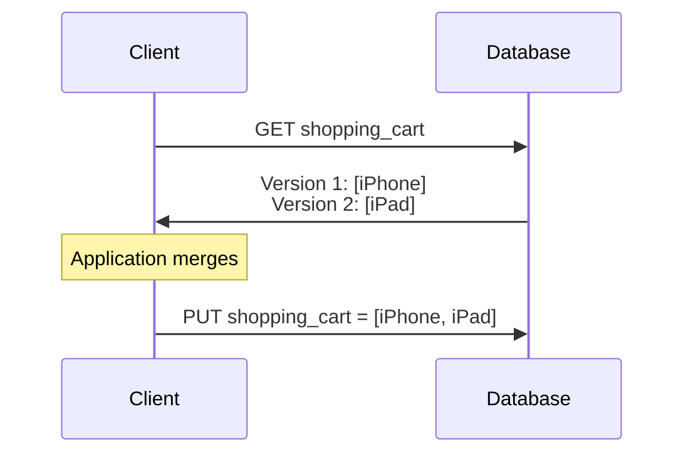
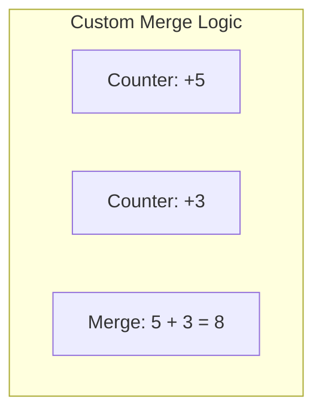
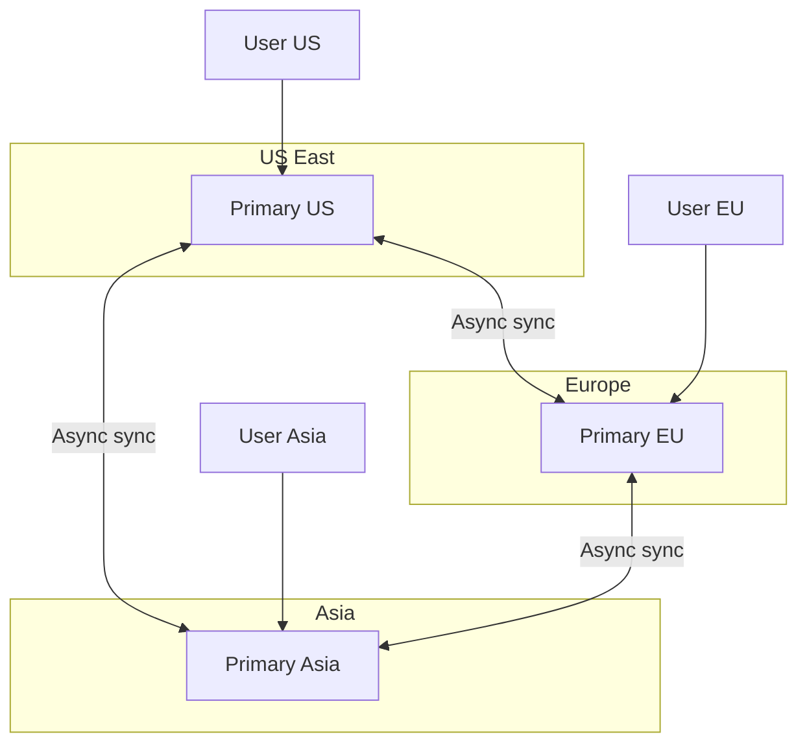

# Multi-Primary Replication

> Multiple nodes accept writes — higher availability, but conflict resolution required.

---

## 🎯 Architecture



**Also known as**: Multi-Master, Active-Active

---

## ⚖️ Comparison with Primary-Backup

| Aspect | Primary-Backup | Multi-Primary |
|--------|----------------|---------------|
| Write nodes | 1 | Multiple |
| Read scaling | ✅ Yes | ✅ Yes |
| Write scaling | ❌ No | ✅ Yes |
| Failover needed | ✅ Yes | ❌ No |
| Conflicts | ❌ None | ✅ Possible |
| Complexity | Lower | Higher |

---

## 💥 The Conflict Problem

When two nodes accept writes for the **same data** concurrently:



---

## 🔧 Conflict Resolution Strategies

### 1. Last-Write-Wins (LWW)



**Implementation**:

```python
def resolve(write1, write2):
    return write1 if write1.timestamp > write2.timestamp else write2
```

**Problems**:

- Clock skew can cause "earlier" writes to win
- Silent data loss — user's write disappears

**Used by**: Cassandra, DynamoDB (by default)

---

### 2. Expose to Application

Return **all versions** and let the application/user decide.



**Used by**: Amazon DynamoDB (optional), Riak

---

### 3. Application-Defined Rules



**Example**: CRDTs (Conflict-free Replicated Data Types)

- **G-Counter**: Only grows, merge = take max from each node
- **PN-Counter**: Track increments and decrements separately
- **LWW-Register**: Last-write-wins for single values
- **OR-Set**: Observed-remove set for collections

---

### 4. Deterministic Resolution

Use a deterministic tie-breaker when timestamps are equal:

```python
def resolve(write1, write2):
    if write1.timestamp != write2.timestamp:
        return max(write1, write2, key=lambda w: w.timestamp)
    # Tie-breaker: node ID
    return max(write1, write2, key=lambda w: w.node_id)
```

---

## 🔥 Real-World: Cassandra Conflict Resolution

```mermaid
graph TB
    subgraph "Cassandra Write Path"
        W[Write: X=5, timestamp=100]
        N1[Node 1: X=5 @ 100]
        N2[Node 2: X=3 @ 95]
        N3[Node 3: X=5 @ 100]
    end
    
    Read[Read Request]
    Read --> N1
    Read --> N2
    Read --> N3
    
    Resolver[Coordinator:<br/>X=5 wins (timestamp 100)]
    
    N1 --> Resolver
    N2 --> Resolver
    N3 --> Resolver
```

**Cassandra approach**:

1. Writes go to multiple nodes with timestamps
2. On read, coordinator queries replicas
3. Latest timestamp wins
4. **Read repair**: Stale nodes get updated

---

## 🏢 Use Cases for Multi-Primary

### 1. Geographic Distribution



**Benefit**: Users write to nearest datacenter

### 2. High Availability

No need for failover — if one primary fails, others continue.

### 3. Collaborative Editing

Google Docs, Figma — multiple users edit simultaneously.

---

## ⚠️ When NOT to Use Multi-Primary

| Scenario | Problem |
|----------|---------|
| Banking transactions | Conflicts could mean money issues |
| Inventory management | Overselling due to concurrent updates |
| Unique constraints | Hard to enforce across nodes |
| Where ordering matters | No single source of truth |

---

## 📊 Multi-Primary Systems

| System | Conflict Resolution | Use Case |
|--------|---------------------|----------|
| Cassandra | LWW + Vector clocks | Time-series, high write volume |
| CockroachDB | Serializable (prevents conflicts) | OLTP with global distribution |
| Galera Cluster (MySQL) | Certification-based | HA MySQL |
| Riak | CRDTs, Siblings | Key-value at scale |

---

## ✅ Key Takeaways

1. **Multi-primary** allows writes to any node → higher availability and write scaling
2. **Conflicts are inevitable** when same data is written concurrently
3. **LWW is simple but lossy** — data silently disappears
4. **CRDTs** enable automatic, lossless merging for certain data types
5. **Choose carefully** — multi-primary adds complexity
6. **Best for**: geo-distributed, high-availability, eventual consistency acceptable

---

[← Previous: Primary-Backup](./04-primary-backup-replication.md) | [Next: Quorums →](./06-quorums.md)
