# Quorums in Distributed Systems

> Achieving consistency through voting mechanisms.

---

## 🎯 The Problem


**Question**: Can we get something in between?

---

## 💡 The Quorum Solution

> **Write to some, read from some, ensure overlap.**

```mermaid
graph TB
    subgraph "3 Replicas, Quorum of 2"
        W[Write] -->|Quorum: 2| R1[Replica 1 ✅]
        W --> R2[Replica 2 ✅]
        W -.->|Not needed| R3[Replica 3]
        
        Rd[Read] -->|Quorum: 2| R1
        Rd --> R3
        
        Note[At least one node<br/>has the latest write!]
    end
```



---

## 📐 The Quorum Formula

For a system with **N** replicas:
- **W** = Write quorum (minimum nodes to write to)
- **R** = Read quorum (minimum nodes to read from)

**Rule**: `W + R > N`

This guarantees **at least one node** overlaps between read and write sets.

```mermaid
graph LR
    subgraph "N=3, W=2, R=2"
        WS[Write Set: {1,2}]
        RS[Read Set: {2,3}]
        OL[Overlap: {2}]
    end
    
    WS --> OL
    RS --> OL
    
    style OL fill:#4caf50,color:#fff
```

---

## 🔢 Common Quorum Configurations

| N | W | R | Properties |
|---|---|---|------------|
| 3 | 2 | 2 | Balanced consistency/availability |
| 3 | 3 | 1 | Write-heavy, fast reads |
| 3 | 1 | 3 | Read-heavy, fast writes |
| 5 | 3 | 3 | Higher fault tolerance |

### Example: N=5, W=3, R=3


---

## 📊 Quorum Trade-offs


---

## 🔧 Sloppy Quorums

What if we can't reach W nodes in the primary set?

**Sloppy Quorum**: Write to **any** W nodes, including non-primary replicas.

```mermaid
graph TB
    subgraph "Normal Quorum"
        P1[Primary 1 ❌ Down]
        P2[Primary 2 ✅]
        P3[Primary 3 ✅]
    end
    
    subgraph "Sloppy Quorum"
        SP2[Primary 2 ✅]
        SP3[Primary 3 ✅]
        Temp[Temp Node ✅]
    end
    
    W[Write W=3] --> SP2
    W --> SP3
    W --> Temp
    
    Note[When P1 recovers,<br/>data is 'hinted handoff']
```



**Hinted Handoff**: Temp node holds data temporarily, transfers when primary recovers.

**Used by**: Cassandra, DynamoDB, Riak

---

## 🔥 Real-World: DynamoDB Quorums


**DynamoDB offers choice per operation**:
- `ConsistentRead: false` → Eventually consistent (faster, cheaper)
- `ConsistentRead: true` → Strongly consistent (slower, ensures latest)

---

## ⚠️ Quorum Limitations

### 1. Latency Still Matters


Writes are as slow as the **W-th fastest** replica.

### 2. Doesn't Prevent All Anomalies

Even with quorums, concurrent writes can cause issues:


Both writes got quorum, but final state depends on timing!

---

## 📋 Summary Table

| Approach | Writes | Reads | Consistency | Trade-off |
|----------|--------|-------|-------------|-----------|
| W=N, R=1 | All replicas | Any one | Strong | Slow writes |
| W=1, R=N | Any one | All replicas | Strong | Slow reads |
| W=R=majority | Majority | Majority | Strong | Balanced |
| W=1, R=1 | Any one | Any one | Eventual | Fast but weak |

---

## 🏢 Systems Using Quorums

| System | Quorum Usage |
|--------|--------------|
| Cassandra | Configurable per query (ONE, QUORUM, ALL) |
| DynamoDB | Configurable consistency |
| Riak | Configurable N, R, W |
| ZooKeeper | Majority quorum for leader election |
| etcd | Raft consensus (majority) |

---

## ✅ Key Takeaways

1. **Quorums** = voting mechanism for consistency without full synchrony
2. **W + R > N** ensures read-write overlap
3. **Trade-off**: Higher quorum = stronger consistency, lower availability
4. **Sloppy quorums** trade consistency for availability
5. **Quorums don't solve all problems** — concurrent writes still need ordering
6. **DynamoDB/Cassandra** let you choose per-operation

---

[← Previous: Multi-Primary](./05-multi-primary-replication.md) | [Back to Module →](./README.md)
