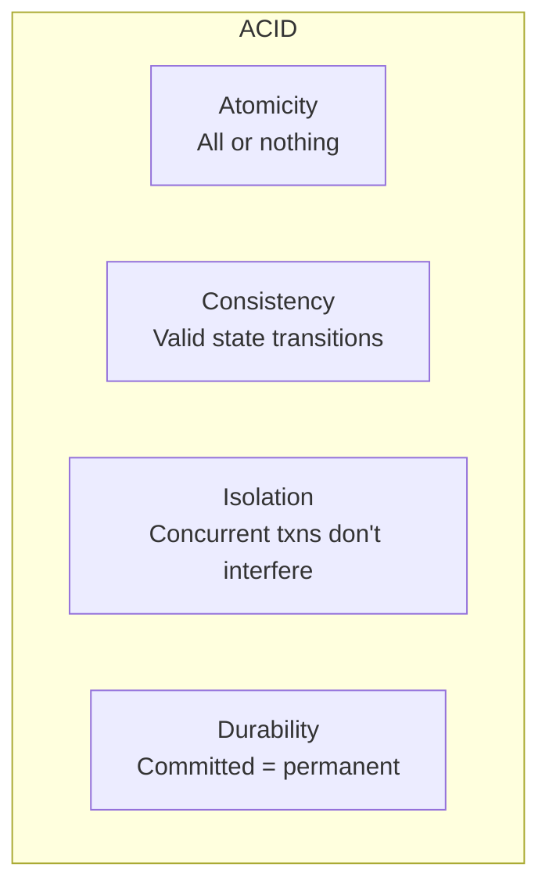
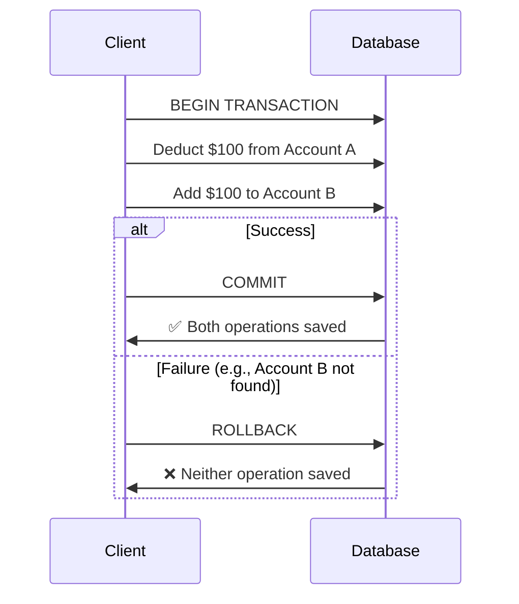
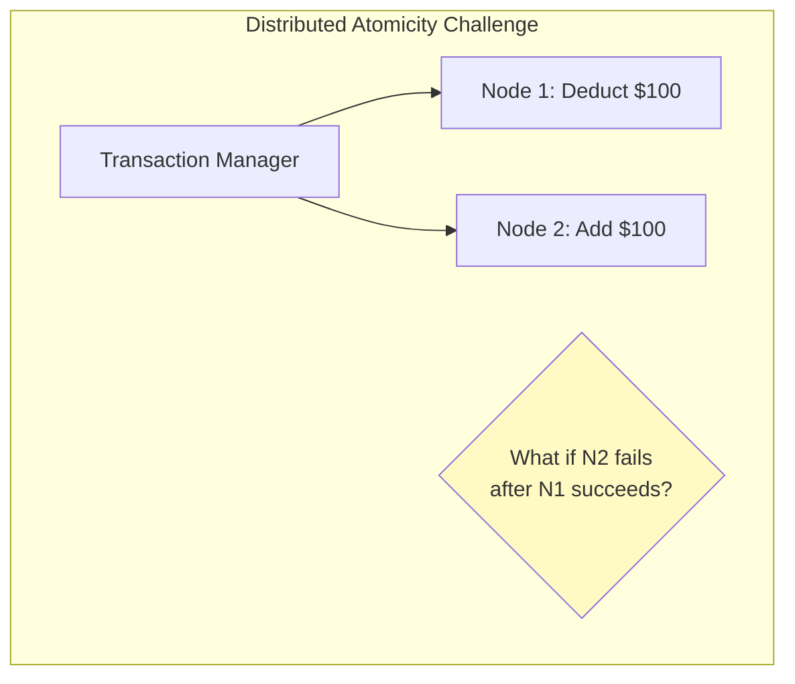
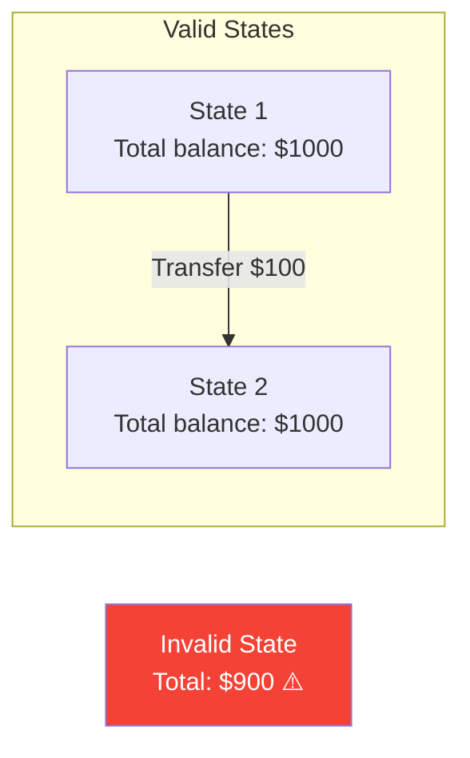
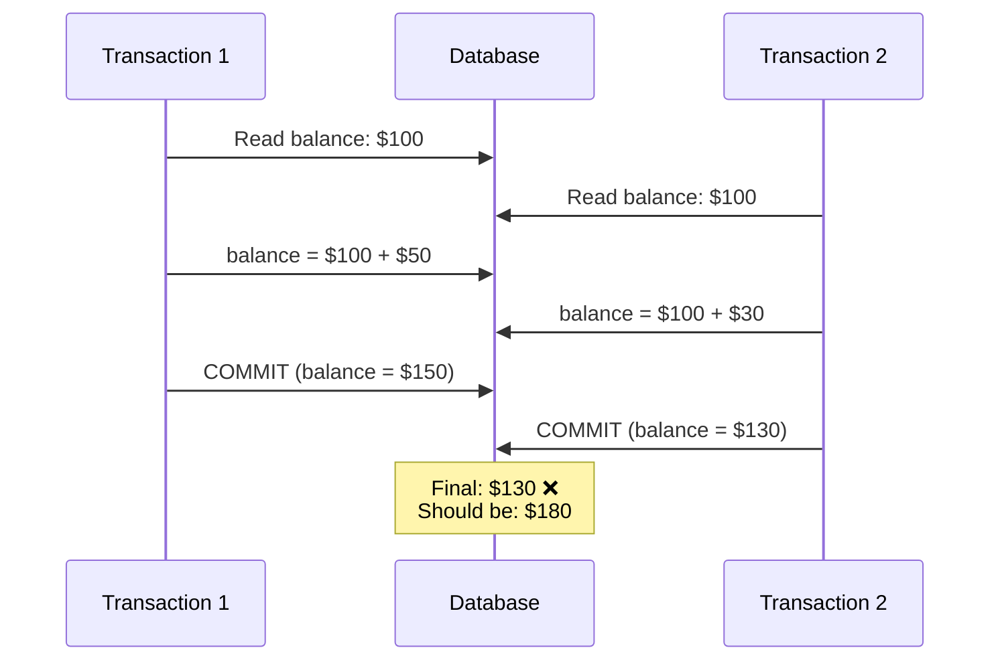
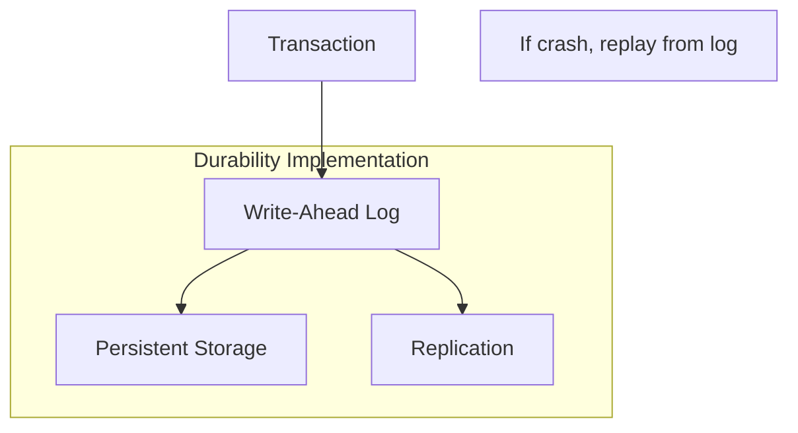
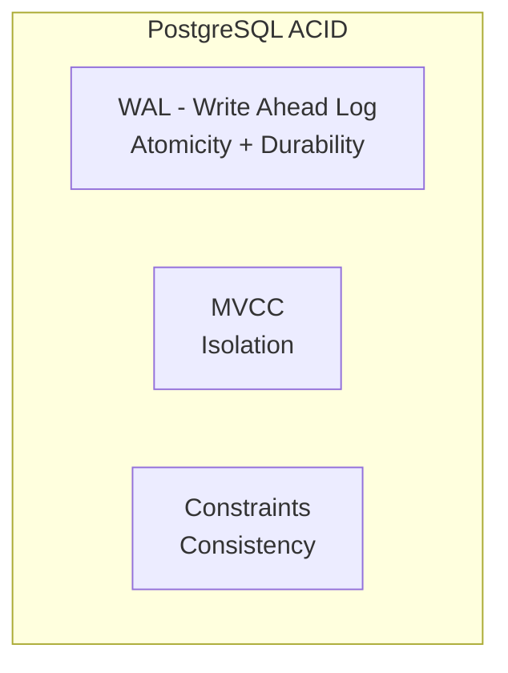
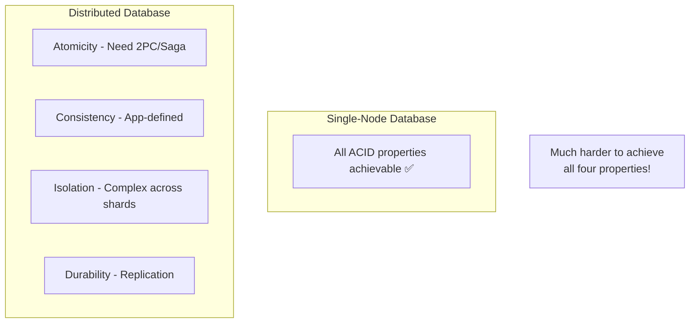

# ACID Transactions

> The bedrock of database reliability — but what does it really mean in distributed systems?

---

## 🎯 The ACID Properties



---

## ⚛️ Atomicity

> **"All or nothing"** — either all operations in a transaction succeed, or none do.



### In Distributed Systems



**Solution**: 2-Phase Commit (2PC), Saga Pattern — covered in Module 4

---

## 🔄 Consistency (ACID version)

> Transactions take the database from one **valid state** to another **valid state**.

⚠️ **NOT the same as CAP consistency!**



**Examples of constraints**:
- Foreign key relationships
- Unique constraints
- Check constraints (balance >= 0)
- Application-level invariants

### ACID Consistency vs CAP Consistency

| ACID Consistency | CAP Consistency |
|------------------|-----------------|
| Valid state after transaction | All nodes see same data |
| Application-defined rules | Every read gets latest write |
| Enforced by database | Replicas in sync |
| Single-node concept | Distributed concept |

---

## 🔒 Isolation

> Concurrent transactions don't see each other's intermediate states.



**Lost Update Problem!** — we'll cover isolation levels in detail later.

---

## 💾 Durability

> Once committed, data survives crashes, power outages, etc.



### In Distributed Systems

Single-node durability (writing to disk) isn't enough:
- Disk could fail
- Entire datacenter could go down

**Distributed durability**: Replicate to multiple nodes in different locations.

---

## 🏢 Real-World: How Databases Implement ACID

### PostgreSQL



### MongoDB (with Transactions)

```javascript
// MongoDB transaction example
session.startTransaction();
try {
    await coll.updateOne({ _id: 1 }, { $inc: { balance: -100 } }, { session });
    await coll.updateOne({ _id: 2 }, { $inc: { balance: 100 } }, { session });
    await session.commitTransaction();
} catch (error) {
    await session.abortTransaction();
}
```

---

## ⚠️ ACID in Distributed Systems: The Challenge



Many distributed databases provide:
- **Weaker isolation levels** (eventual consistency)
- **Single-row ACID only** (no multi-row transactions)
- **Opt-in strong consistency** (at performance cost)

---

## 📊 ACID Support by Database

| Database | Atomicity | Consistency | Isolation | Durability |
|----------|-----------|-------------|-----------|------------|
| PostgreSQL | ✅ Full | ✅ Constraints | ✅ Serializable | ✅ WAL |
| MySQL | ✅ Full | ✅ Constraints | ⚠️ Default: Repeatable Read | ✅ InnoDB |
| MongoDB | ✅ Multi-doc (4.0+) | ⚠️ App-level | ⚠️ Snapshot | ✅ WiredTiger |
| Cassandra | ⚠️ Row-level | ❌ Limited | ⚠️ Limited | ✅ Commitlog |
| DynamoDB | ⚠️ Item-level | ❌ Limited | ⚠️ Eventual/Strong | ✅ Multi-AZ |

---

## ✅ Key Takeaways

1. **Atomicity**: All or nothing — harder across nodes, need 2PC or Saga
2. **Consistency (ACID)**: Valid state transitions — NOT the same as CAP
3. **Isolation**: Concurrent transactions appear sequential — many levels exist
4. **Durability**: Committed = permanent — replication for distributed durability
5. **Full ACID in distributed systems is expensive** — often trade-offs are made

---

[← Back to Module](./README.md) | [Next: CAP Theorem →](./02-cap-theorem.md)
