# The CAP Theorem

> The most important theorem in distributed systems — understanding the fundamental trade-off.

---

## 🎯 The Theorem

> **It is impossible for a distributed system to simultaneously provide all three guarantees: Consistency, Availability, and Partition Tolerance.**


---

## 📋 The Three Guarantees

### C - Consistency

Every read receives the **most recent write** or an error.

```mermaid
sequenceDiagram
    participant C as Client
    participant N1 as Node 1
    participant N2 as Node 2
    
    C->>N1: Write X=5
    N1->>N2: Replicate X=5
    N2->>N1: ACK
    N1->>C: Success
    
    C->>N2: Read X
    N2->>C: X=5 ✅
    
    Note over C,N2: Consistent: N2<br/>returned latest value
```



### A - Availability

Every request receives a **non-error response** (no guarantee it's the latest).


### P - Partition Tolerance

System continues operating despite **network partitions**.

```mermaid
graph TB
    subgraph "Partition"
        N1[Node 1] -.X.-|Broken link| N2[Node 2]
    end
    
    C1[Client 1] --> N1
    C2[Client 2] --> N2
    
    Note[System must handle<br/>this scenario]
```

---

## ⚠️ The Key Insight

**Partition tolerance is NOT optional** in distributed systems!

Network partitions **will happen**:
- Cables cut
- Switch failures
- Datacenter issues
- Cloud provider problems

So the real choice is:


---

## 🔬 Proof (Simplified)


**Options**:
1. **N1 returns success** → N2 returns stale data → ❌ Not consistent
2. **N1 blocks write** → ❌ Not available
3. **N2 blocks read** → ❌ Not available

**No way to have all three during partition!**

---

## 📊 CP vs AP Systems

### CP Systems (Consistency + Partition Tolerance)

```mermaid
graph TB
    subgraph "CP System During Partition"
        M[Master] -.X.-|Partition| S[Slave]
        C[Client] -->|Write| M
        M -->|Error: Cannot reach quorum| C
    end
    
    style M fill:#2196f3,color:#fff
```

**Behavior**: Reject writes that can't be confirmed by quorum

**Examples**:
| System | Why CP? |
|--------|---------|
| ZooKeeper | Coordination needs consistency |
| etcd | Configuration must be consistent |
| HBase | Strong consistency for reads |
| Google Spanner | Global transactions need consistency |

### AP Systems (Availability + Partition Tolerance)

```mermaid
graph TB
    subgraph "AP System During Partition"
        N1[Node 1<br/>X=5] -.X.-|Partition| N2[Node 2<br/>X=3]
        C1[Client 1] -->|Write X=5| N1
        C2[Client 2] -->|Read X| N2
        N2 -->|X=3 (stale)| C2
    end
    
    style N1 fill:#4caf50,color:#fff
    style N2 fill:#4caf50,color:#fff
```

**Behavior**: Continue serving requests, accept inconsistency

**Examples**:
| System | Why AP? |
|--------|---------|
| Cassandra | High availability for writes |
| DynamoDB | Shopping cart should work |
| CouchDB | Offline-first applications |
| DNS | Must always resolve |

---

## 🔥 Real-World Incident: Amazon Shopping Cart

**Scenario** (from Dynamo paper):
- Customer adds item to cart
- Network partition occurs
- Cart service must respond

**Decision**: Availability > Consistency
- Let customer add items from any node
- Merge cart versions on checkout
- Better to have extra items than lose them


---

## 📈 CAP in Practice

### When NO Partition (Normal Operation)


**CAP only forces a choice DURING a partition!**

### System Classification


---

## ⚠️ Common Misconceptions

| Misconception | Reality |
|---------------|---------|
| "Pick two of three" | You must pick P; choice is C vs A during partition |
| "CA systems exist" | Only if you ignore partitions (single node) |
| "CAP is binary" | Many systems offer tunable consistency |
| "Always AP or always CP" | Some systems are configurable per-operation |

---

## ✅ Key Takeaways

1. **CAP says**: During partition, choose consistency OR availability
2. **Partition tolerance is mandatory** — networks fail
3. **CP systems**: Bank, coordination, config management
4. **AP systems**: Shopping cart, social feeds, DNS
5. **Normal operation**: Can have both C and A
6. **Many systems are tunable** (e.g., Cassandra, DynamoDB)

---

[← Previous: ACID](./01-acid-transactions.md) | [Next: PACELC Theorem →](./03-pacelc-theorem.md)
