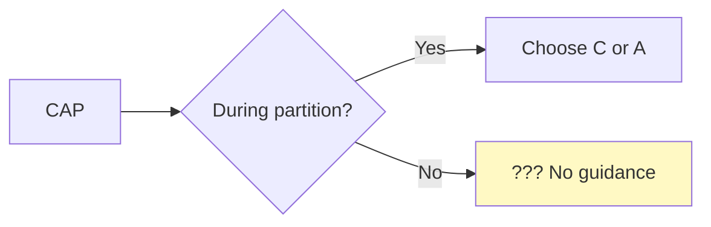
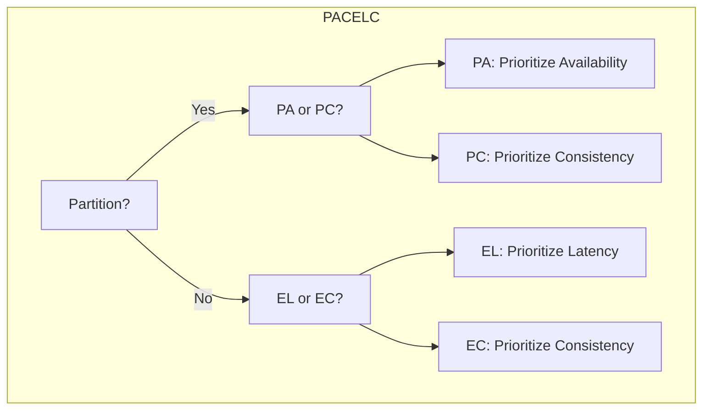
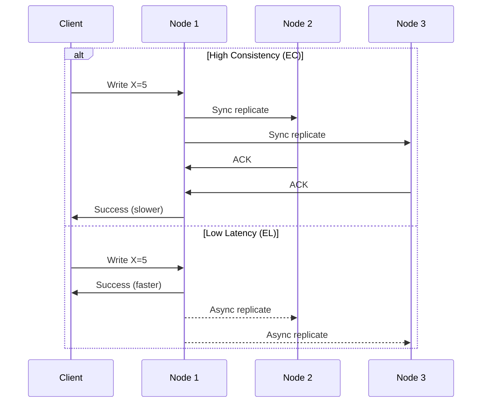
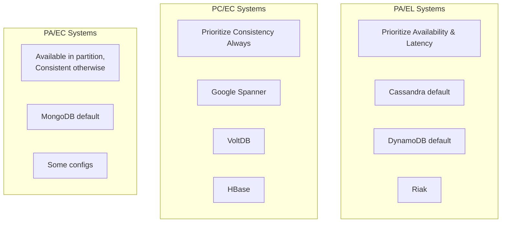
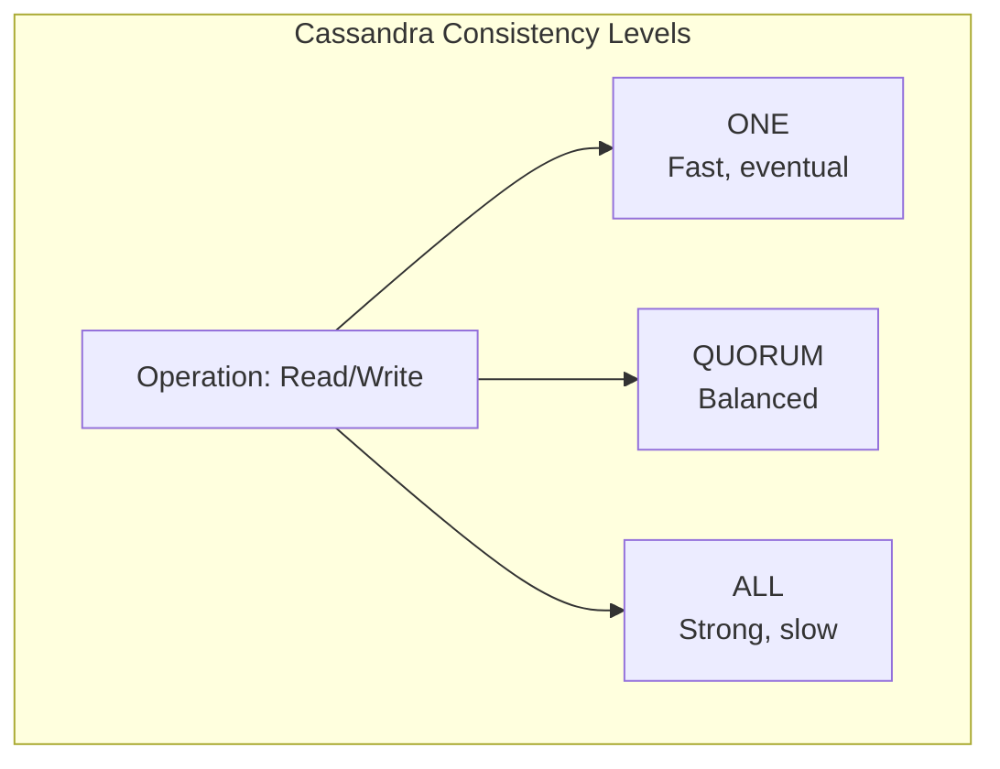
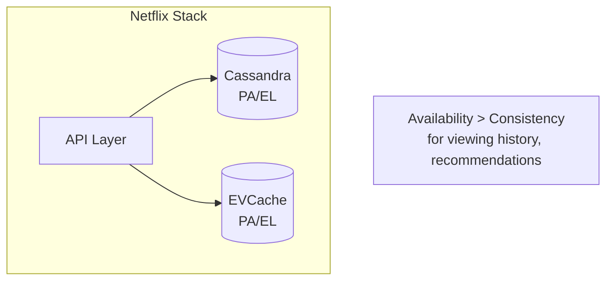
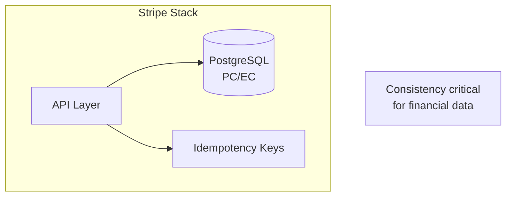
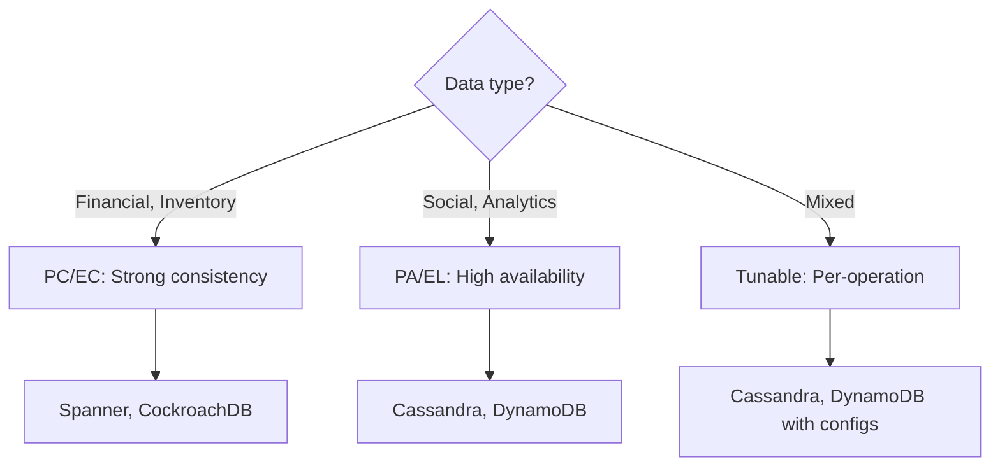

# The PACELC Theorem

> CAP's practical extension — what happens when there's NO partition?

---

## 🎯 The Problem with CAP

CAP only tells us what happens **during** a partition. But partitions are rare!

**What about normal operation?**



---

## 💡 PACELC: The Full Picture

> **P**artition → Choose **A**vailability or **C**onsistency  
> **E**lse (no partition) → Choose **L**atency or **C**onsistency



---

## 📊 Why Latency Matters

Even without partitions, there's a trade-off:



**EC (Else Consistency)**: Wait for replication → Higher latency  
**EL (Else Latency)**: Return immediately → Lower latency, eventual consistency

---

## 🗂️ PACELC Classification



---

## 📋 System Classification Table

| System | P (Partition) | E (Else/Normal) | Notes |
|--------|---------------|-----------------|-------|
| **Cassandra** | PA | EL | Tunable consistency per query |
| **DynamoDB** | PA | EL | Default eventual, optional strong |
| **Riak** | PA | EL | Designed for availability |
| **Spanner** | PC | EC | TrueTime enables strong consistency |
| **ZooKeeper** | PC | EC | Coordination requires consistency |
| **MongoDB** | PA | EC | Default: available, then consistent |
| **CockroachDB** | PC | EC | Serializable by default |
| **MySQL (async)** | PA | EL | Async replication for performance |

---

## 🔧 Tunable Consistency

Many modern databases let you choose per-operation:



### Cassandra Example

```cql
-- Fast write (PA/EL)
INSERT INTO users (id, name) VALUES (1, 'Alice')
  USING CONSISTENCY ONE;

-- Consistent write (PC/EC)
INSERT INTO users (id, name) VALUES (1, 'Alice')
  USING CONSISTENCY ALL;

-- Balanced read
SELECT * FROM users WHERE id = 1
  USING CONSISTENCY QUORUM;
```

---

## 🏢 Real-World Decisions

### Netflix: PA/EL by Default



**Why?**: Better to show slightly stale recommendations than error.

### Stripe: PC/EC for Payments



**Why?**: Money must never be lost or duplicated.

---

## 📈 Making the Choice



---

## 📊 Quick Reference

| Category | During Partition | Normal Operation | Use Case |
|----------|------------------|------------------|----------|
| **PA/EL** | Available | Low latency | Social feeds, IoT |
| **PA/EC** | Available | Consistent | General apps |
| **PC/EL** | Consistent | Low latency | (Rare) |
| **PC/EC** | Consistent | Consistent | Banking, inventory |

---

## ✅ Key Takeaways

1. **PACELC extends CAP** with what happens during normal operation
2. **The tradeoff**: Latency vs Consistency (even without partitions)
3. **PA/EL systems** (Cassandra, DynamoDB): Fast but eventually consistent
4. **PC/EC systems** (Spanner, ZooKeeper): Consistent but higher latency
5. **Modern databases are tunable** — choose per operation
6. **Choose based on your data**: Financial = PC/EC, Social = PA/EL

---

[← Previous: CAP Theorem](./02-cap-theorem.md) | [Next: Consistency Models →](./04-consistency-models.md)
