# Consistency Models

> Different levels of consistency guarantees in distributed systems.

---

## 🎯 The Spectrum

---

## 1️⃣ Linearizability (Strongest)

> Operations appear to happen **instantaneously** at some point between call and return.

```mermaid
sequenceDiagram
    participant C1 as Client 1
    participant S as System
    participant C2 as Client 2
    
    Note over S: X = 0
    C1->>S: Write X=1 (starts)
    Note over S: X = 1 (committed)
    C1->>S: (returns)
    C2->>S: Read X
    S->>C2: X=1 ✅
    
    Note over C1,C2: Once write returns,<br/>all reads see it
```

**Also known as**: Strong consistency, Atomic consistency

### Properties
- Reads always return latest write
- Operations appear atomic
- **Real-time ordering** maintained

### Real-World Examples
- **Spanner**: Uses TrueTime for linearizability
- **ZooKeeper**: Znodes are linearizable
- **etcd**: Raft-based linearizability

### Cost
- Requires coordination (latency)
- Lower availability during partitions

---

## 2️⃣ Sequential Consistency

> Operations appear in **same order** to all clients, but not necessarily real-time order.

### Key Difference from Linearizability

---

## 3️⃣ Causal Consistency

> Causally related operations appear in correct order; concurrent operations may vary.

### Causal Relationships

**Rule**: If operation B "knows about" operation A, A must come before B.

---

## 4️⃣ Eventual Consistency (Weakest)

> If no new writes, all replicas **eventually** converge to same value.

```mermaid
sequenceDiagram
    participant C as Client
    participant R1 as Replica 1
    participant R2 as Replica 2
    
    C->>R1: Write X=5
    R1->>C: OK
    
    Note over R1,R2: R2 still has X=0
    
    C->>R2: Read X
    R2->>C: X=0 (stale!)
    
    Note over R1,R2: Eventually syncs...
    
    R1-->>R2: Sync X=5
    
    C->>R2: Read X
    R2->>C: X=5 ✅
```

### Variations

| Variant | Guarantee |
|---------|-----------|
| **Read-your-writes** | You see your own writes |
| **Monotonic reads** | Never see older values after newer |
| **Monotonic writes** | Your writes applied in order |
| **Session consistency** | Guarantees within a session |

---

## 📊 Comparison Table

| Model | Guarantee | Latency | Use Case |
|-------|-----------|---------|----------|
| **Linearizable** | Real-time, atomic | Highest | Leader election, locks |
| **Sequential** | Same order for all | High | Some consistency needed |
| **Causal** | Cause before effect | Medium | Social features |
| **Eventual** | Will converge | Lowest | Analytics, caching |

---

## 🏢 Real-World: Social Media Example

**Causal consistency is perfect here**:
- Post appears before reactions (causal)
- Order of reactions can vary (concurrent, OK)
- Lower latency than linearizable

---

## 🔥 Real-World Incident: Amazon S3 (2006)

**S3's eventual consistency caused issues**:

```mermaid
sequenceDiagram
    participant App as Application
    participant S3 as S3
    
    App->>S3: PUT object/config.json
    S3->>App: 200 OK
    App->>S3: GET object/config.json
    S3->>App: 404 Not Found ⚠️
    
    Note over App,S3: Eventual consistency!<br/>Object not yet visible
```

**Fix (2020)**: S3 now offers strong read-after-write consistency!

---

## 🔧 Choosing the Right Model

---

## ✅ Key Takeaways

1. **Linearizability**: Strongest, most expensive — for coordination
2. **Sequential**: Same order for all, not real-time
3. **Causal**: Preserves cause-effect — good for social features
4. **Eventual**: Weakest, fastest — for analytics, caching
5. **Choose based on requirements** — don't over-engineer
6. **S3 incident shows** even big systems struggle with consistency

---

[← Previous: PACELC](./03-pacelc-theorem.md) | [Next: Isolation Levels →](./05-isolation-levels.md)
