# Isolation Levels

> How concurrent transactions interact — and the anomalies that can occur.

---

## 🎯 The Problem

When transactions run concurrently, they can interfere:


**Lost Update!** — T2's read was stale.

---

## 📊 Isolation Levels (SQL Standard)


---

## 🐛 Anomalies (What Can Go Wrong)

### 1. Dirty Read

Reading **uncommitted** data from another transaction.


**Prevented by**: Read Committed and above

---

### 2. Non-Repeatable Read

Reading same row twice, getting different values.

```mermaid
sequenceDiagram
    participant T1 as Transaction 1
    participant DB as Database
    participant T2 as Transaction 2
    
    T1->>DB: Read X (100)
    T2->>DB: Write X=200
    T2->>DB: COMMIT
    T1->>DB: Read X (200) ⚠️
    
    Note over T1: Same query,<br/>different result!
```



**Prevented by**: Repeatable Read and above

---

### 3. Phantom Read

Query returns different **rows** on re-execution.

```mermaid
sequenceDiagram
    participant T1 as Transaction 1
    participant DB as Database
    participant T2 as Transaction 2
    
    T1->>DB: SELECT * WHERE age > 25<br/>(returns 3 rows)
    T2->>DB: INSERT user (age=30)
    T2->>DB: COMMIT
    T1->>DB: SELECT * WHERE age > 25<br/>(returns 4 rows) ⚠️
    
    Note over T1: New row appeared!<br/>(phantom)
```



**Prevented by**: Serializable only

---

### 4. Write Skew

Two transactions read, then write based on stale reads.

```mermaid
sequenceDiagram
    participant T1 as Doctor 1
    participant DB as On-Call DB
    participant T2 as Doctor 2
    
    Note over DB: Alice=ON, Bob=ON<br/>(Rule: 1 must be ON)
    
    T1->>DB: Check: 2 doctors ON ✓
    T2->>DB: Check: 2 doctors ON ✓
    T1->>DB: Set Alice=OFF
    T2->>DB: Set Bob=OFF
    T1->>DB: COMMIT
    T2->>DB: COMMIT
    
    Note over DB: Alice=OFF, Bob=OFF<br/>NO ONE ON CALL! ❌
```



**Prevented by**: Serializable only

---

## 📋 Isolation Level Matrix

| Level | Dirty Read | Non-Repeatable | Phantom | Write Skew |
|-------|------------|----------------|---------|------------|
| Read Uncommitted | ✅ Possible | ✅ Possible | ✅ Possible | ✅ Possible |
| Read Committed | ❌ Prevented | ✅ Possible | ✅ Possible | ✅ Possible |
| Repeatable Read | ❌ Prevented | ❌ Prevented | ✅ Possible | ✅ Possible |
| Serializable | ❌ Prevented | ❌ Prevented | ❌ Prevented | ❌ Prevented |

---

## 🔧 How Databases Implement Isolation

### 1. Locking (Pessimistic)


**Types**:
- **Shared lock**: Multiple readers OK
- **Exclusive lock**: Single writer only
- **Range locks**: Prevent phantoms

### 2. MVCC (Multi-Version Concurrency Control)


**How it works**:
- Each transaction sees a **snapshot**
- Old versions retained for ongoing transactions
- No blocking for readers!

**Used by**: PostgreSQL, MySQL InnoDB, Oracle

---

## 🏢 Database Defaults

| Database | Default Isolation |
|----------|-------------------|
| PostgreSQL | Read Committed |
| MySQL (InnoDB) | Repeatable Read |
| SQL Server | Read Committed |
| Oracle | Read Committed |
| CockroachDB | Serializable |

---

## 🔥 Real-World: The Ticket Booking Problem

```mermaid
sequenceDiagram
    participant U1 as User 1
    participant DB as Database
    participant U2 as User 2
    
    Note over DB: Seats available: 1
    
    U1->>DB: Check seats (1 available)
    U2->>DB: Check seats (1 available)
    U1->>DB: Book seat
    U2->>DB: Book seat
    U1->>DB: COMMIT
    U2->>DB: COMMIT
    
    Note over DB: 2 bookings for 1 seat! ❌
```



**Solutions**:
1. **Serializable isolation** (expensive)
2. **Explicit locking**: `SELECT ... FOR UPDATE`
3. **Optimistic locking**: Version column + retry

```sql
-- Solution: SELECT FOR UPDATE
BEGIN;
SELECT * FROM seats WHERE id = 1 FOR UPDATE;
-- Blocks other transactions
UPDATE seats SET booked = true WHERE id = 1;
COMMIT;
```

---

## 📊 Choosing Isolation Level


---

## ✅ Key Takeaways

1. **Isolation levels** define what anomalies are possible
2. **Higher isolation = less anomalies but more blocking**
3. **Dirty reads**: Prevented by Read Committed (most DBs default)
4. **Serializable**: Full isolation, but expensive
5. **MVCC**: Enables readers without blocking
6. **SELECT FOR UPDATE**: Explicit locking when needed
7. **Write skew**: Only prevented by Serializable

---

[← Previous: Consistency Models](./04-consistency-models.md) | [Back to Module →](./README.md)
