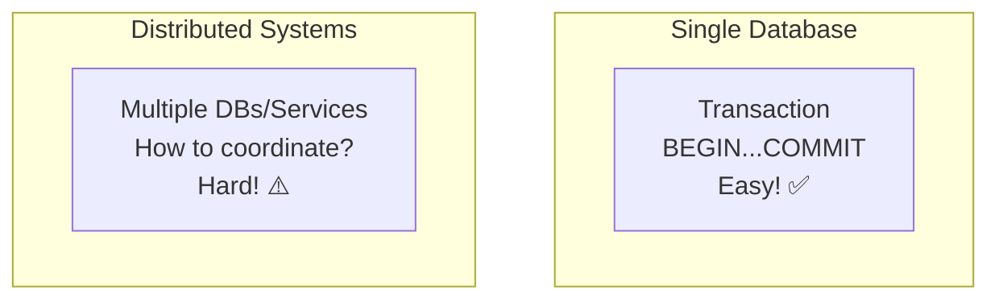
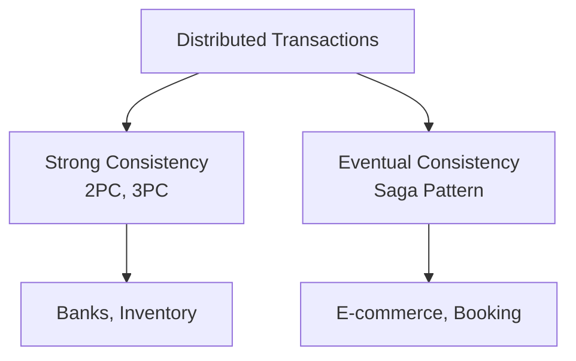

# Introduction to Distributed Transactions

> Making multiple operations across different systems behave as one atomic unit.

---

## 🍕 **Pizza Ordering Analogy**

Imagine ordering a pizza online:
1. Your payment is charged
2. The restaurant receives the order
3. The delivery is scheduled

**What if step 2 fails after step 1 succeeds?**
- You paid but no pizza! 😱
- This is the **distributed transaction problem**

---

## 🎯 The Challenge

---

## 📋 Why Distributed Transactions Are Hard

| Challenge | Description | Analogy |
|-----------|-------------|---------|
| **Network Failures** | Messages can be lost | Like a phone call dropping |
| **Partial Failures** | Some nodes succeed, some fail | Half the team shows up |
| **Timeouts** | Can't tell slow from dead | Is the pizza oven broken or just slow? |
| **Coordination** | All must agree | Getting 5 friends to agree on dinner |

---

## 🔗 Types of Distributed Transactions

---

## 🏠 **House Building Analogy**

Think of it like building a house with multiple contractors:

| Approach | Analogy | Real-World |
|----------|---------|------------|
| **2PC** | All contractors confirm ready, then all start together | Traditional banking |
| **3PC** | Add pre-confirmation step before starting | High-reliability systems |
| **Saga** | Each contractor works independently, undo if problems | Modern microservices |

---

## 📊 Quick Comparison

| Method | Consistency | Availability | Complexity | Use Case |
|--------|-------------|--------------|------------|----------|
| 2PC | Strong ✅ | Lower ❌ | Medium | Banking |
| 3PC | Strong ✅ | Medium | High | Critical systems |
| Saga | Eventual ⚠️ | High ✅ | Medium | Microservices |

---

## ✅ Key Takeaways

1. **Distributed transactions** = Coordinating across multiple systems
2. **Hard because** of network failures, partial failures, timeouts
3. **2PC/3PC** for strong consistency (blocking)
4. **Saga** for high availability (compensating actions)
5. **Choose based on requirements**: Strong consistency vs availability

---

[← Back to Module](./README.md) | [Next: Two-Phase Commit →](./02-two-phase-commit.md)
