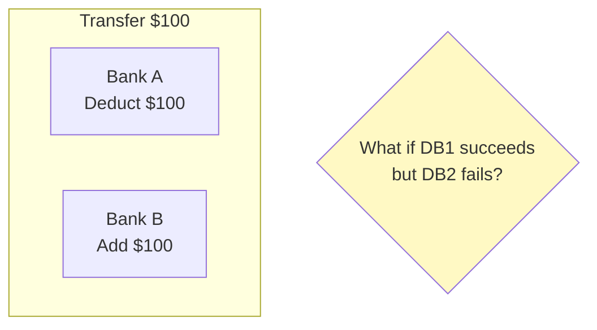
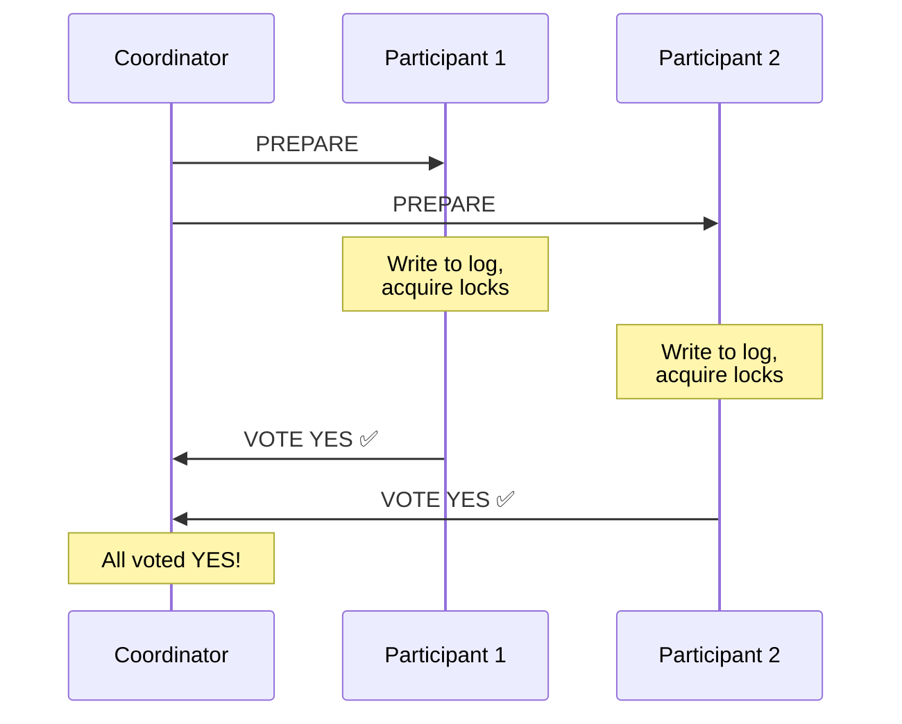
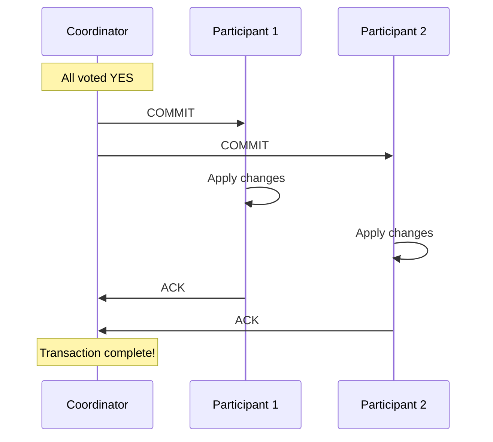
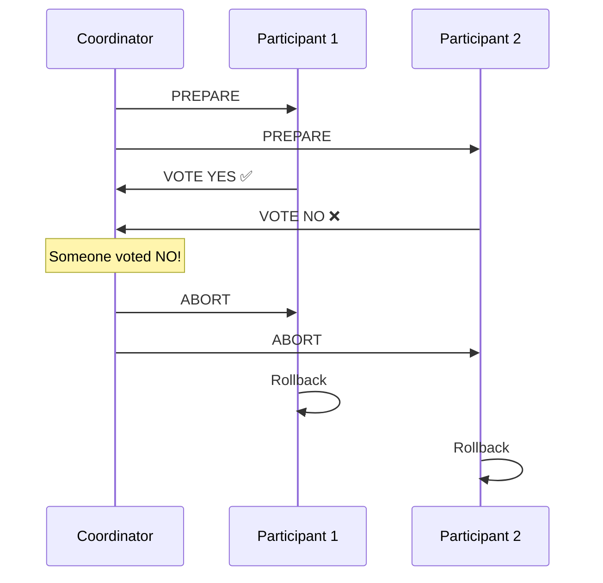
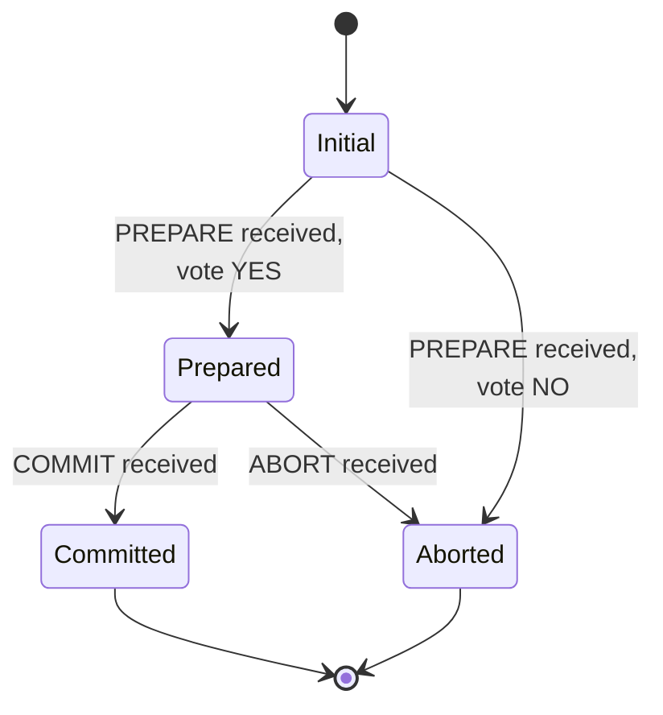
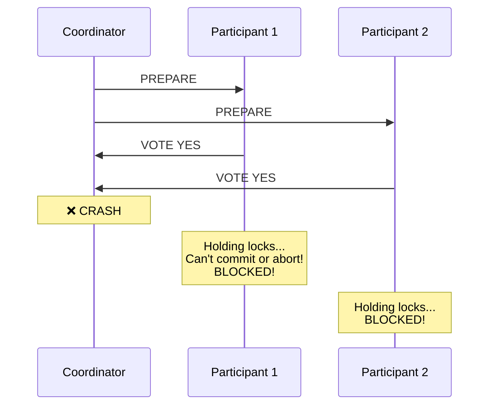
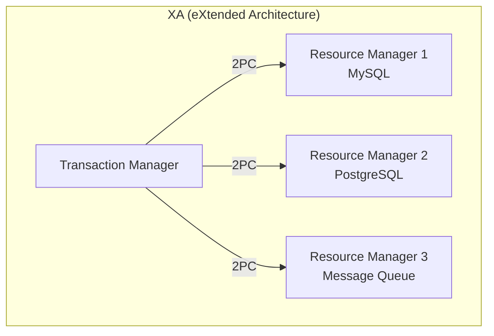
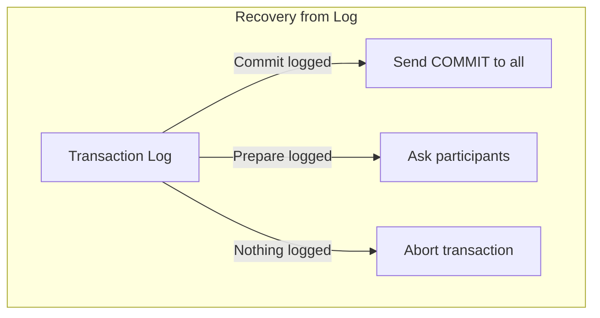

# Two-Phase Commit (2PC)

> The classic protocol for distributed atomic transactions.

---

## 🎯 The Problem

**We need atomicity across multiple databases!**

---

## 📋 The Protocol

### Phase 1: Prepare (Voting)

### Phase 2: Commit (Decision)

### Abort Scenario

---

## 🔒 Participant State Machine

---

## ⚠️ The Blocking Problem

What if the **coordinator crashes** after PREPARE?

**Participants are stuck!** They can't decide without coordinator.

---

## 🔥 Real-World: XA Transactions

**XA standard** implements 2PC for distributed transactions across:
- Multiple databases
- Databases + message queues
- Different database vendors

---

## 📊 2PC Trade-offs

| Pros | Cons |
|------|------|
| ✅ Atomicity guaranteed | ❌ Blocking on coordinator failure |
| ✅ Widely supported (XA) | ❌ High latency (multiple round trips) |
| ✅ Strong consistency | ❌ Holds locks during protocol |
| ✅ Simple to understand | ❌ Single point of failure |

---

## 🔧 Handling Failures

### Coordinator Recovery

### Participant Recovery

1. Check local log
2. If PREPARED but no decision → ask coordinator
3. If COMMITTED/ABORTED → replay decision

---

## ✅ Key Takeaways

1. **2PC** = Prepare phase + Commit phase
2. **All or nothing**: Either all commit or all abort
3. **Blocking protocol**: Coordinator failure blocks participants
4. **XA standard** implements 2PC across databases
5. **Use when**: Strong consistency required, can tolerate blocking
6. **Avoid when**: High availability required, long-running transactions

---

[← Back to Module](./README.md) | [Next: Three-Phase Commit →](./03-three-phase-commit.md)
