# Three-Phase Commit (3PC)

> Non-blocking improvement over 2PC — but with trade-offs.

---

## 🚦 **Traffic Light Analogy**

**2PC** = Red → Green (two states)
- Problem: What if signal controller dies while changing?

**3PC** = Red → Yellow → Green (three states)
- Yellow = "Get ready to go"
- Less likely to get stuck!

---

## 🎯 The Problem with 2PC

**2PC is blocking** — participants can't proceed without coordinator.

---

## 📋 3PC Adds a Pre-Commit Phase

---

## 🔄 The Three Phases

### Phase 1: CanCommit?

```mermaid
sequenceDiagram
    participant C as Coordinator
    participant P1 as P1
    participant P2 as P2
    
    C->>P1: CanCommit?
    C->>P2: CanCommit?
    
    P1->>C: Yes ✅
    P2->>C: Yes ✅
```

**Lightweight check** — No locks yet!

### Phase 2: PreCommit

### Phase 3: DoCommit

---

## 🎭 **Wedding Ceremony Analogy**

| Phase | Wedding | 3PC |
|-------|---------|-----|
| **CanCommit?** | "Do you take...?" (just asking) | Probe for readiness |
| **PreCommit** | "I do" (committed but not finished) | Lock resources |
| **DoCommit** | "I pronounce you..." | Finalize |

If the officiant faints after "PreCommit", the couple knows they both said "I do" and can continue!

---

## ✨ Why 3PC Is Non-Blocking

```mermaid
sequenceDiagram
    participant C as Coordinator
    participant P1 as P1
    participant P2 as P2
    
    C->>P1: PreCommit
    C->>P2: PreCommit
    P1->>C: ACK
    P2->>C: ACK
    
    Note over C: ❌ CRASH after PreCommit
    
    Note over P1: Timeout...<br/>I got PreCommit ✓<br/>Others must have too
    Note over P2: Timeout...<br/>I got PreCommit ✓
    
    Note over P1,P2: Elect new coordinator<br/>→ DoCommit!
```

**Key insight**: If you're in PreCommit, everyone must be!

---

## ⚠️ The Network Partition Problem

```mermaid
graph TB
    subgraph "Partition A"
        C[Coordinator]
        P1[P1: PreCommit]
    end
    
    subgraph "Partition B"
        P2[P2: CanCommit]
        P3[P3: CanCommit]
    end
    
    Note[A commits, B aborts!<br/>INCONSISTENT! ❌]
```

**3PC doesn't handle network partitions well!**

---

## 📊 2PC vs 3PC Comparison

| Aspect | 2PC | 3PC |
|--------|-----|-----|
| Phases | 2 | 3 |
| Blocking? | Yes ❌ | No* ✅ |
| Network partition safe? | No | No |
| Messages | Fewer | More |
| Latency | Lower | Higher |
| Complexity | Lower | Higher |

*Non-blocking only without network partitions

---

## 🏢 Real-World Usage

**3PC is rarely used in practice because:**
1. Doesn't handle partitions (most common failure)
2. More complex than 2PC
3. Higher latency

**What's used instead?**
- **Paxos/Raft** for consensus
- **Saga pattern** for long transactions
- **2PC with timeouts** for short transactions

---

## ✅ Key Takeaways

1. **3PC adds PreCommit phase** to allow recovery without coordinator
2. **Non-blocking** when there are no network partitions
3. **Still fails** with network partitions
4. **Higher latency** due to extra round trip
5. **Rarely used** — Paxos/Raft are preferred for true fault tolerance

---

[← Previous: 2PC](./02-two-phase-commit.md) | [Next: Saga Pattern →](./04-saga-pattern.md)
