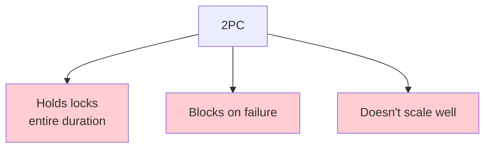
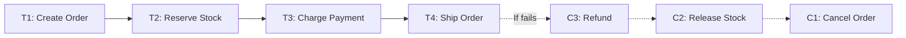
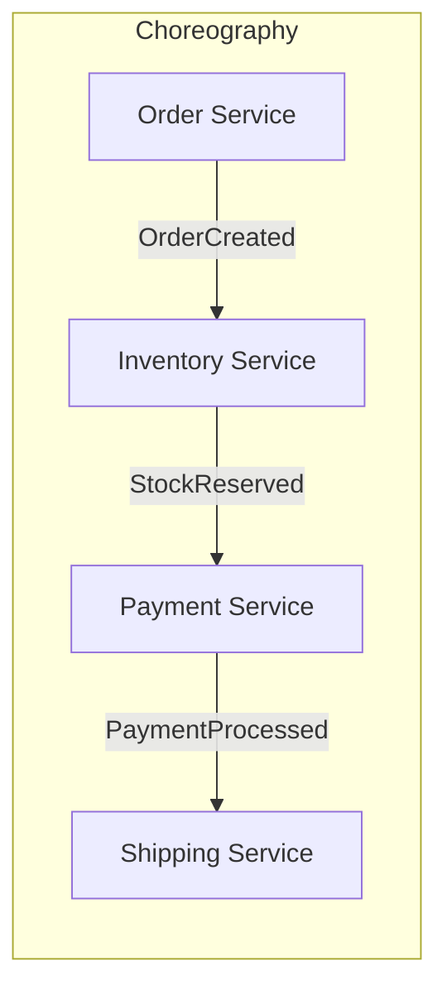
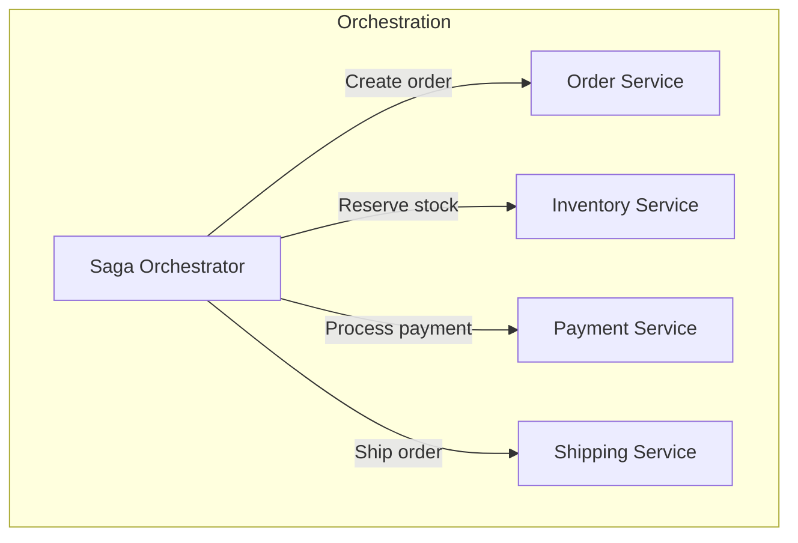
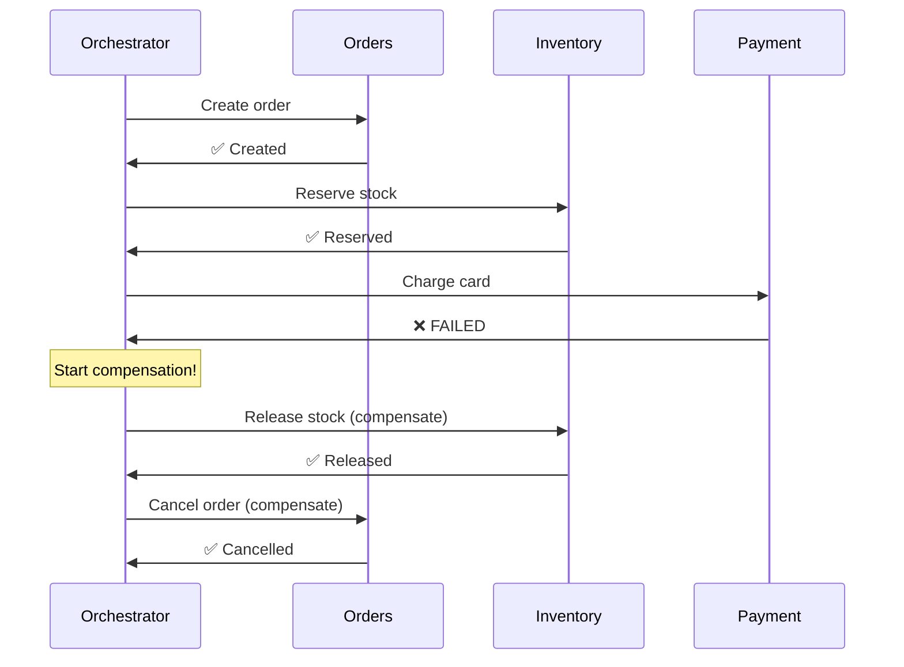
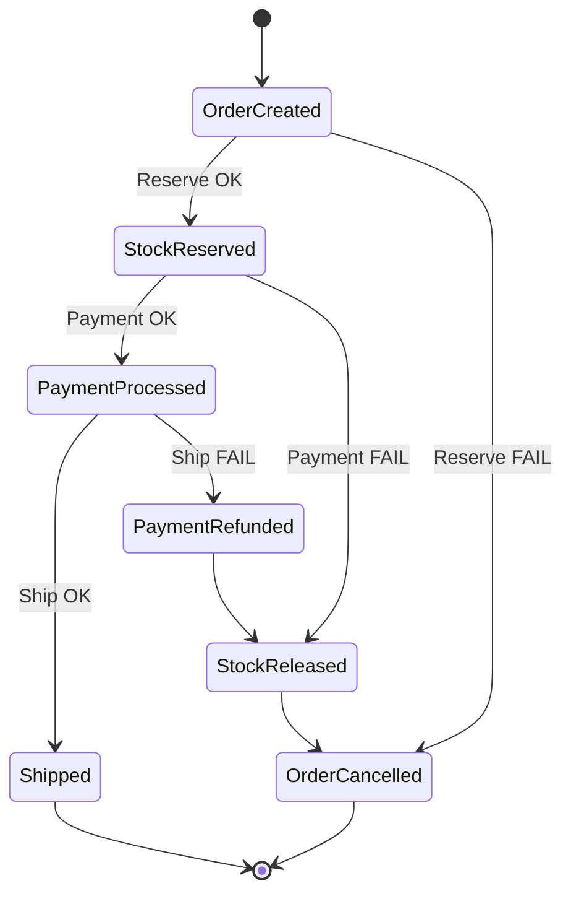
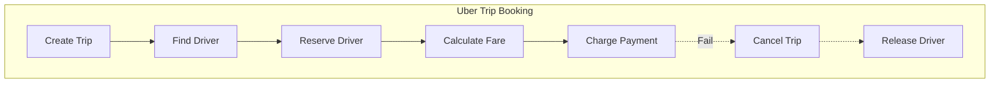

# The Saga Pattern

> Managing long-running distributed transactions through compensating actions.

---

## 🎯 The Problem with 2PC

**For long-running transactions, 2PC is impractical!**

---

## 💡 The Saga Solution

Instead of one atomic transaction, break it into:
- **Local transactions** (each atomic by itself)
- **Compensating transactions** (to undo if needed)

---

## 📋 Saga Types

### 1. Choreography (Event-Driven)

Each service:
1. Listens for events
2. Does its work
3. Publishes next event

**Pros**: Decoupled, simple  
**Cons**: Hard to track, scattered logic

### 2. Orchestration (Central Coordinator)

Orchestrator:
1. Executes steps in order
2. Handles failures
3. Triggers compensations

**Pros**: Centralized logic, easier to understand  
**Cons**: Orchestrator is a coupling point

---

## 🔄 Compensation Example

---

## 🔧 Saga State Machine

---

## 🔥 Real-World: Uber Trip Saga

**Uber uses Cadence/Temporal** for saga orchestration!

---

## 📊 Saga vs 2PC

| Aspect | 2PC | Saga |
|--------|-----|------|
| Atomicity | ✅ Full | ⚠️ Eventual (semantic) |
| Isolation | ✅ Full | ❌ None (intermediate visible) |
| Availability | ❌ Lower (blocking) | ✅ Higher |
| Latency | ❌ Higher (locks) | ✅ Lower |
| Complexity | Lower | Higher (compensations) |

---

## ⚠️ Saga Challenges

### 1. Dirty Reads
Other transactions see intermediate state.

### 2. Compensation Complexity
Some actions are hard to undo (e.g., sent email).

### 3. Ordering
Need to ensure compensations run in reverse order.

### Solution Patterns

| Problem | Solution |
|---------|----------|
| Dirty reads | Semantic locks, read-your-writes |
| Hard to undo | Plan for idempotent compensations |
| Tracking | Use saga state machine, event sourcing |

---

## 🛠️ Implementation Tools

| Tool | Type | Used By |
|------|------|---------|
| **Temporal** | Orchestration | Netflix, Uber, Stripe |
| **Camunda** | Orchestration | Enterprise |
| **Kafka + Debezium** | Choreography | Event-driven apps |
| **AWS Step Functions** | Orchestration | AWS-native |

---

## ✅ Key Takeaways

1. **Saga** = Sequence of local transactions with compensating actions
2. **Choreography**: Event-driven, decoupled but complex
3. **Orchestration**: Centralized coordinator, easier to reason about
4. **Compensations** must be idempotent and well-defined
5. **No isolation**: Intermediate state is visible
6. **Use for**: Long-running processes, microservices, high availability

---

[← Previous: 3PC](./03-three-phase-commit.md) | [Next: Concurrency Control →](./05-concurrency-control.md)
