# Concurrency Control

> Preventing conflicts when multiple transactions access the same data.

---

## 🏪 **Grocery Store Analogy**

Two people want the last milk carton at the same time:

| Approach | Analogy | Technical Name |
|----------|---------|----------------|
| **Pessimistic** | Put hand on carton first | Locking |
| **Optimistic** | Both grab, one puts back at checkout | MVCC + Retry |

---

## 🎯 The Problem

```mermaid
sequenceDiagram
    participant T1 as Transaction 1
    participant DB as Database
    participant T2 as Transaction 2
    
    Note over DB: Balance = $100
    T1->>DB: Read balance (100)
    T2->>DB: Read balance (100)
    T1->>DB: balance = 100 + 50
    T2->>DB: balance = 100 + 30
    
    Note over DB: Final: $130 ❌<br/>Should be: $180
```



**Lost Update Problem!**

---

## 🔒 Pessimistic Concurrency Control

> "Lock first, ask questions later"

### How It Works



```mermaid
sequenceDiagram
    participant T1 as Transaction 1
    participant Lock as Lock Manager
    participant T2 as Transaction 2
    
    T1->>Lock: Acquire lock on row X
    Lock->>T1: ✅ Lock granted
    
    T2->>Lock: Acquire lock on row X
    Lock->>T2: ⏳ WAIT...
    
    T1->>T1: Read, modify, write
    T1->>Lock: Release lock
    
    Lock->>T2: ✅ Lock granted
    T2->>T2: Read, modify, write
```

### Lock Types

| Lock Type | Allows | Blocks |
|-----------|--------|--------|
| **Shared (S)** | Other reads | Writes |
| **Exclusive (X)** | Nothing | Everything |
| **Update (U)** | Reads | Other updates, writes |

### 🚗 **Parking Space Analogy**

- **Shared Lock** = Multiple cars can LOOK at the space
- **Exclusive Lock** = One car PARKED in the space

---

## ✨ Optimistic Concurrency Control (OCC)

> "Hope for the best, check at the end"

### How It Works



```mermaid
sequenceDiagram
    participant T1 as Transaction 1
    participant DB as Database
    participant T2 as Transaction 2
    
    T1->>DB: Read row (version=1)
    T2->>DB: Read row (version=1)
    
    T1->>DB: Write (if version=1)
    DB->>T1: ✅ Success (version=2)
    
    T2->>DB: Write (if version=1)
    DB->>T2: ❌ CONFLICT! Version is now 2
    
    T2->>T2: Retry from beginning
```

### Version Check Patterns

```sql
-- Version column
UPDATE accounts 
SET balance = 150, version = version + 1
WHERE id = 1 AND version = 5;

-- If 0 rows affected → conflict!
```

---

## 📊 Pessimistic vs Optimistic

| Aspect | Pessimistic | Optimistic |
|--------|-------------|------------|
| **When to lock** | Before access | Never (check at commit) |
| **Conflict handling** | Wait | Retry |
| **Best for** | High contention | Low contention |
| **Performance** | Lock overhead | Retry overhead |
| **Deadlocks** | Possible ⚠️ | Not possible ✅ |

---

## 🍽️ **Restaurant Reservation Analogy**

| Scenario | Pessimistic | Optimistic |
|----------|-------------|------------|
| **Strategy** | Call ahead, reserve table | Walk in, hope for seat |
| **High demand** | Safe but others wait | May get turned away |
| **Low demand** | Unnecessary overhead | Works great! |

---

## 💀 Deadlocks

When two transactions wait for each other forever:

```mermaid
graph TB
    T1[Transaction 1<br/>Holds: A<br/>Wants: B]
    T2[Transaction 2<br/>Holds: B<br/>Wants: A]
    
    T1 -->|Waiting for| T2
    T2 -->|Waiting for| T1
    
    Note[DEADLOCK! ❌]
    
    style Note fill:#f44336,color:#fff
```



### Solutions

| Solution | How |
|----------|-----|
| **Detection** | Find cycles, abort one |
| **Prevention** | Always acquire locks in order |
| **Timeout** | Give up after waiting too long |

---

## 🔧 MVCC (Multi-Version Concurrency Control)

> Readers never block writers!


**Used by**: PostgreSQL, MySQL InnoDB, Oracle

---

## 🏢 Real-World Implementations

| Database | Default Approach |
|----------|------------------|
| PostgreSQL | MVCC + Pessimistic locks available |
| MySQL InnoDB | MVCC + Row-level locking |
| MongoDB | Optimistic (WiredTiger) |
| Cassandra | Last-write-wins (LWW) |
| Spanner | Pessimistic (2PL) |

---

## ✅ Key Takeaways

1. **Pessimistic** = Lock early, prevent conflicts
2. **Optimistic** = Check late, retry on conflict
3. **Use pessimistic** when conflicts are likely
4. **Use optimistic** when conflicts are rare
5. **MVCC** lets readers and writers coexist
6. **Deadlocks** are the main risk with pessimistic locking

---

[← Previous: Saga Pattern](./04-saga-pattern.md) | [Back to Module →](./README.md)
