# The Consensus Problem

> Getting distributed nodes to agree on a single value.

---

## 🎯 What is Consensus?

> **Consensus** = All nodes agreeing on the same value, even when some nodes fail.

```mermaid
graph TB
    subgraph "Consensus Example"
        N1[Node 1<br/>Proposes: A]
        N2[Node 2<br/>Proposes: B]
        N3[Node 3<br/>Proposes: C]
        
        Result[All agree: B ✅]
        
        N1 --> Result
        N2 --> Result
        N3 --> Result
    end
```

---

## 📋 Requirements

A valid consensus algorithm must satisfy:

### 1. Agreement

All non-faulty nodes decide on the **same value**.

### 2. Validity

The decided value must have been proposed by some node.

```mermaid
graph TB
    Proposed[Proposed values: A, B, C]
    Decided[Decided: B ✅]
    Invalid[Decided: Z ❌<br/>Never proposed!]
    
    Proposed --> Decided
    Proposed -.->|Invalid| Invalid
    
    style Invalid fill:#f44336,color:#fff
```

### 3. Termination (Liveness)

All non-faulty nodes **eventually** decide.

---

## 🔧 Use Cases for Consensus

### 1. Leader Election

### 2. Distributed Locking

### 3. Atomic Broadcast / State Machine Replication

---

## ⚠️ Why Is It Hard?

### 1. Failures Happen

```mermaid
graph TB
    N1[Node 1 ✅]
    N2[Node 2 ❌ Crashed]
    N3[Node 3 ✅]
    N4[Node 4 ⚠️ Slow]
    
    Q{How do remaining<br/>nodes agree?}
```

### 2. Network Delays

### 3. Partial Failures

---

## 🔥 Real-World: Cloudflare 2020 Outage

**What happened**:
1. Multiple etcd nodes in cluster
2. Leader election triggered
3. Bug caused repeated elections
4. No stable leader → service degradation

**Lesson**: Consensus algorithms need careful configuration and testing.

---

## 📊 Summary

| Requirement | Description | Challenge |
|-------------|-------------|-----------|
| Agreement | All decide same | Failures change views |
| Validity | Decided was proposed | Trivial |
| Termination | All eventually decide | FLP impossibility! |

---

## ✅ Key Takeaways

1. **Consensus** = agreeing on a single value despite failures
2. **Three requirements**: Agreement, Validity, Termination
3. **Use cases**: Leader election, distributed locks, state machine replication
4. **Hard because**: Failures, delays, partial failures
5. **FLP says**: Can't guarantee termination in async systems with failures

---

[← Back to Module](./README.md) | [Next: FLP Impossibility →](./02-flp-impossibility.md)
