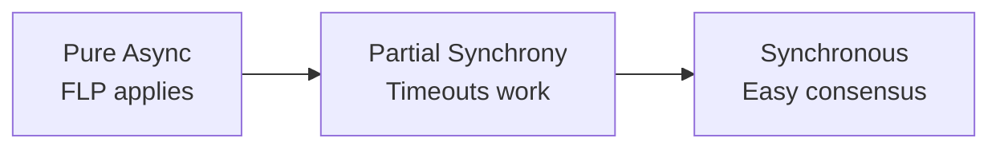

# FLP Impossibility

> The most important impossibility result in distributed computing.

---

## 🎯 The Theorem

> **In an asynchronous system with even ONE faulty process, no algorithm can guarantee consensus.**

Named after **Fischer, Lynch, and Paterson** (1985).

---

## 📋 What It Actually Says

### The Three Consensus Properties

| Property | Description |
|----------|-------------|
| **Agreement** | All nodes decide same value |
| **Validity** | Decided value was proposed |
| **Termination** | All nodes eventually decide |

### FLP Result

> You **cannot guarantee termination** while ensuring agreement and validity in an async system with failures.

---

## 🔬 Why Is It Impossible?

### The Core Problem

In an async system, you **cannot distinguish**:
1. A slow node
2. A crashed node

```mermaid
sequenceDiagram
    participant A as Node A
    participant B as Node B
    
    A->>B: Are you alive?
    Note over A,B: No response...
    
    A->>A: Is B dead?<br/>Or just slow?<br/>🤷 Can't tell!
```

### The Proof Insight

1. System can always be in a **bivalent state** (could decide 0 or 1)
2. Any message delay can keep it bivalent
3. A single crash at the wrong moment = no progress

---

## 💡 How Real Systems Work Anyway

FLP is a **theoretical result**. Real systems work because:

### 1. Timeouts (Partial Synchrony)

Real networks are **partially synchronous**:
- Usually messages arrive in bounded time
- Sometimes they're delayed
- We use timeouts and retry

### 2. Randomization

**Example**: Raft uses random election timeouts to avoid split votes.

### 3. Failure Detectors

Abstract the problem of detecting failures:
- **Eventually Perfect**: Eventually detects all failures
- **Omega (Ω)**: Eventually agrees on one leader

---

## 📊 Practical Implications

| FLP Says | Real Systems Do |
|----------|-----------------|
| Can't guarantee termination | Use timeouts, accept occasional delays |
| Async is hard | Assume partial synchrony |
| One failure breaks everything | Use failure detectors |

---

## 🏢 How Famous Systems Handle This

### Paxos/Raft

- **Safety**: Always maintained (never decide wrong)
- **Liveness**: Only under partial synchrony (timeouts work)

### ZooKeeper (ZAB)

- Assumes leader will eventually be elected
- Uses timeouts for failure detection
- Trades theoretical guarantee for practical reliability

---

## ✅ Key Takeaways

1. **FLP** = Cannot guarantee termination in pure async with failures
2. **It's theoretical** — real systems use partial synchrony
3. **Timeouts** break the impossibility (with trade-offs)
4. **Safety vs Liveness**: Systems choose to always be safe, eventually live
5. **Randomization** helps avoid pathological cases

---

[← Previous: Consensus Problem](./01-consensus-problem.md) | [Next: Paxos →](./03-paxos.md)
