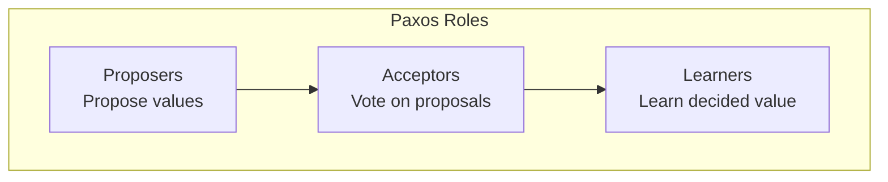
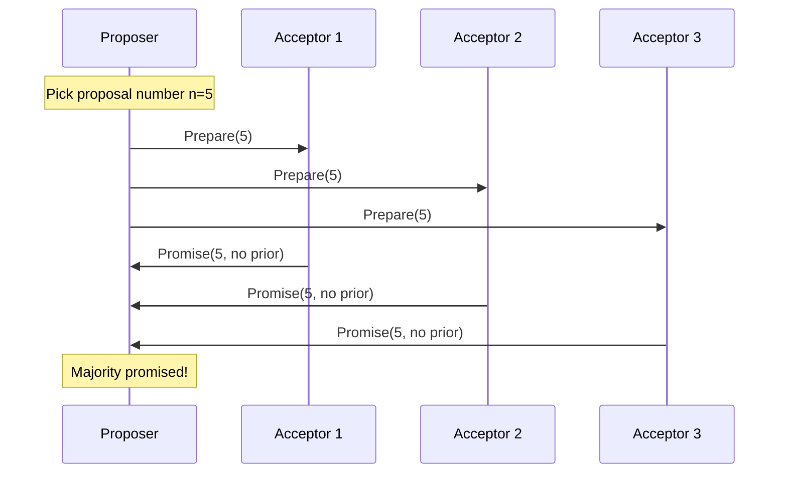
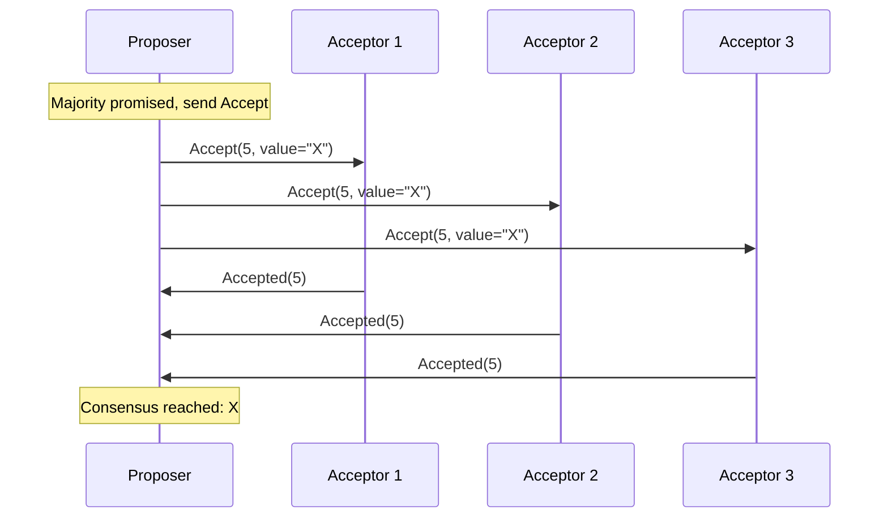
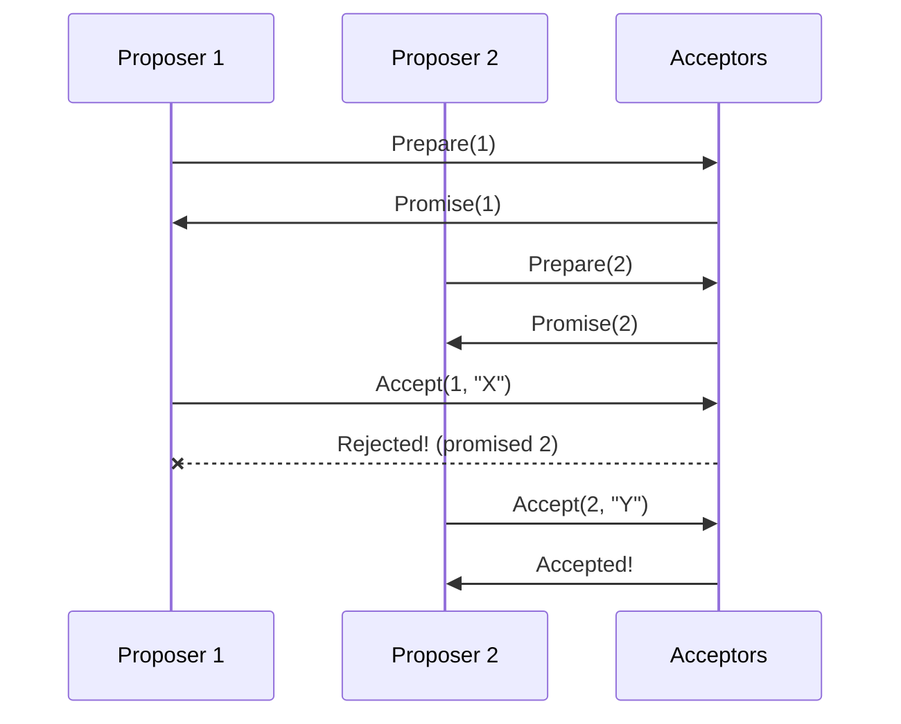
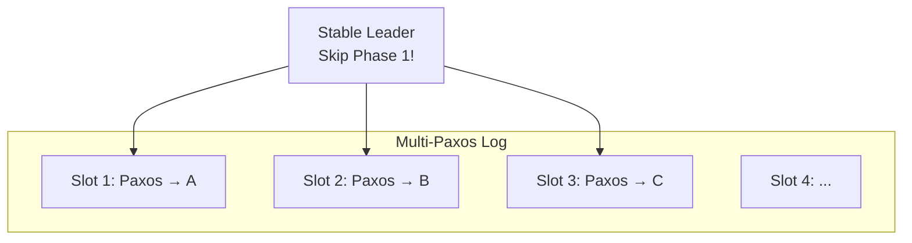
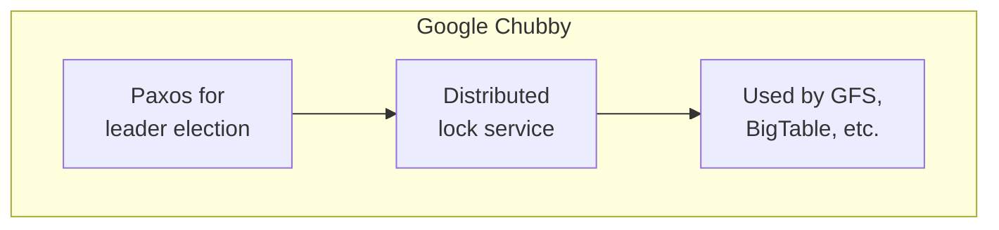

# Paxos Consensus Algorithm

> The foundational consensus algorithm — complex but correct.

---

## 🎯 Overview

Paxos solves consensus in an asynchronous system that may have failures.

**One node can play multiple roles.**

---

## 📋 The Two Phases

### Phase 1: Prepare

**Prepare message**: "I want to make proposal #n"  
**Promise response**: "I won't accept proposals < n" (+ any value already accepted)

### Phase 2: Accept

---

## 🔒 Safety Rules

### Acceptor Rules

1. **On Prepare(n)**: If n > highest seen, promise to ignore proposals < n
2. **On Accept(n, v)**: Accept if n >= highest promised

### Proposer Rules

1. Pick unique, increasing proposal numbers
2. If any acceptor already accepted a value, must use that value

---

## 🔄 Handling Conflicts

**Higher proposal number wins**, but existing values are preserved.

---

## 🔧 Multi-Paxos

Basic Paxos decides **one value**. Multi-Paxos extends it for a log:

**Optimization**: With a stable leader, skip Phase 1 for subsequent slots.

---

## 📊 Paxos Variants

| Variant | Improvement |
|---------|-------------|
| **Multi-Paxos** | Log of decisions, leader optimization |
| **Fast Paxos** | Fewer round trips in common case |
| **Cheap Paxos** | Fewer acceptors in normal case |
| **Egalitarian Paxos** | No designated leader |

---

## ⚠️ Why Paxos Is Hard

1. **Liveness not guaranteed**: Dueling proposers can prevent progress
2. **Complex edge cases**: Recovery, reconfiguration
3. **Underspecified**: Original paper leaves implementation details vague
4. **Hard to understand**: Lamport himself wrote "Paxos Made Simple" later

---

## 🏢 Real-World: Google Chubby

**Chubby uses Paxos** for:
- Leader election
- Distributed locking
- Storing small amounts of metadata

---

## 📋 Paxos vs Raft

| Aspect | Paxos | Raft |
|--------|-------|------|
| Understandability | ❌ Complex | ✅ Designed for clarity |
| Leader | Optional | Required |
| Log structure | Implicit | Explicit |
| Practical implementations | Harder | Easier |

---

## ✅ Key Takeaways

1. **Paxos** = Classic consensus, two phases (Prepare, Accept)
2. **Majority quorum** required for each phase
3. **Safety always maintained**, liveness not guaranteed
4. **Multi-Paxos** for log of decisions with leader optimization
5. **Hard to implement** — Raft is often preferred today
6. **Used by**: Google (Chubby, Spanner), Amazon (DynamoDB internals)

---

[← Previous: FLP Impossibility](./02-flp-impossibility.md) | [Next: Raft →](./04-raft.md)
