# Raft Consensus Algorithm

> "Designed to be understandable" — The practical consensus algorithm.

---

## 🎯 Why Raft?

Paxos is notoriously hard to understand. Raft was designed with **understandability** as a primary goal.


---

## 📋 Raft Basics

### Node States


- **Follower**: Passive, responds to leader/candidates
- **Candidate**: Trying to become leader
- **Leader**: Handles all client requests, replicates log

---

## 🗳️ Leader Election

### Step by Step


### Election Rules

1. **Term**: Logical clock, increases with each election
2. **First come, first served**: Node votes for first valid request
3. **Majority wins**: Need > N/2 votes
4. **Random timeouts**: Prevents split votes

---

## 📝 Log Replication

### How Writes Work


### The Log


---

## 🔒 Safety Guarantees

### 1. Election Safety

At most one leader per term.


### 2. Log Matching

If two logs have same index and term, all prior entries match.

### 3. Leader Completeness

If an entry is committed, it will be in all future leaders' logs.

---

## 🔄 Handling Failures

### Leader Crashes

```mermaid
sequenceDiagram
    participant L as Leader
    participant F1 as Follower 1
    participant F2 as Follower 2
    
    Note over L: ❌ CRASH
    
    F1->>F1: Timeout, no heartbeat
    F1->>F1: Become candidate
    F1->>F2: RequestVote
    F2->>F1: Vote granted
    
    Note over F1: F1 is new leader!
```



### Network Partition


---

## 🏢 Real-World: etcd (Kubernetes)


**Why Raft for Kubernetes?**
- Config must be consistent
- Tolerates node failures (2 of 3, 3 of 5, etc.)
- Understandable = maintainable

---

## 📊 Raft vs Paxos

| Aspect | Raft | Paxos |
|--------|------|-------|
| Understandability | ✅ Designed for it | ❌ Notoriously complex |
| Leader | Always has one | Optional |
| Log structure | Explicit | Implicit |
| Membership changes | Built-in | Separate |
| Production use | etcd, Consul | Chubby, Spanner |

---

## 🔧 Key Implementation Details

### Heartbeat & Timeout

```
Leader heartbeat: 50-100ms
Election timeout: 150-300ms (random)
```

Random timeout prevents multiple candidates simultaneously.

### Cluster Sizes

| Nodes | Tolerated Failures | Quorum |
|-------|-------------------|--------|
| 3 | 1 | 2 |
| 5 | 2 | 3 |
| 7 | 3 | 4 |

---

## ✅ Key Takeaways

1. **Raft** = understandable consensus (vs Paxos)
2. **Three states**: Follower → Candidate → Leader
3. **Leader handles all writes**, replicates log
4. **Majority quorum** required for election and commits
5. **Random timeouts** prevent split votes
6. **Used by**: etcd, Consul, CockroachDB

---

[← Previous: Paxos](./03-paxos.md) | [Next: Leader Election →](./05-leader-election.md)
