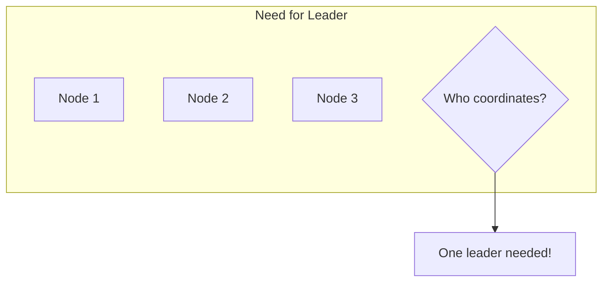
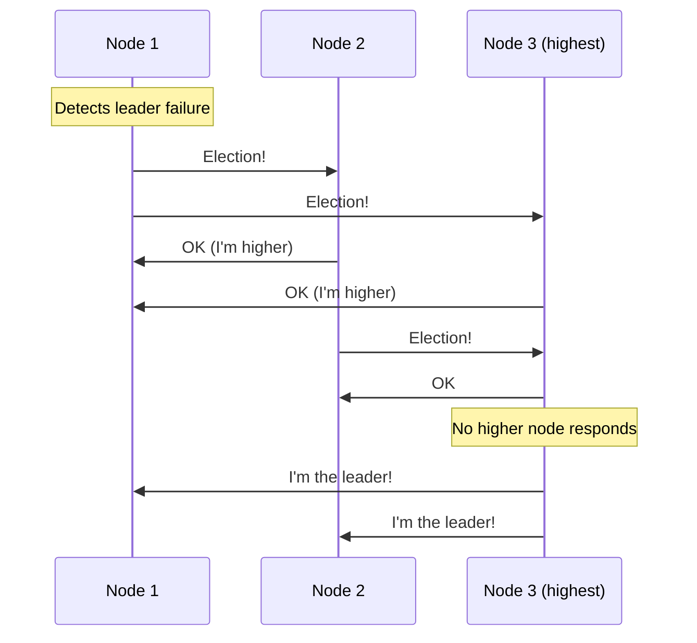
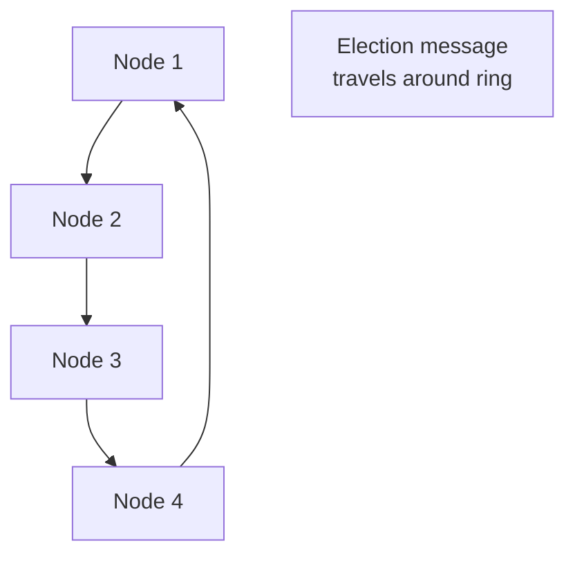
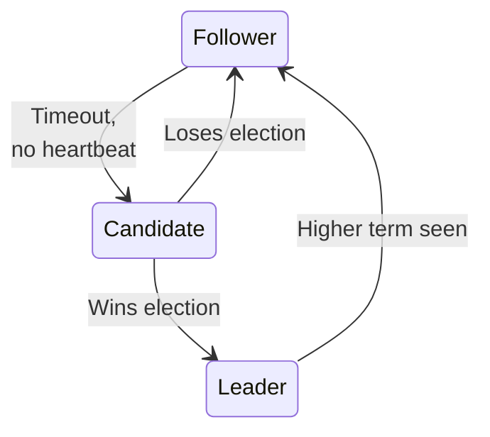
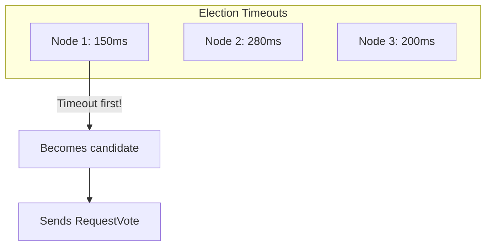
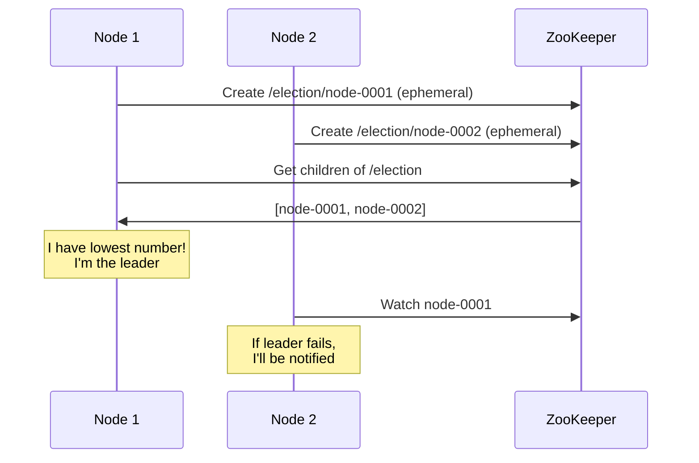
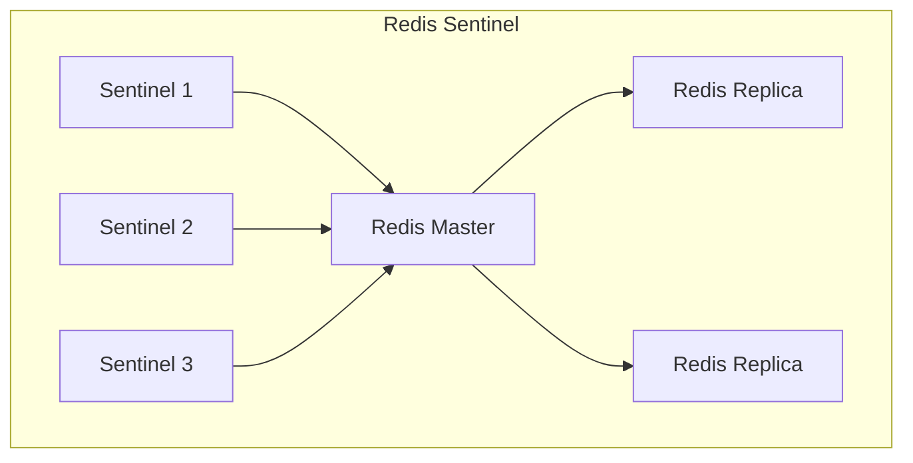
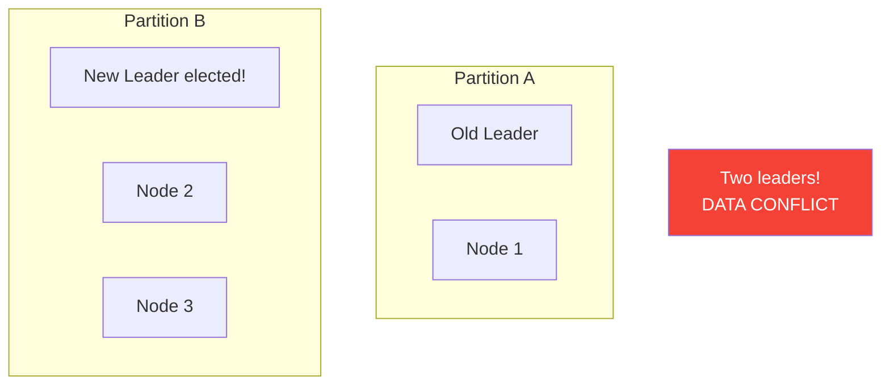

# Leader Election

> Choosing a single coordinator in a distributed system.

---

## 🎯 The Problem

**Use cases**:
- Database primary selection
- Distributed lock holder
- Partition leader in Kafka
- Master in HDFS

---

## 📋 Requirements

| Property | Description |
|----------|-------------|
| **Safety** | At most one leader at any time |
| **Liveness** | Eventually a leader is elected |
| **Stability** | Leader stays unless it fails |

---

## 🔧 Bully Algorithm

The node with **highest ID** becomes leader.

### Algorithm Steps

1. Node detects leader failure
2. Sends ELECTION to all higher-numbered nodes
3. If no response → declare self leader
4. If OK received → wait for leader announcement

### Pros & Cons

| Pros | Cons |
|------|------|
| ✅ Simple | ❌ Many messages |
| ✅ Deterministic | ❌ Network partitions cause issues |

---

## 🔧 Ring Algorithm

Nodes organized in a logical ring.

### Algorithm

1. Node sends election message with its ID
2. Each node adds its ID and forwards
3. When originator receives it back → highest ID wins
4. Coordinator message sent around ring

---

## 🔧 Raft Leader Election

### Key Mechanism: Random Timeouts

**Random timeouts prevent split votes!**

---

## 🔧 ZooKeeper Leader Election

Using a coordination service:

### ZooKeeper Recipe

1. Create **ephemeral sequential** znode under `/election`
2. Get all children
3. If your znode is smallest → you're leader
4. Otherwise, watch the next-smallest znode

---

## 🔥 Real-World: Redis Sentinel

**How it works**:
1. Sentinels monitor master
2. If master fails, they vote on failover
3. Majority decides new master
4. Clients get new master from Sentinel

---

## ⚠️ Split-Brain Problem

### Solutions

| Solution | How |
|----------|-----|
| **Fencing tokens** | Stamps from leader to identify stale leaders |
| **Quorum** | Need majority to become leader |
| **Lease** | Leadership expires, must renew |

---

## 📊 Comparison

| Algorithm | Messages | Complexity | Split-brain safe? |
|-----------|----------|------------|-------------------|
| Bully | O(n²) | Low | ❌ No |
| Ring | O(n) | Low | ❌ No |
| Raft | O(n) | Medium | ✅ With quorum |
| ZooKeeper | O(n) | Low (uses ZK) | ✅ Yes |

---

## ✅ Key Takeaways

1. **Leader election** = choosing one coordinator
2. **Bully algorithm**: Highest ID wins (simple but chatty)
3. **Raft**: Random timeouts, majority vote
4. **ZooKeeper**: Ephemeral sequential znodes
5. **Split-brain** is the main danger — use quorums!
6. **Fencing tokens** prevent stale leaders from causing harm

---

[← Previous: Raft](./04-raft.md) | [Back to Module →](./README.md)
