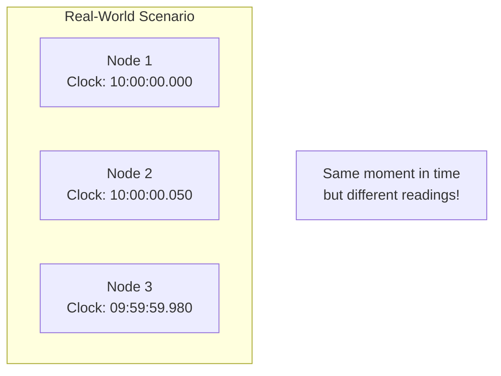
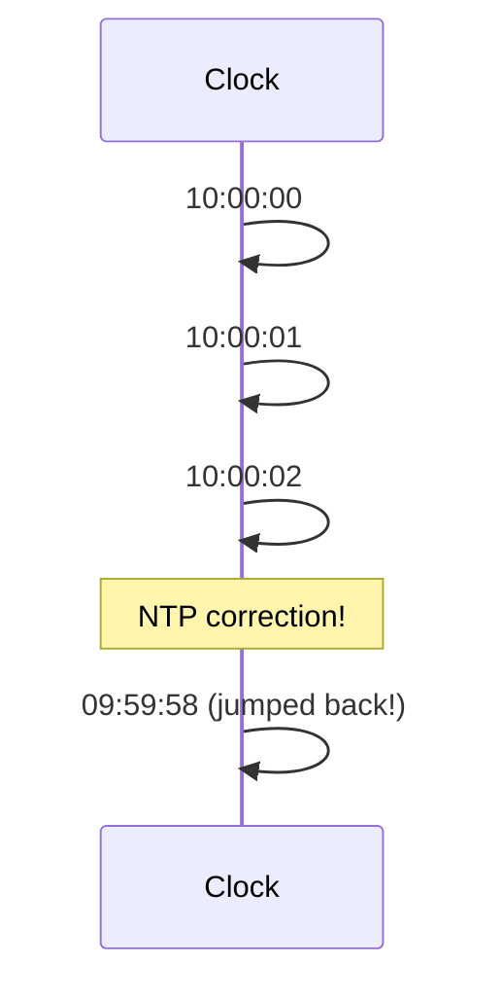
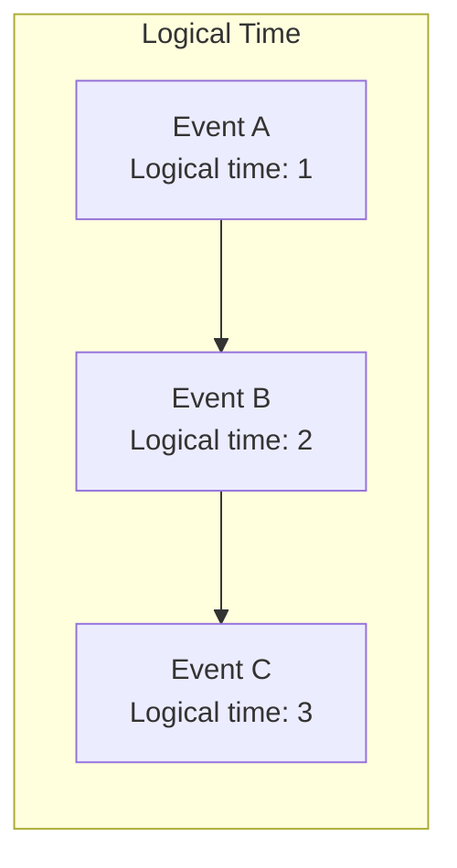
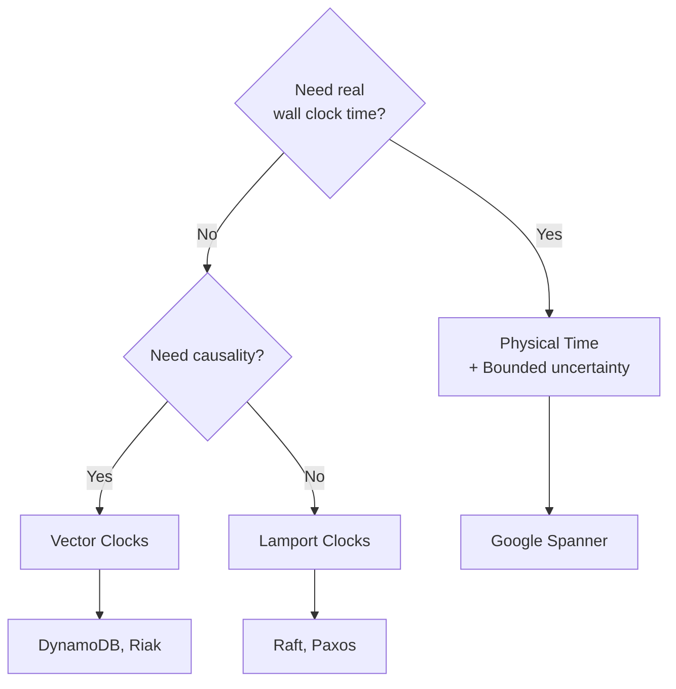
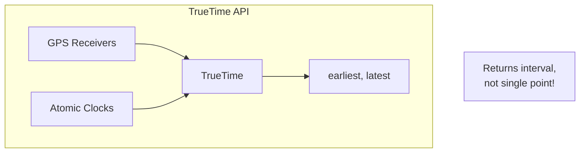

# Physical vs Logical Time

> Why you can't trust wall clocks in distributed systems.

---

## 🎯 The Problem



**Physical clocks are never perfectly synchronized.**

---

## 🕐 Physical Time Problems

### 1. Clock Drift

Clocks run at slightly different rates:
- Typical drift: 10-100 ppm (parts per million)
- 100 ppm = ~8 seconds per day

### 2. Clock Skew

Even after synchronization, clocks differ:
```
NTP accuracy: ~10ms over internet
GPS accuracy: ~100ns (expensive)
```

### 3. Clock Jumps

Clocks can jump forward or **backward**:
- NTP corrections
- Leap seconds
- VM migrations



---

## 🔥 Real-World Incident: Cloudflare Leap Second

**What happened** (2017):
1. Leap second added at midnight
2. Some servers had time go backward
3. Software assumed time only goes forward
4. Negative durations caused crashes

**Lesson**: Never assume monotonic physical time!

---

## 💡 Logical Time

Instead of asking "What time is it?", ask "What happened before what?"



**Logical clocks** capture ordering, not actual time.

---

## 📊 Comparison

| Aspect | Physical Time | Logical Time |
|--------|---------------|--------------|
| Source | Hardware clock | Counter |
| Accuracy | Approximate | Exact ordering |
| Synchronized? | Approximately | N/A |
| Jumps backward? | Yes | Never |
| Cross-system comparison | Unreliable | Reliable |

---

## 🔧 When to Use What



---

## 🏢 Google Spanner's TrueTime

Spanner uses **bounded physical time**:



```go
// TrueTime API
interval := TrueTime.Now()
// interval = [earliest, latest]
// Actual time is guaranteed to be within this range
```

---

## ✅ Key Takeaways

1. **Physical clocks drift, skew, and jump** — don't trust them for ordering
2. **Logical clocks** provide ordering without real time
3. **Lamport clocks**: Simple, total ordering
4. **Vector clocks**: Detect causality
5. **TrueTime**: Bounded uncertainty for physical time (expensive)
6. **Choose based on need**: Ordering only? Use logical. Need wall time? Add uncertainty bounds.

---

[← Back to Module](./README.md) | [Next: Lamport Clocks →](./02-lamport-clocks.md)
