# Lamport Clocks

> The foundation of logical time in distributed systems.

---

## 🎯 The Idea

> "A happened before B" doesn't need wall clock time — just a logical counter.


---

## 📋 The Algorithm

### Rules

1. **Before any event**: Increment local counter
2. **When sending message**: Attach current counter
3. **When receiving message**: `counter = max(local, received) + 1`


---

## 🔧 Implementation

```python
class LamportClock:
    def __init__(self):
        self.counter = 0
    
    def local_event(self):
        self.counter += 1
        return self.counter
    
    def send(self):
        self.counter += 1
        return self.counter  # Attach to message
    
    def receive(self, received_counter):
        self.counter = max(self.counter, received_counter) + 1
        return self.counter
```

---

## ✅ What Lamport Clocks Guarantee

### If A happened-before B, then LC(A) < LC(B)

```mermaid
graph LR
    A[A: LC=2] -->|causes| B[B: LC=5]
    
    Note[LC-A < LC-B ✅]
```



### ⚠️ BUT: LC(A) < LC(B) does NOT mean A happened-before B


---

## 📊 Limitations

| Guarantee | ✅ / ❌ |
|-----------|--------|
| Causality implies LC ordering | ✅ Yes |
| LC ordering implies causality | ❌ No |
| Detect concurrent events | ❌ No |
| Total ordering | ⚠️ With tie-breaker |

---

## 🔧 Creating Total Order

Lamport clocks + process ID = total order:

```python
def compare(event_a, event_b):
    if event_a.lc != event_b.lc:
        return event_a.lc - event_b.lc
    return event_a.process_id - event_b.process_id  # Tie-breaker
```

---

## 🏢 Real-World Usage

### Raft Terms


### Paxos Proposal Numbers

Same concept — increasing numbers to order proposals.

---

## ✅ Key Takeaways

1. **Lamport clocks** = Simple counters incremented on events
2. **Causality → LC ordering** but NOT the reverse
3. **Cannot detect concurrency** — use vector clocks for that
4. **Used in**: Raft terms, Paxos proposals, database versioning
5. **Simple and efficient** — just one integer per event

---

[← Previous: Physical vs Logical](./01-physical-vs-logical-time.md) | [Next: Vector Clocks →](./03-vector-clocks.md)
