# Vector Clocks

> Detecting causality and concurrency in distributed systems.

---

## 🎯 The Problem with Lamport Clocks

```mermaid
graph TB
    subgraph "Lamport can't tell"
        A[Event A: LC=5]
        B[Event B: LC=7]
        
        Q{Did A cause B?<br/>Or are they concurrent?<br/>🤷 Can't tell!}
    end
```



**Vector clocks** solve this!

---

## 📋 The Concept

Each process maintains a **vector** of counters — one for each process.

```mermaid
graph TB
    subgraph "3 Processes"
        P1[P1: [2, 0, 0]]
        P2[P2: [1, 3, 0]]
        P3[P3: [0, 1, 2]]
    end
```

---

## 🔧 The Algorithm

### Rules

1. **Local event**: Increment own counter
2. **Send**: Increment own counter, attach vector
3. **Receive**: Take element-wise max, then increment own


---

## 🔍 Comparing Vector Clocks

### A happened-before B

```
VC(A) < VC(B) if:
  - Every element of VC(A) <= corresponding element of VC(B)
  - At least one element of VC(A) < corresponding element of VC(B)
```


### Concurrent Events

```
A || B (concurrent) if neither A < B nor B < A
```


---

## 📊 Relationship Detection

| Comparison | Meaning |
|------------|---------|
| VC(A) < VC(B) | A happened-before B |
| VC(A) > VC(B) | B happened-before A |
| Neither | A and B are concurrent |

---

## 🔥 Real-World: Amazon DynamoDB


**DynamoDB uses vector clocks to**:
1. Detect conflicting updates
2. Return all versions to client
3. Let application merge

---

## 🔧 Implementation

```python
class VectorClock:
    def __init__(self, process_id, num_processes):
        self.id = process_id
        self.clock = [0] * num_processes
    
    def local_event(self):
        self.clock[self.id] += 1
    
    def send(self):
        self.clock[self.id] += 1
        return self.clock.copy()
    
    def receive(self, received_vc):
        for i in range(len(self.clock)):
            self.clock[i] = max(self.clock[i], received_vc[i])
        self.clock[self.id] += 1
    
    def compare(self, other_vc):
        less = equal = greater = False
        for i in range(len(self.clock)):
            if self.clock[i] < other_vc[i]: less = True
            elif self.clock[i] > other_vc[i]: greater = True
            else: equal = True
        
        if less and not greater: return "BEFORE"
        if greater and not less: return "AFTER"
        return "CONCURRENT"
```

---

## ⚠️ Limitations

### Size Grows with Processes

```
N processes → N integers per event
```

For large systems, this is expensive!

### Solutions

| Approach | How |
|----------|-----|
| **Version vectors** | Track per-replica, not per-event |
| **Dotted version vectors** | Compact representation |
| **Interval tree clocks** | Dynamic number of processes |

---

## 📋 Vector Clocks vs Lamport Clocks

| Feature | Lamport | Vector |
|---------|---------|--------|
| Size | O(1) | O(N) |
| Detect causality | ❌ | ✅ |
| Detect concurrency | ❌ | ✅ |
| Total ordering | ⚠️ With tie-break | ❌ Partial order |

---

## ✅ Key Takeaways

1. **Vector clocks** = One counter per process
2. **Can detect causality**: A happened-before B
3. **Can detect concurrency**: Neither happened first
4. **Size = O(N)** — expensive for many processes
5. **Used by**: DynamoDB, Riak for conflict detection
6. **Perfect for**: Multi-master replication, conflict resolution

---

[← Previous: Lamport Clocks](./02-lamport-clocks.md) | [Next: Hybrid Logical Clocks →](./04-hybrid-logical-clocks.md)
