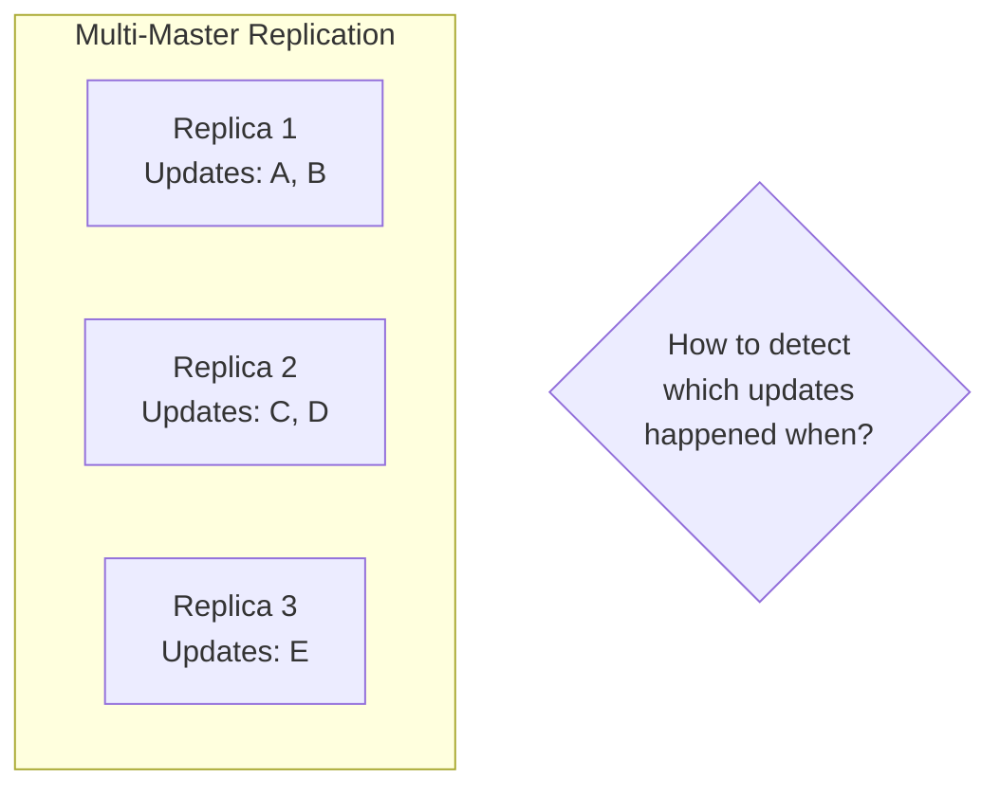
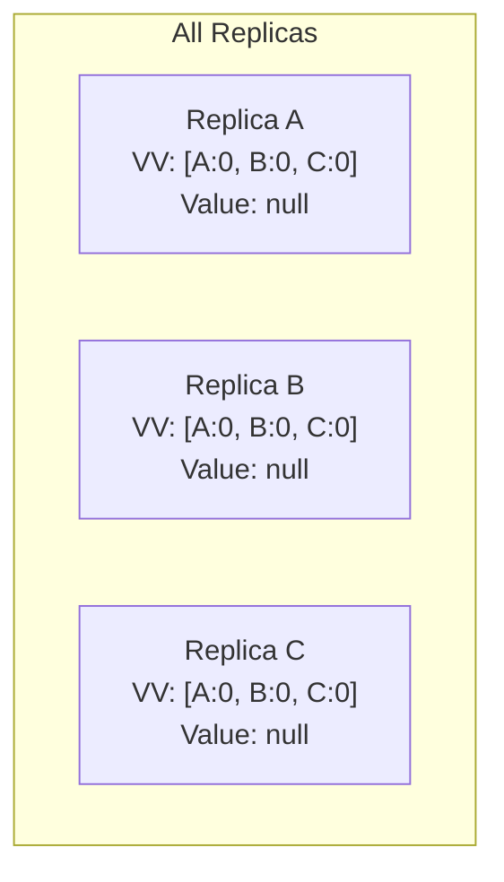
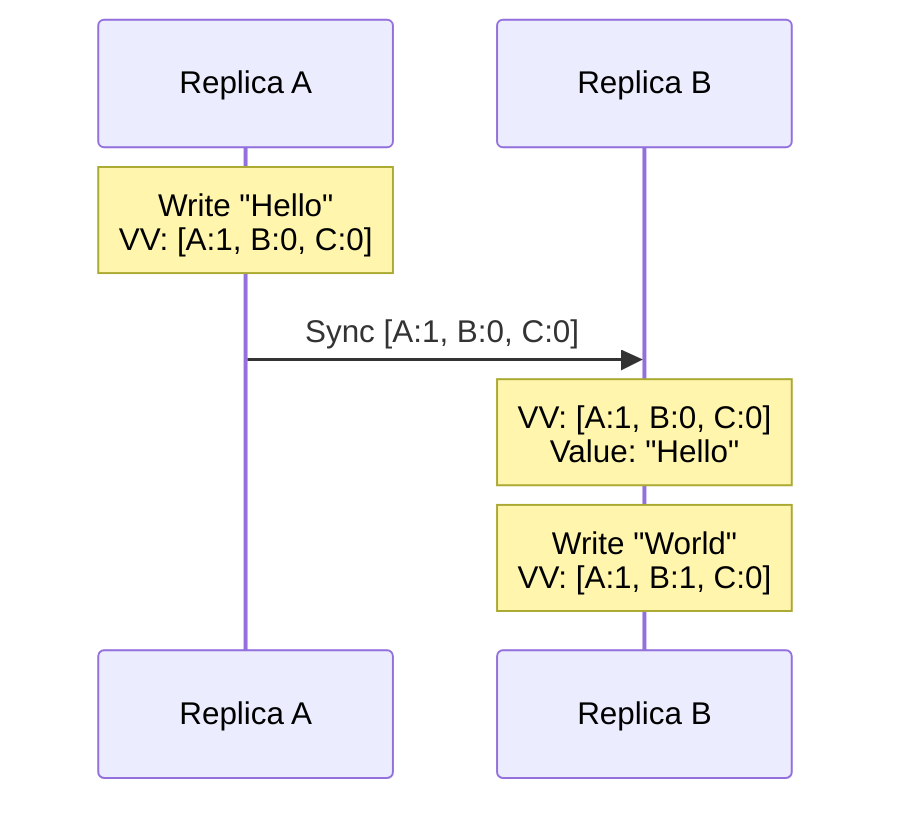
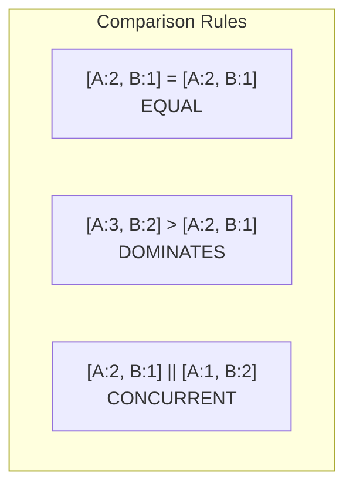
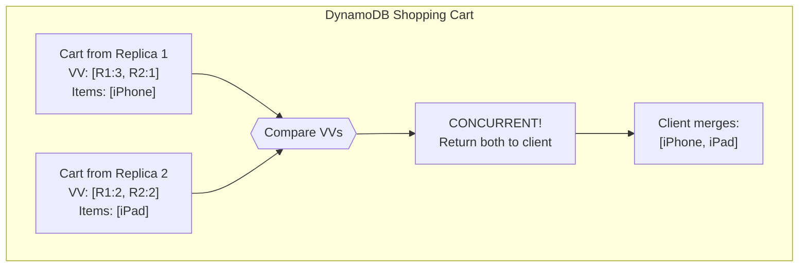

# Version Vectors

> Tracking versions per replica for conflict detection.

---

## 📦 **Package Tracking Analogy**

Imagine a package going through multiple sorting centers:
- Each center stamps the package with its ID and a counter
- `[NYC:3, LA:2, CHI:1]` = Processed 3 times in NYC, 2 in LA, 1 in Chicago

Version vectors work the same way for data!

---

## 🎯 What Problem Do They Solve?

---

## 📋 Version Vectors vs Vector Clocks

| Aspect | Vector Clocks | Version Vectors |
|--------|---------------|-----------------|
| **Tracks** | Events per process | Updates per replica |
| **Entries** | One per process | One per replica |
| **Size** | Can grow large | Bounded by replicas |
| **Use case** | Fine-grained causality | Replica synchronization |

---

## 🔧 How Version Vectors Work

### Initial State

### After Updates

---

## 🔍 Comparing Version Vectors

| V1 vs V2 | All V1 ≤ V2? | All V1 ≥ V2? | Result |
|----------|--------------|--------------|--------|
| Yes | Yes | EQUAL |
| Yes | No | V2 newer |
| No | Yes | V1 newer |
| No | No | CONCURRENT |

---

## 🔥 Real-World: Amazon DynamoDB

---

## 🎭 **Family Photo Album Analogy**

| Scenario | Version Vector Equivalent |
|----------|---------------------------|
| Each family member adds photos | Each replica writes |
| Photos have "added by Mom, #5" | VV entry for that replica |
| Merging albums from grandparents | Comparing VVs to detect conflicts |
| Same photo from different sources | Concurrent updates |

---

## ✅ Key Takeaways

1. **Version vectors** track updates per replica (not per event)
2. **More compact** than vector clocks for replication
3. **Detect concurrent updates** for conflict resolution
4. **Used by**: DynamoDB, Riak, Cassandra (conceptually)
5. **Three outcomes**: One dominates, equal, or concurrent

---

[← Previous: Vector Clocks](./03-vector-clocks.md) | [Next: Causality →](./05-causality.md)
