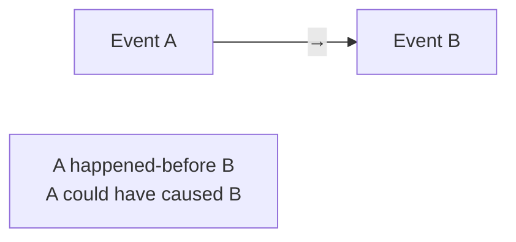
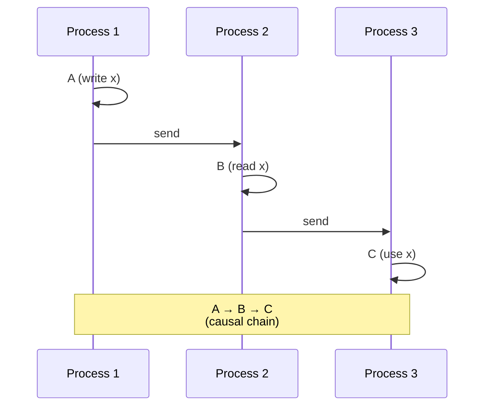
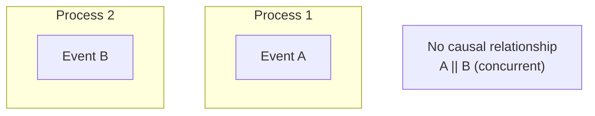
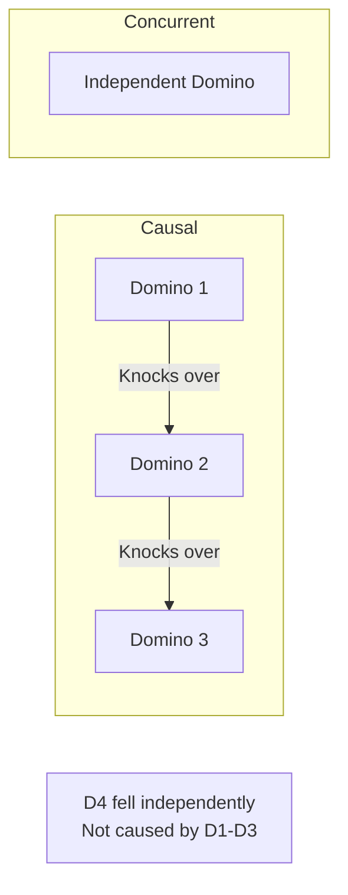
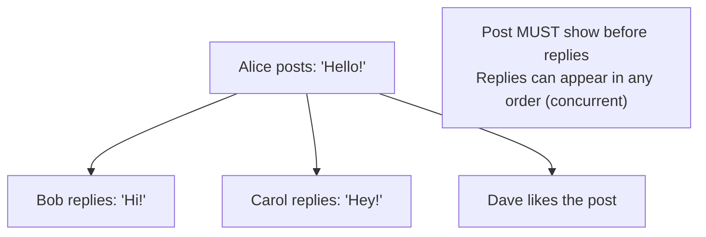
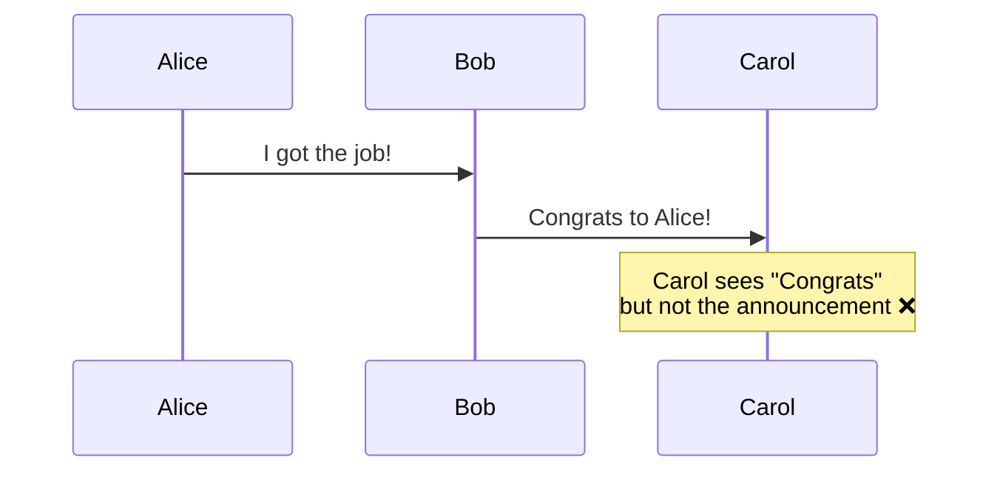

# Causality in Distributed Systems

> Understanding "what caused what" without global time.

---

## 📧 **Email Thread Analogy**

```
Alice → Bob: "Let's meet at 3pm"       [Email 1]
Bob → Alice: "Sure, see you then"       [Email 2]
Charlie → Alice: "Happy birthday!"      [Email 3]
```

- Email 2 was **caused by** Email 1 (reply)
- Email 3 is **concurrent** (independent)

This is **causality**!

---

## 🎯 Formal Definition

### Happened-Before Relation (→)



**Three rules:**
1. Same process: If A comes before B, then A → B
2. Message: If A sends, B receives, then A → B
3. Transitive: If A → B and B → C, then A → C

---

## 🔗 Causality Chains



---

## ⚡ Concurrent Events

If neither A → B nor B → A, then A and B are **concurrent** (A || B).



---

## 🎭 **Dominoes Analogy**



---

## 📊 Why Causality Matters

| Problem | Why Causality Helps |
|---------|---------------------|
| **Message ordering** | Show cause before effect |
| **Conflict detection** | Know if updates are related |
| **Debugging** | Trace what caused what |
| **Consistency** | Respect logical dependencies |

---

## 🔧 Tools for Tracking Causality

| Tool | What It Captures |
|------|------------------|
| Lamport Clock | Ordering (not full causality) |
| Vector Clock | Full causality ✅ |
| Version Vector | Per-replica causality |

---

## 🔥 Real-World: Social Media



**Causal consistency** ensures you never see a reply without the original post.

---

## 📋 Causality Violations

### The Problem



### The Solution: Causal Ordering

Ensure messages are delivered respecting causality.

---

## ✅ Key Takeaways

1. **Causality** = "Could A have influenced B?"
2. **Happened-before** (→) captures potential causality
3. **Concurrent events** have no causal relationship
4. **Vector clocks** are the tool to track causality
5. **Causal consistency** is often sufficient (cheaper than strong)

| Remember | Analogy |
|----------|---------|
| Causal chain | Domino effect |
| Concurrent | Two people texting at same time |
| Happened-before | Email thread replies |

---

[← Previous: Version Vectors](./04-version-vectors.md) | [Back to Module →](./README.md)
