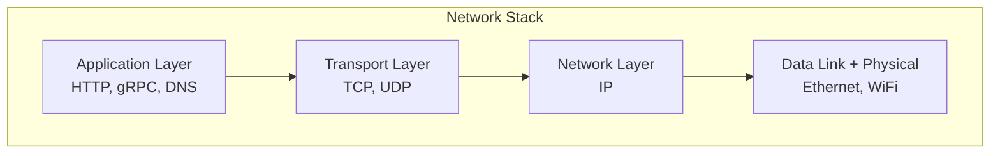
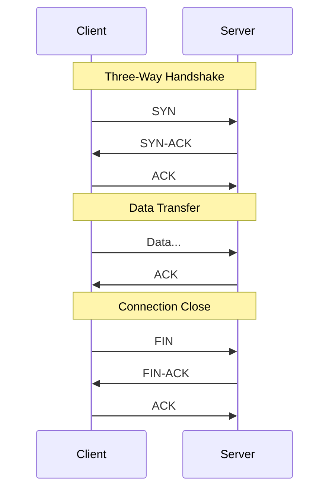
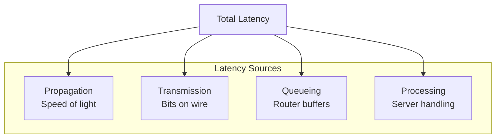

# Network Layers

> Understanding how data travels between distributed systems.

---

## 📮 **Mail System Analogy**

Sending a letter is like sending network data:

| Mail | Network | Layer |
|------|---------|-------|
| Write letter | Application data | Application |
| Put in envelope | Add headers | Transport |
| Add address | Add IP address | Network |
| Postal truck | Physical cable/WiFi | Physical |

---

## 🏗️ The OSI Model (Simplified for Distributed Systems)



---

## 📊 Key Protocols

### Application Layer

| Protocol | Use Case | Type |
|----------|----------|------|
| **HTTP/HTTPS** | Web, REST APIs | Request-Response |
| **gRPC** | Microservices | RPC, bi-directional |
| **WebSocket** | Real-time updates | Full-duplex |
| **DNS** | Name resolution | Query-Response |

### Transport Layer

| Protocol | Reliable? | Use Case |
|----------|-----------|----------|
| **TCP** | ✅ Yes | Most applications |
| **UDP** | ❌ No | Video, gaming, DNS |

---

## 📞 **Phone Call Analogy: TCP vs UDP**

| Aspect | TCP (Phone Call) | UDP (Walkie-Talkie) |
|--------|------------------|---------------------|
| **Connection** | Dial, wait for answer | Just start talking |
| **Reliability** | Know if they heard | Hope they heard |
| **Order** | Conversation makes sense | Words might jumble |
| **Speed** | Slower (call setup) | Faster |

---

## 🤝 TCP Connection Lifecycle



---

## 🌐 HTTP/1.1 vs HTTP/2 vs HTTP/3

```mermaid
graph LR
    subgraph "HTTP/1.1"
        H1[One request<br/>per connection]
    end
    
    subgraph "HTTP/2"
        H2[Multiplexing<br/>Multiple requests<br/>One connection]
    end
    
    subgraph "HTTP/3"
        H3[QUIC (UDP-based)<br/>Faster, no head-of-line]
    end
    
    H1 --> H2 --> H3
```

| Version | Multiplexing | Protocol | Head-of-Line Blocking |
|---------|--------------|----------|----------------------|
| HTTP/1.1 | ❌ No | TCP | Yes |
| HTTP/2 | ✅ Yes | TCP | At TCP level |
| HTTP/3 | ✅ Yes | QUIC/UDP | ❌ No |

---

## 🔄 gRPC vs REST

| Aspect | REST | gRPC |
|--------|------|------|
| **Protocol** | HTTP/1.1 or 2 | HTTP/2 |
| **Format** | JSON (text) | Protobuf (binary) |
| **Speed** | Slower | Faster |
| **Streaming** | Limited | Bi-directional |
| **Browser support** | ✅ Native | ⚠️ Needs proxy |

---

## ⏱️ Network Latency



| Location | Typical Latency |
|----------|-----------------|
| Same data center | < 1 ms |
| Same region | 1-10 ms |
| Cross-region | 30-100 ms |
| Cross-continent | 100-300 ms |

---

## ✅ Key Takeaways

1. **TCP** = Reliable, ordered delivery (most apps)
2. **UDP** = Fast, unreliable (video, gaming)
3. **HTTP/2** = Multiplexing over single connection
4. **gRPC** = Fast binary protocol for microservices
5. **Latency** = Distance matters, design for it!

---

[← Back to Module](./README.md) | [Next: TLS & Encryption →](./02-tls-and-encryption.md)
