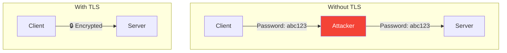
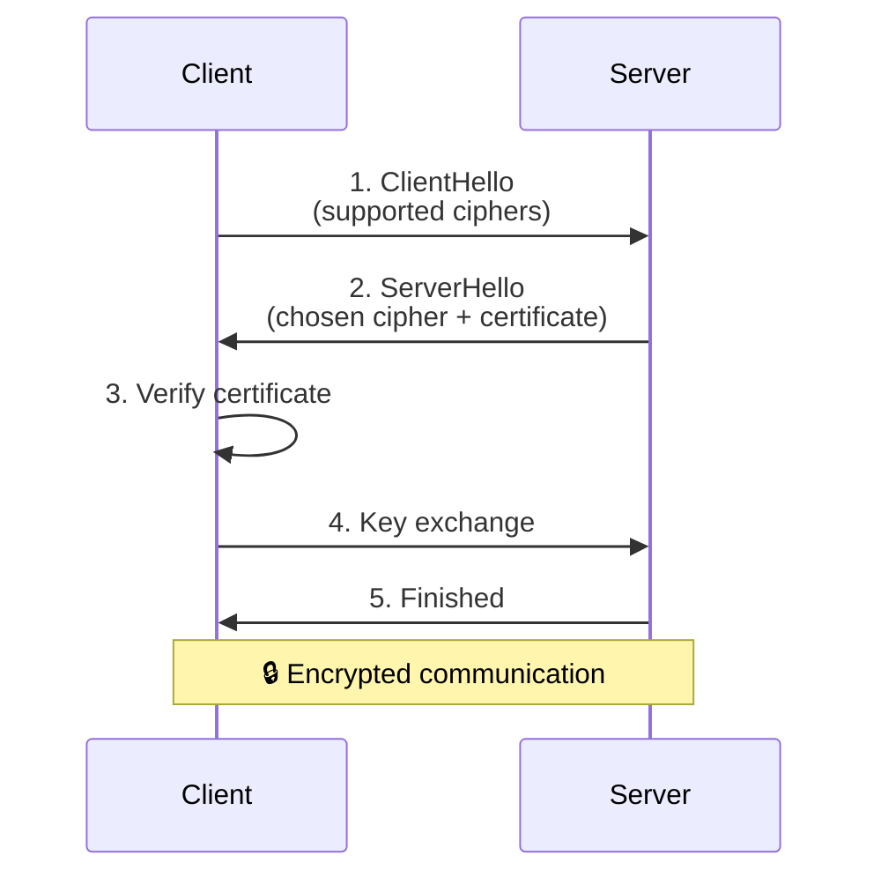
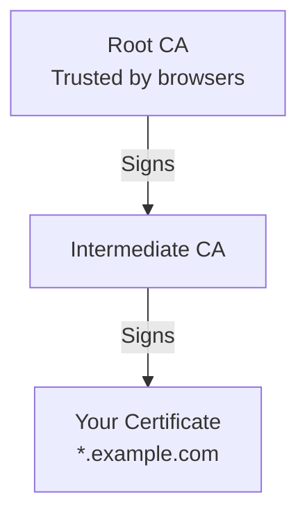
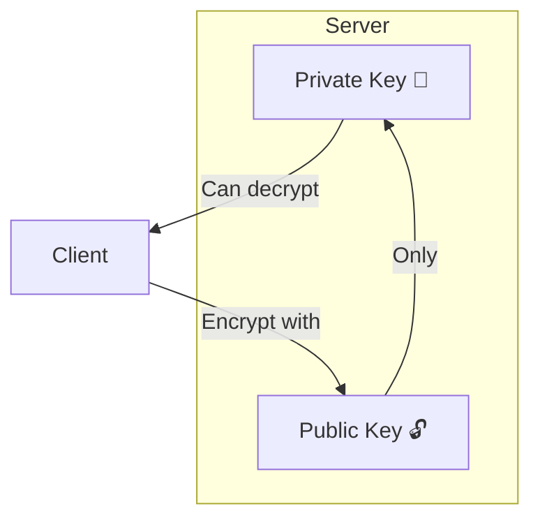
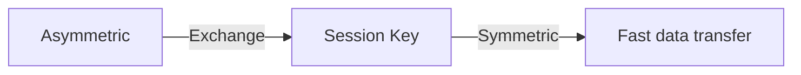
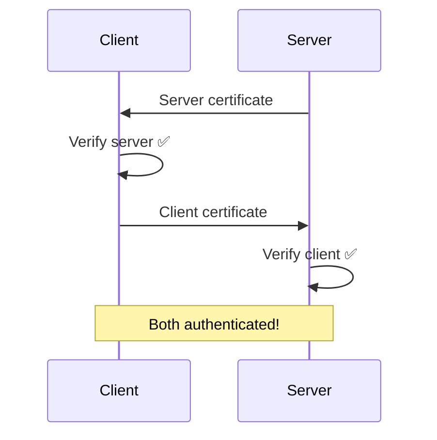
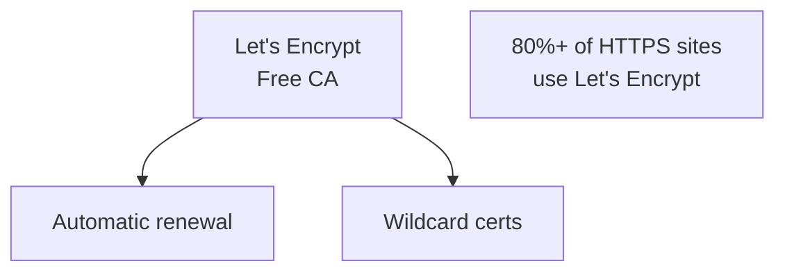

# TLS and Encryption

> Securing data in transit between distributed systems.

---

## 🔐 **Secret Decoder Ring Analogy**

Remember childhood secret decoder rings?

| Concept | Decoder Ring | TLS |
|---------|--------------|-----|
| **Encryption** | Scramble message | Encrypt data |
| **Key** | Ring setting | Shared secret |
| **Without key** | Gibberish | Secure transmission |

---

## 🎯 Why TLS?



---

## 📋 TLS Handshake



---

## 📜 Certificates

### The Trust Chain



### 🏦 **Bank ID Analogy**

| Real World | TLS |
|------------|-----|
| Government issues ID | Root CA signs leaf |
| Bank checks your ID | Client verifies certificate |
| ID proves identity | Certificate proves server |

---

## 🔧 Types of Encryption

### Symmetric (Fast)

```mermaid
graph LR
    Plain[Hello] -->|Key: 🔑| Cipher[X#@!]
    Cipher -->|Key: 🔑| Plain2[Hello]
```

**Same key** for encrypt and decrypt. Fast but key distribution is hard.

### Asymmetric (Secure Key Exchange)



**Public key** encrypts, **private key** decrypts.

### TLS Uses Both!



---

## 🔒 mTLS (Mutual TLS)

Regular TLS: Server proves identity  
mTLS: **Both** prove identity



**Used in**: Microservices, zero-trust networks

---

## 🔥 Real-World: Let's Encrypt



---

## 📊 TLS Versions

| Version | Status | Notes |
|---------|--------|-------|
| TLS 1.0 | ❌ Deprecated | Vulnerabilities |
| TLS 1.1 | ❌ Deprecated | Vulnerabilities |
| TLS 1.2 | ✅ Acceptable | Still widely used |
| TLS 1.3 | ✅ Recommended | Faster, more secure |

---

## ✅ Key Takeaways

1. **TLS** encrypts data in transit
2. **Certificates** prove server identity
3. **Asymmetric crypto** for key exchange, **symmetric** for data
4. **mTLS** = Both sides authenticate (microservices)
5. **Use TLS 1.2+**, prefer TLS 1.3

---

[← Previous: Network Layers](./01-network-layers.md) | [Next: Authentication →](./03-authentication-oauth.md)
