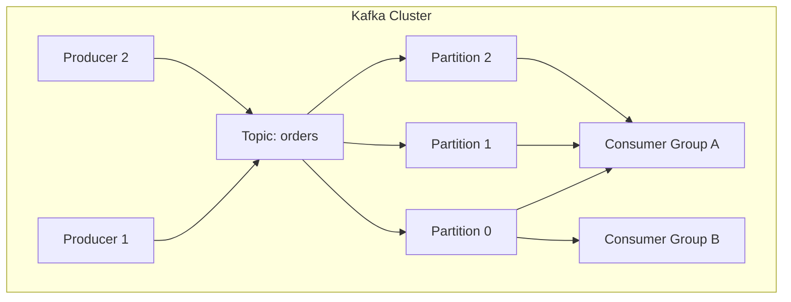
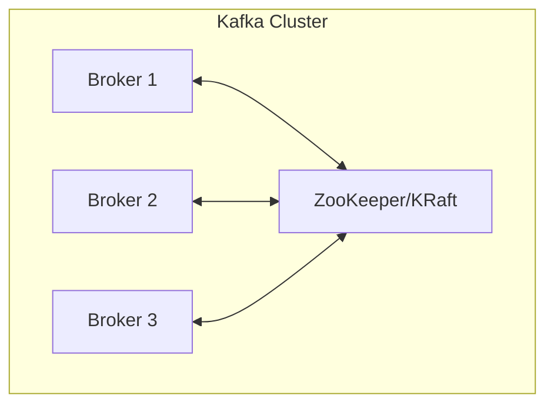
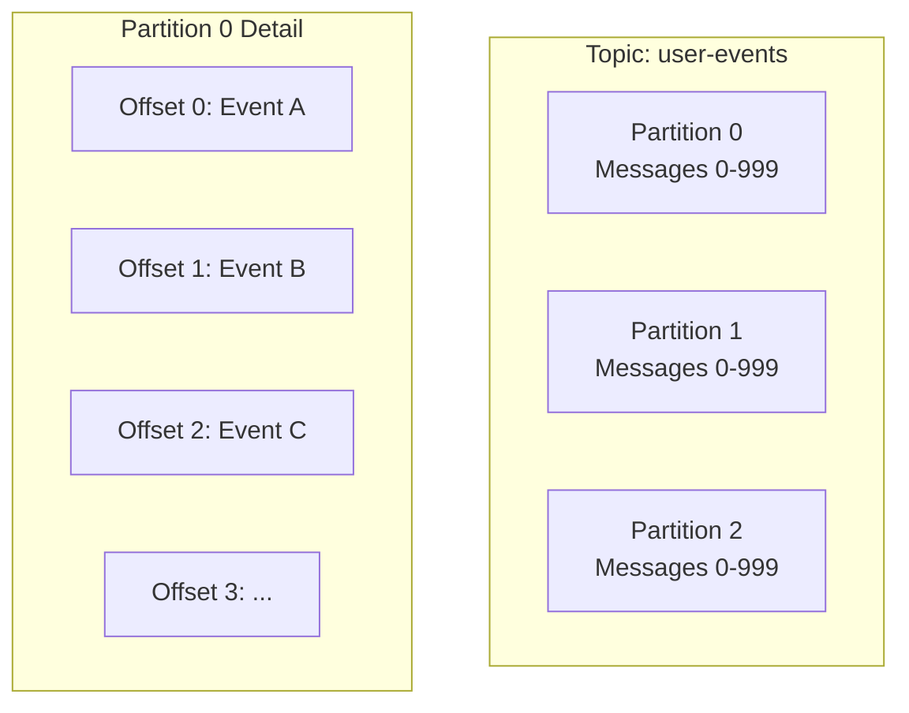
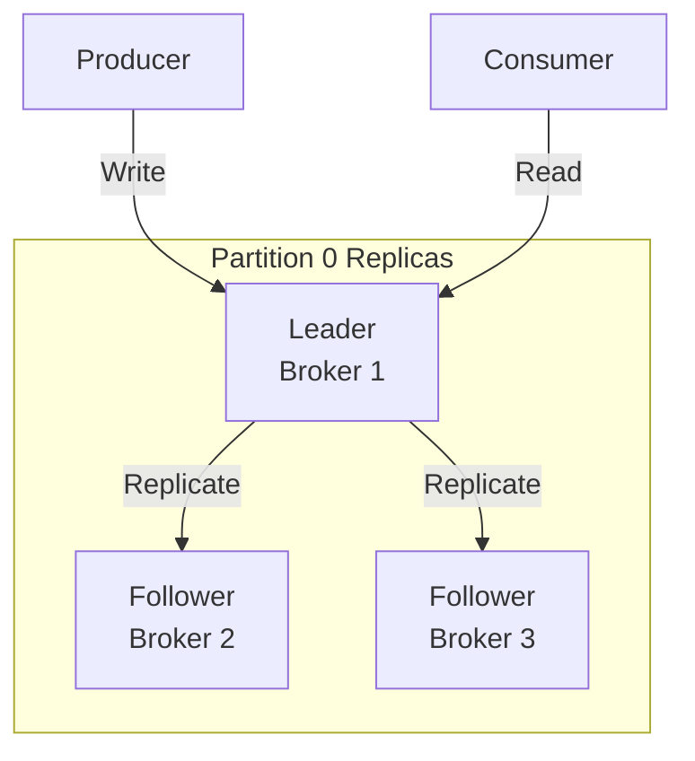
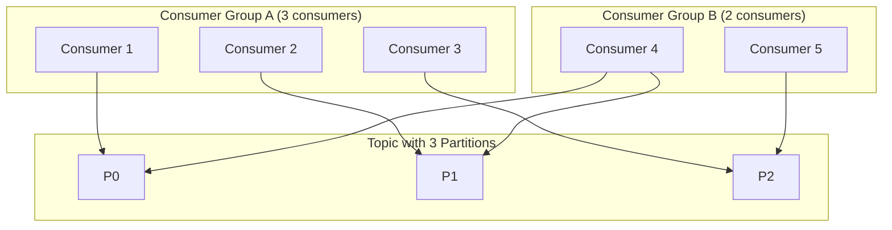
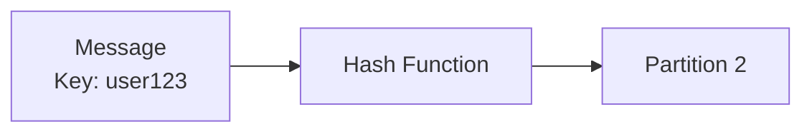
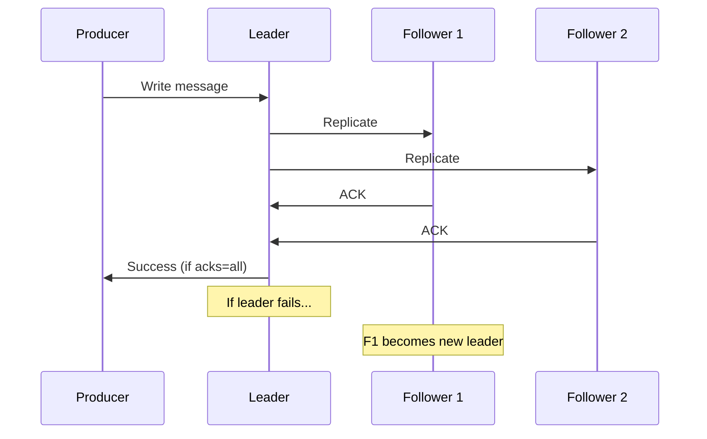
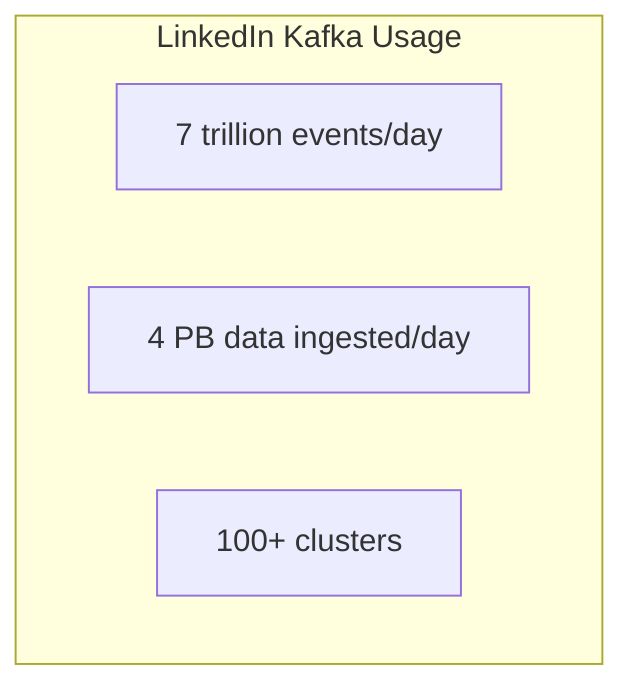

# Apache Kafka

> The distributed event streaming platform that handles trillions of events per day.

---

## 🎯 What is Kafka?



**Kafka is a distributed commit log** — append-only, immutable, partitioned.

---

## 🏗️ Core Architecture

### Brokers



### Topics & Partitions



**Key concepts**:
- **Topic**: Named feed of messages
- **Partition**: Ordered, immutable sequence
- **Offset**: Position in partition
- **Key**: Determines partition assignment

---

## 🔄 Replication



**ISR (In-Sync Replicas)**: Followers that are caught up with leader.

**Acknowledgment levels**:
| acks | Meaning | Durability |
|------|---------|------------|
| 0 | Fire and forget | None |
| 1 | Leader acknowledged | Medium |
| all | All ISRs acknowledged | Highest |

---

## 📊 Consumer Groups



**Rules**:
- Each partition consumed by ONE consumer in a group
- Consumer can consume multiple partitions
- Different groups get all messages independently

---

## 🔧 Distributed Systems Concepts in Kafka

### Partitioning (Sharding)



```java
// Partition = hash(key) % numPartitions
// Same key always goes to same partition (ordering!)
```

### Consistency

- **Within partition**: Total order guaranteed
- **Across partitions**: No ordering guarantee
- **Consumer offsets**: Stored in Kafka itself (__consumer_offsets topic)

### Fault Tolerance



---

## 🔥 Real-World: LinkedIn Scale



**Use cases at LinkedIn**:
- Activity tracking
- Metrics collection
- Log aggregation
- Stream processing

---

## 📋 When to Use Kafka

| Use Case | Why Kafka? |
|----------|-----------|
| Event streaming | High throughput, durability |
| Log aggregation | Append-only, retention policies |
| Stream processing | Kafka Streams, ksqlDB |
| Event sourcing | Immutable log as source of truth |
| Microservice communication | Decoupled, reliable |

---

## ⚠️ Kafka Trade-offs

| Pro | Con |
|-----|-----|
| ✅ High throughput | ❌ Complex to operate |
| ✅ Durable | ❌ Not for request-response |
| ✅ Horizontally scalable | ❌ No message priority |
| ✅ Replay capability | ❌ Ordering only per-partition |

---

## ✅ Key Takeaways

1. **Kafka = distributed commit log** with partitioning
2. **Partitions** enable parallelism and ordering within key
3. **Consumer groups** enable parallel processing
4. **Replication** with configurable durability (acks)
5. **Use for**: Event streaming, log aggregation, decoupling services
6. **Not for**: Request-response, low-latency messaging

---

[← Back to Module](./README.md) | [Next: Cassandra →](./02-cassandra.md)
