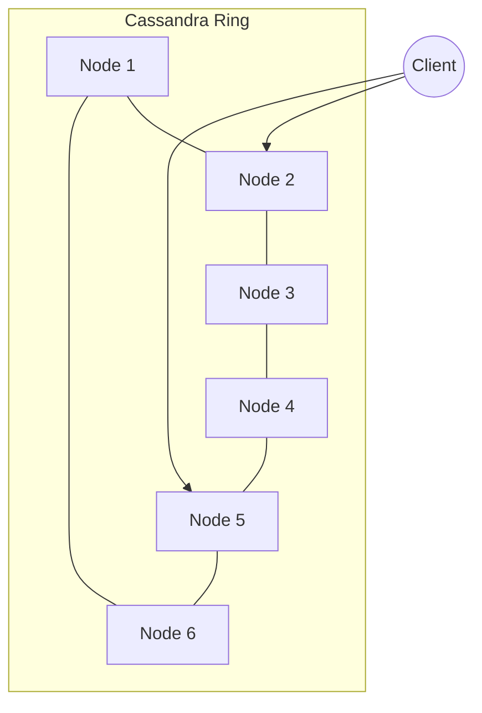
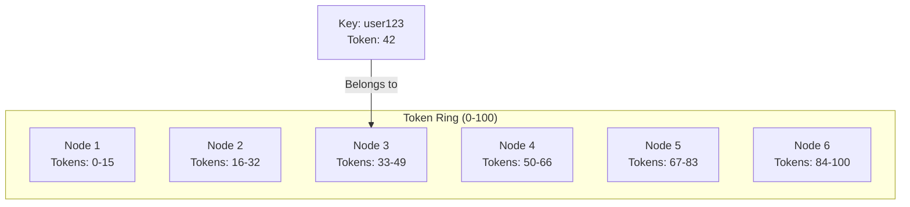
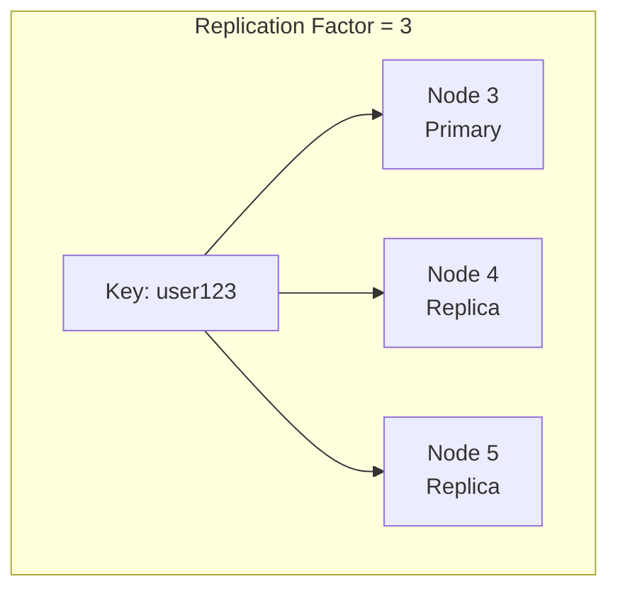
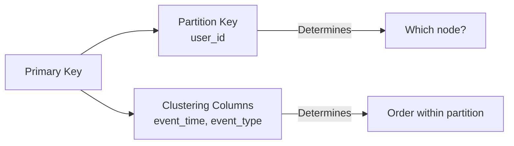
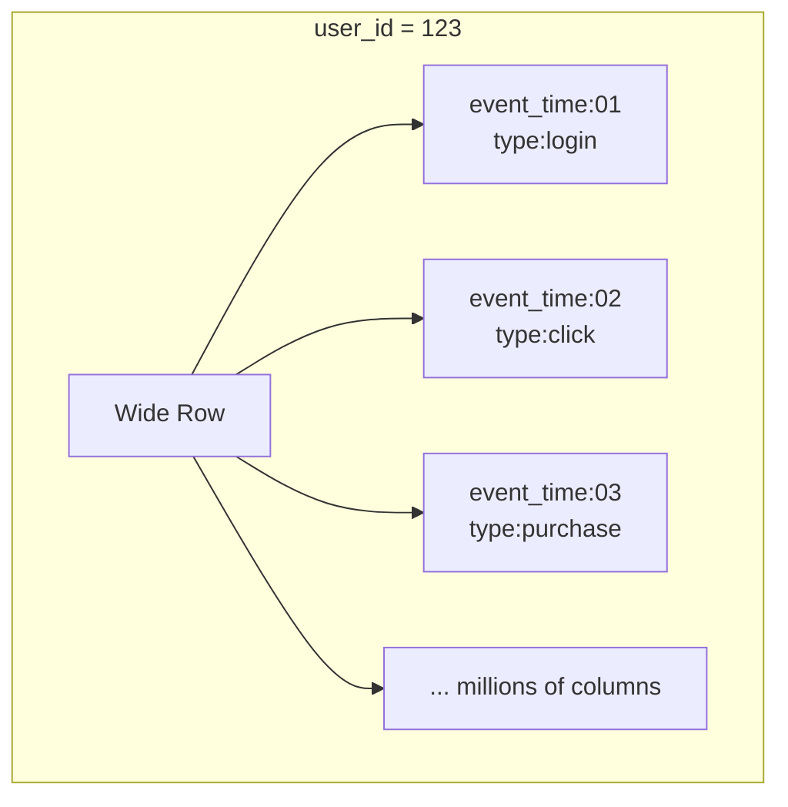
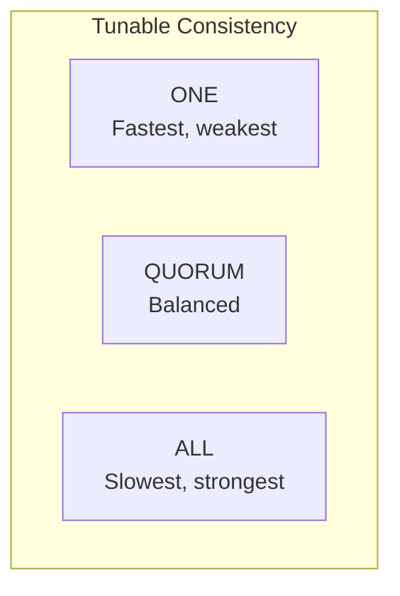
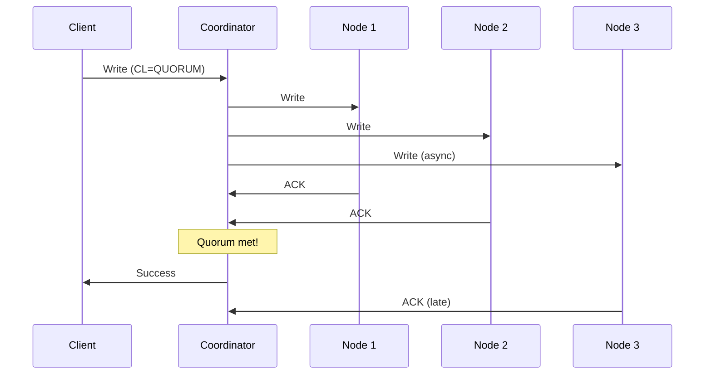
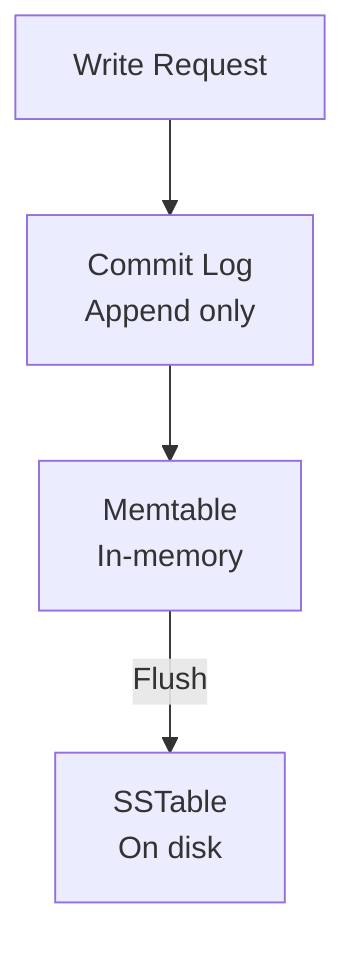
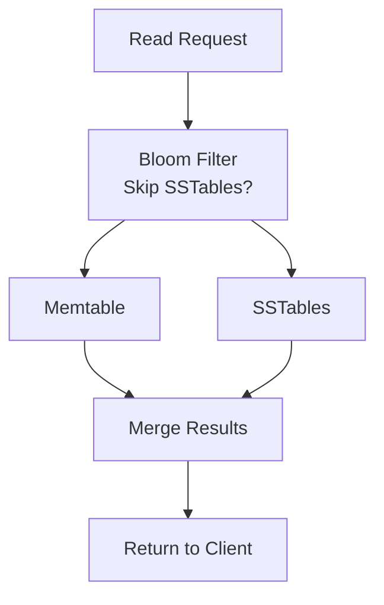
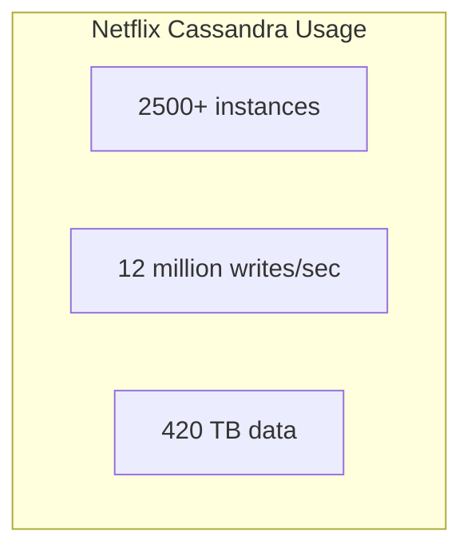

# Apache Cassandra

> The highly available, eventually consistent, wide-column database.

---

## 🎯 What is Cassandra?



**Cassandra is a masterless, peer-to-peer distributed database** designed for high availability.

---

## 🏗️ Architecture

### Consistent Hashing Ring



### Data Distribution



---

## 🔧 Key Concepts

### Primary Key Structure

```sql
CREATE TABLE users (
    user_id UUID,
    event_time TIMESTAMP,
    event_type TEXT,
    data TEXT,
    PRIMARY KEY ((user_id), event_time, event_type)
);
```



### Wide Rows



---

## ⚖️ Consistency Levels



| Level | Read | Write | Guarantee |
|-------|------|-------|-----------|
| ONE | 1 replica | 1 replica | Eventual |
| QUORUM | N/2+1 | N/2+1 | Strong* |
| ALL | All replicas | All replicas | Strongest |

*Strong consistency when: `R + W > N`

---

## 🔄 Write Path



### Internal Write Flow



---

## 🔄 Read Path



---

## ⚠️ Anti-Patterns

### ❌ Unbounded Partitions

```sql
-- BAD: All data for user in one partition
PRIMARY KEY (user_id)

-- GOOD: Bucket by time
PRIMARY KEY ((user_id, month), event_time)
```

### ❌ Secondary Indexes on High-Cardinality

```sql
-- BAD: Index on unique values
CREATE INDEX ON users(email);

-- Use: Materialized view or denormalize
```

---

## 🔥 Real-World: Netflix



**Use cases**:
- User viewing history
- Movie metadata
- A/B test data
- Real-time analytics

---

## 📊 When to Use Cassandra

| Good For | Not Good For |
|----------|--------------|
| ✅ High write throughput | ❌ Complex joins |
| ✅ Time-series data | ❌ Ad-hoc queries |
| ✅ Geo-distributed | ❌ Strong consistency required |
| ✅ Known query patterns | ❌ Small datasets |

---

## 📋 Comparison: Cassandra vs Others

| Feature | Cassandra | MongoDB | DynamoDB |
|---------|-----------|---------|----------|
| Data model | Wide-column | Document | Key-value |
| Consistency | Tunable | Tunable | Tunable |
| Scaling | Masterless | Sharded | Managed |
| Query language | CQL | MQL | API |

---

## ✅ Key Takeaways

1. **Masterless architecture** — no single point of failure
2. **Consistent hashing** for data distribution
3. **Tunable consistency** — choose per query
4. **Write-optimized** — LSM tree structure
5. **Design for your queries** — denormalization is key
6. **Used by**: Netflix, Apple, Instagram, Uber

---

[← Previous: Kafka](./01-kafka.md) | [Next: ZooKeeper →](./03-zookeeper.md)
