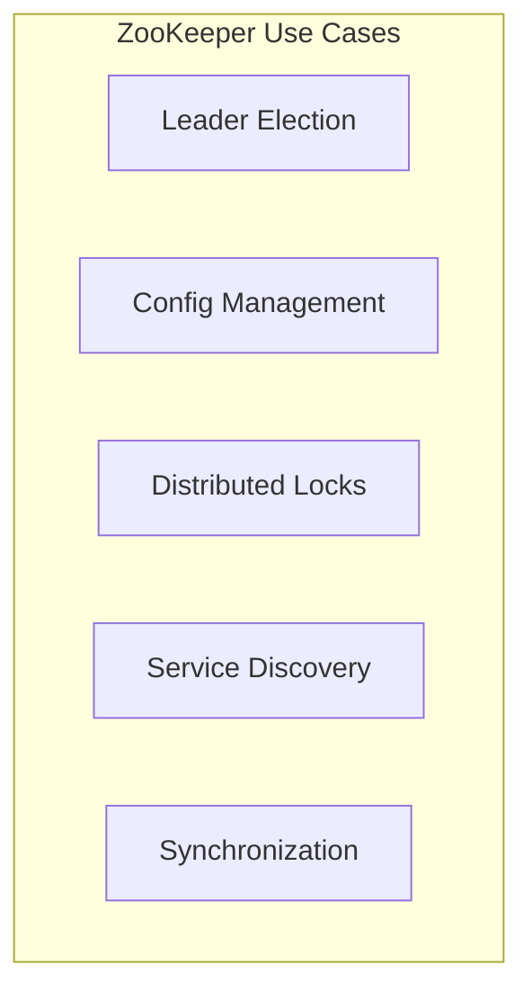
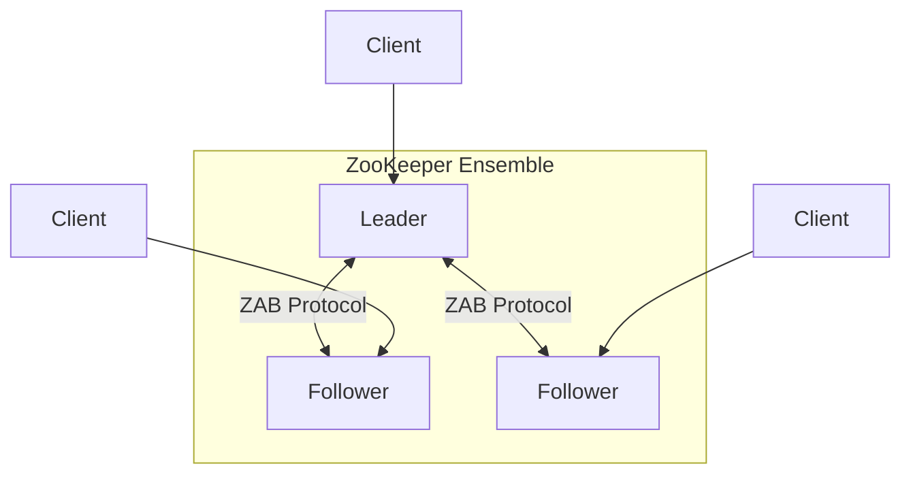
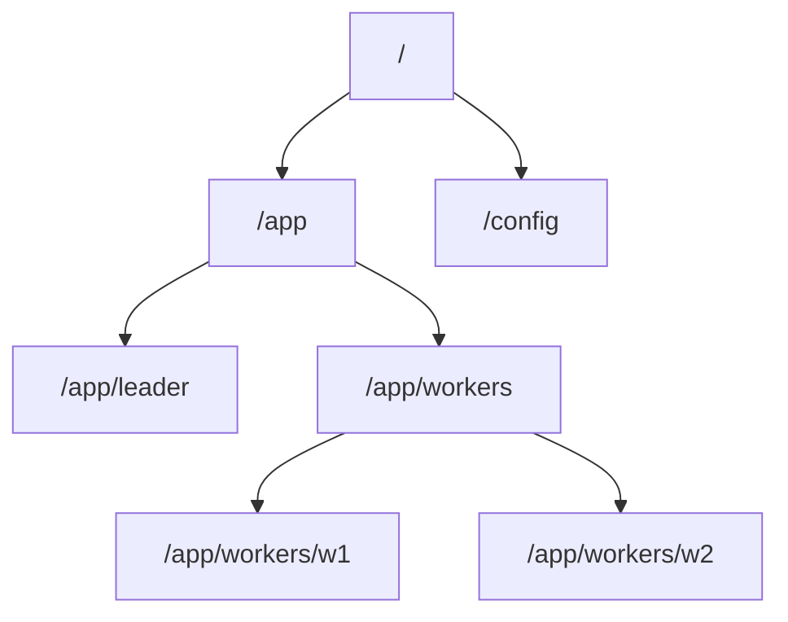
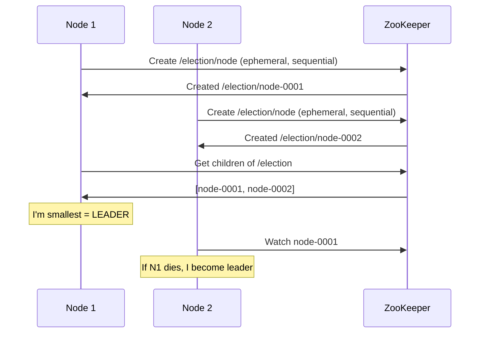
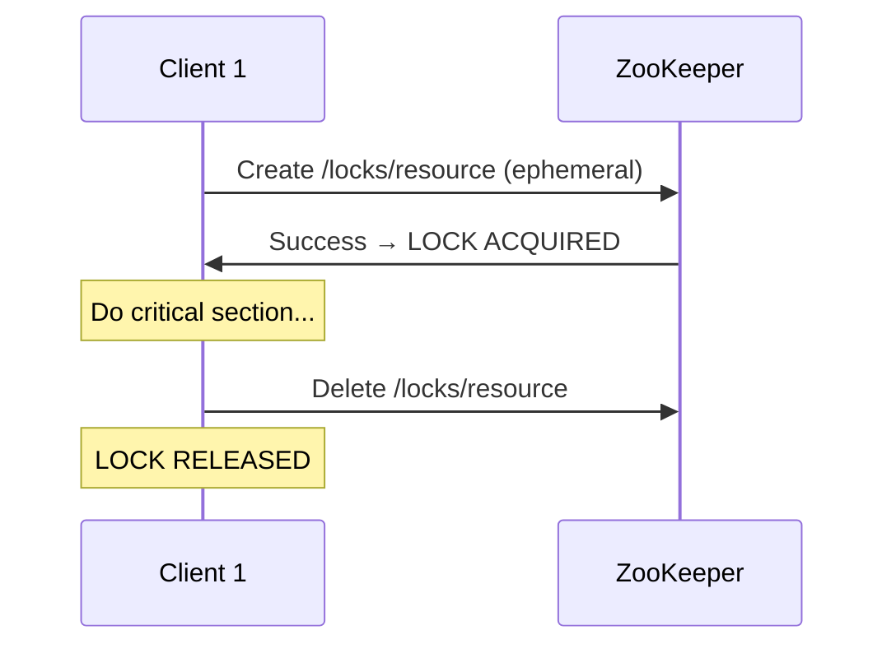
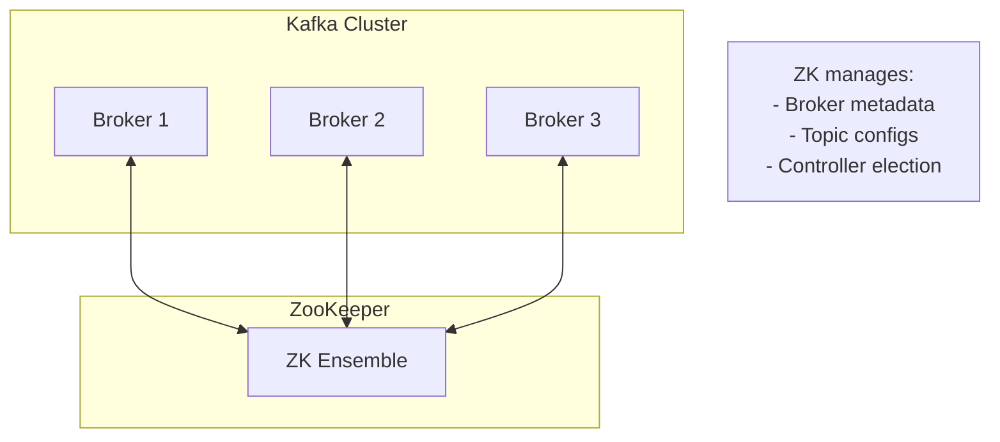

# ZooKeeper

> The distributed coordination service that powers many systems.

---

## 🎯 What is ZooKeeper?

**ZooKeeper provides primitives** for building distributed coordination.

---

## 🏗️ Architecture

- **Leader**: Handles all writes
- **Followers**: Replicate data, serve reads
- **ZAB**: ZooKeeper Atomic Broadcast (like Paxos)

---

## 📁 Data Model: ZNodes

### ZNode Types

| Type | Description |
|------|-------------|
| **Persistent** | Survives client disconnect |
| **Ephemeral** | Deleted when client disconnects |
| **Sequential** | Auto-incrementing suffix |

---

## 🔧 Common Recipes

### Leader Election

### Distributed Lock

---

## 📊 Guarantees

| Guarantee | Description |
|-----------|-------------|
| **Sequential consistency** | Updates applied in order |
| **Atomicity** | Updates succeed or fail entirely |
| **Durability** | Committed = persisted |
| **Timeliness** | Bounded staleness |

---

## 🔥 Real-World: Kafka + ZooKeeper

**Note**: Kafka is moving away from ZK (KRaft mode).

---

## ⚠️ Limitations

| Issue | Impact |
|-------|--------|
| Not for large data | Max 1MB per znode |
| Latency for writes | All go through leader |
| Complex operations | Need application-level coordination |
| Separate cluster | Additional operational burden |

---

## ✅ Key Takeaways

1. **ZooKeeper** = Coordination primitives for distributed systems
2. **ZNodes** = Hierarchical namespace with ephemeral/sequential options
3. **Common uses**: Leader election, distributed locks, config management
4. **ZAB protocol** for consensus (like Paxos)
5. **Used by**: Kafka (legacy), HBase, Hadoop, Solr

---

[← Previous: Cassandra](./02-cassandra.md) | [Next: Spanner →](./04-spanner.md)
