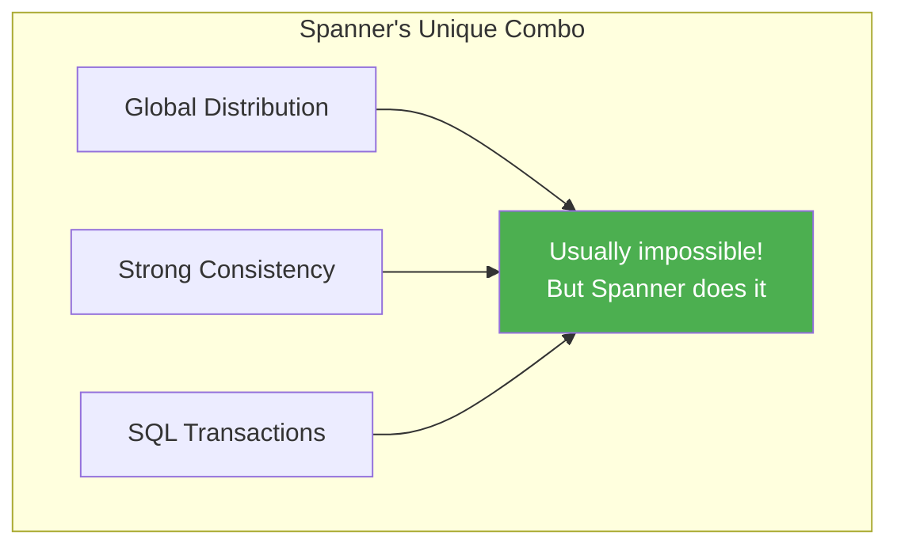
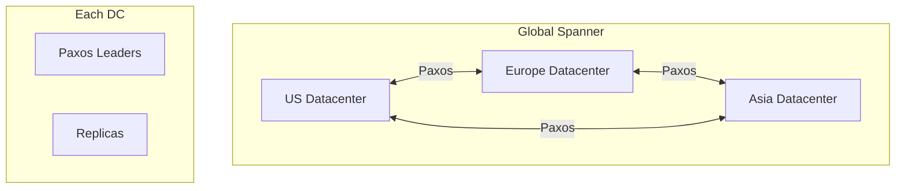
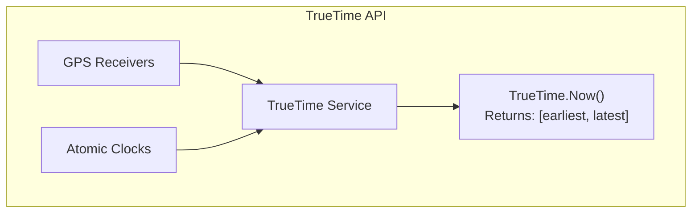
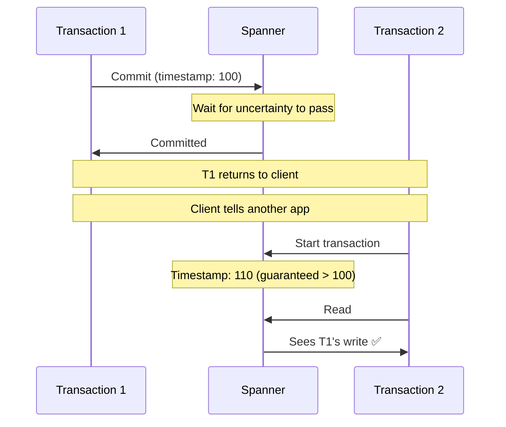
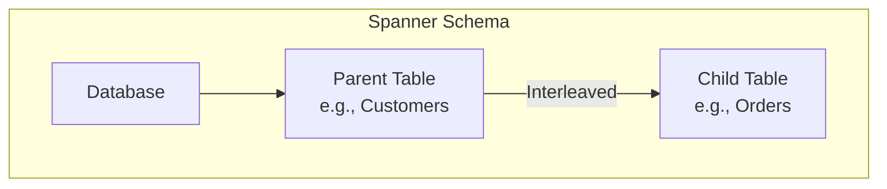
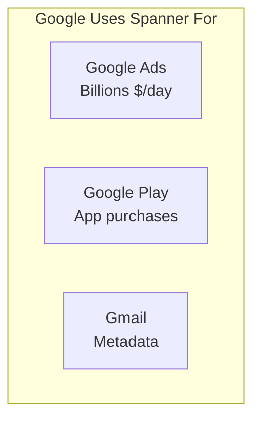

# Google Spanner

> The globally distributed database with strong consistency.

---

## 🎯 What Makes Spanner Special?



---

## 🏗️ Architecture



---

## ⏱️ TrueTime: The Secret Sauce



### How TrueTime Works

```python
interval = TrueTime.now()
# interval.earliest = 10:00:00.000
# interval.latest   = 10:00:00.007
# Actual time is GUARANTEED within this range
```

**Bound uncertainty**: Usually < 7ms!

---

## 🔒 External Consistency



**If T1 commits before T2 starts (real time), T2 sees T1's effects.**

---

## 📊 Data Model



**Interleaving**: Store related rows together for locality.

---

## 🔧 Transactions

```sql
-- Spanner supports standard SQL
BEGIN TRANSACTION;
  UPDATE accounts SET balance = balance - 100 WHERE id = 1;
  UPDATE accounts SET balance = balance + 100 WHERE id = 2;
COMMIT;
```

**Spanner provides**:
- Serializable isolation
- Global strong consistency
- Automatic sharding

---

## 📊 Spanner vs Other DBs

| Feature | Spanner | Cassandra | DynamoDB |
|---------|---------|-----------|----------|
| Consistency | Strong | Eventual | Eventual/Strong |
| SQL | ✅ Full | ❌ CQL | ❌ Limited |
| Global | ✅ Yes | ✅ Yes | ⚠️ Per region |
| Open source | ❌ No | ✅ Yes | ❌ No |

---

## 🔥 Real-World: Google Services



---

## ⚠️ Trade-offs

| Pro | Con |
|-----|-----|
| ✅ Strong consistency | ❌ Higher latency (wait for uncertainty) |
| ✅ Global transactions | ❌ Proprietary (Cloud Spanner) |
| ✅ SQL support | ❌ Expensive at scale |
| ✅ Automatic sharding | ❌ Requires GPS/atomic clocks |

---

## ✅ Key Takeaways

1. **Spanner** = Globally distributed + strongly consistent + SQL
2. **TrueTime** enables external consistency with bounded uncertainty
3. **Paxos** for replication across datacenters
4. **Wait out uncertainty** for timestamp ordering
5. **Use when**: Global transactions required, consistency critical

---

[← Previous: ZooKeeper](./03-zookeeper.md) | [Next: DynamoDB →](./05-dynamodb.md)
