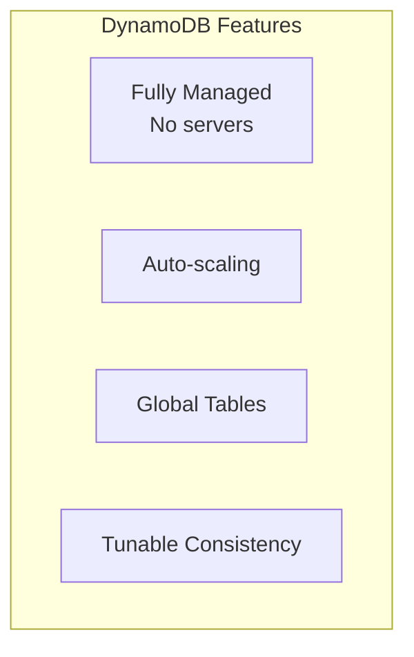
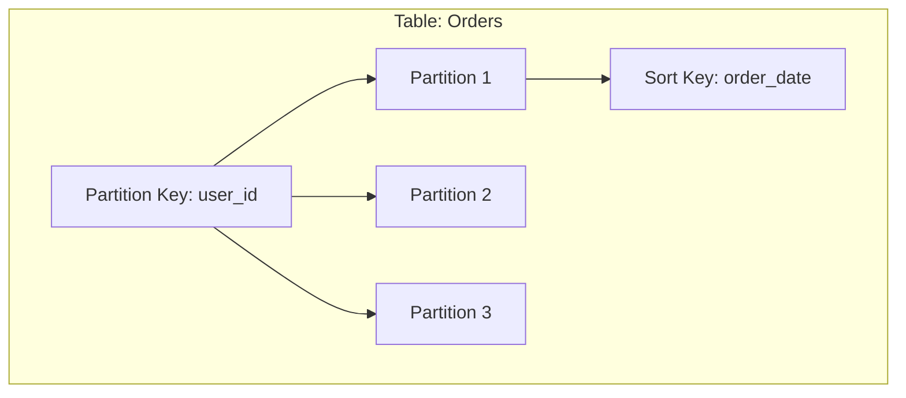
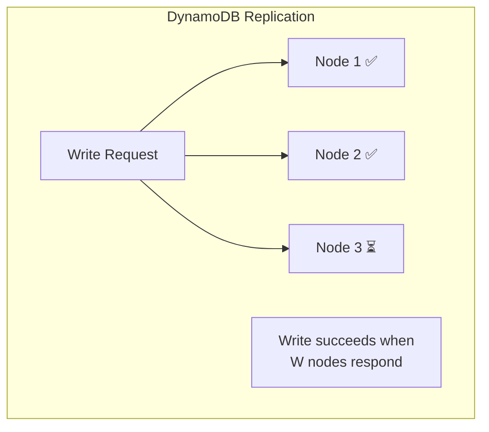
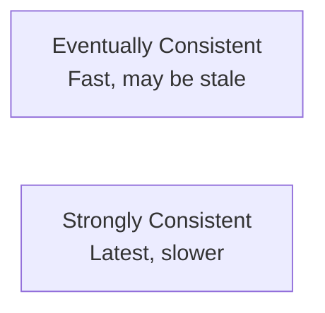
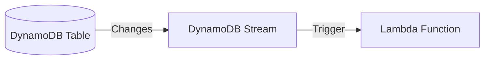
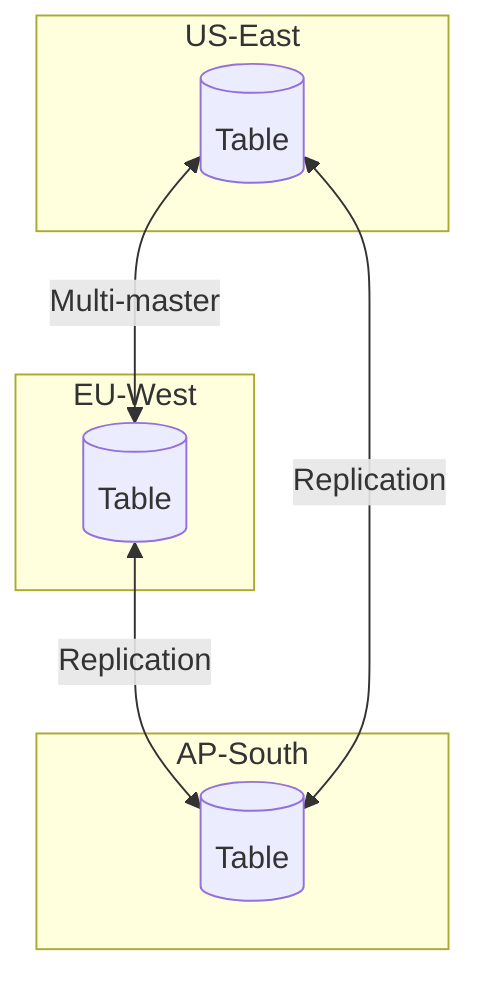
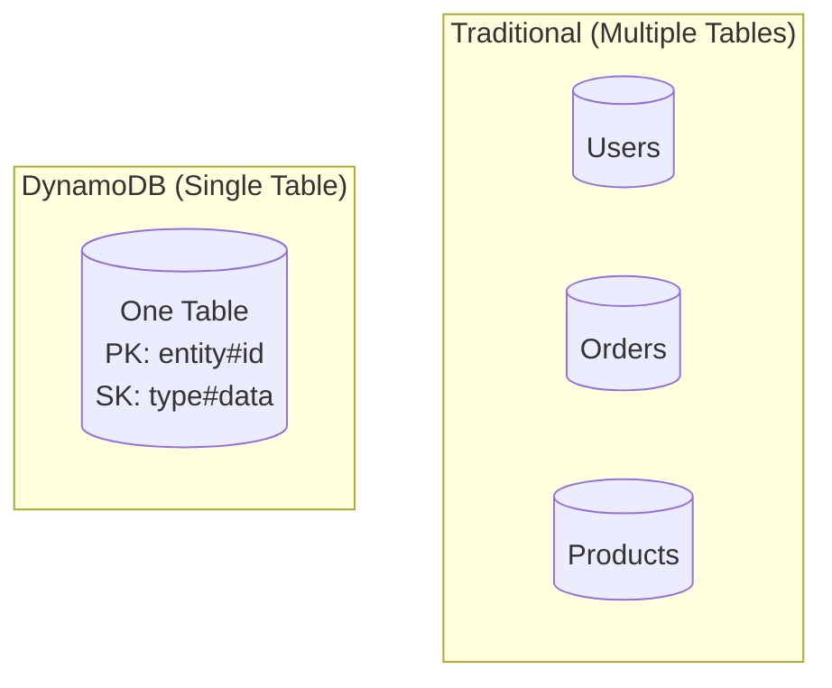
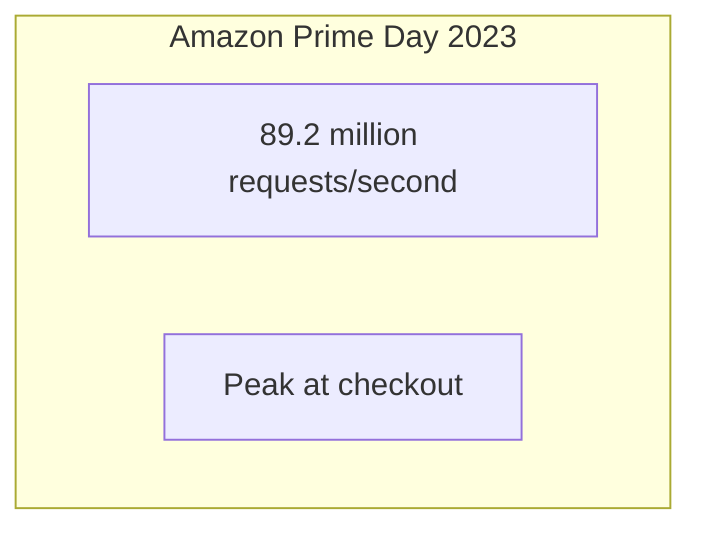

# Amazon DynamoDB

> The fully managed, massively scalable NoSQL database.

---

## 🛒 **Shopping Cart Origin**

DynamoDB evolved from the Amazon Dynamo paper (2007), designed to ensure:
> "The shopping cart must always be available"

---

## 🎯 What Makes DynamoDB Special



---

## 🏗️ Architecture

### Partition Keys & Sort Keys



```
Primary Key = Partition Key + (optional) Sort Key
```

| Example | Partition Key | Sort Key |
|---------|---------------|----------|
| User orders | user_id | order_date |
| Game scores | game_id | score |
| IoT readings | device_id | timestamp |

---

## 🔧 Consistent Hashing + Sloppy Quorums



---

## ⚖️ Consistency Options



| Type | Latency | Guarantee | Cost |
|------|---------|-----------|------|
| Eventually Consistent | Lower | May be stale | 1 RCU |
| Strongly Consistent | Higher | Latest value | 2 RCUs |

```python
# Eventually consistent (default)
response = table.get_item(Key={'id': '123'})

# Strongly consistent
response = table.get_item(
    Key={'id': '123'},
    ConsistentRead=True
)
```

---

## 🔄 DynamoDB Streams



**Use cases**: 
- Replicate to other regions
- Build real-time analytics
- Trigger downstream processes

---

## 🌍 Global Tables



**Multi-master**: Write to any region!

---

## 📊 Access Patterns

### Single Table Design



**DynamoDB tip**: Model for access patterns, not entities!

---

## 🔍 Query vs Scan

| Operation | Use | Performance |
|-----------|-----|-------------|
| **Query** | By partition key | Fast ✅ |
| **Scan** | Full table | Slow ❌ (avoid!) |

---

## 🔥 Real-World: Amazon Scale



---

## ✅ Key Takeaways

1. **Partition key** determines data distribution
2. **Sort key** enables range queries within partition
3. **Eventually consistent** by default (faster, cheaper)
4. **Strongly consistent** when needed (+cost)
5. **Design for access patterns**, not normalized models
6. **Avoid scans** — use queries with partition keys

| Remember | Analogy |
|----------|---------|
| Partition key | Filing cabinet drawer |
| Sort key | Folder order in drawer |
| Query vs Scan | Looking in right drawer vs searching all |

---

[← Previous: Spanner](./04-spanner.md) | [Next: Kubernetes →](./06-kubernetes.md)
