# Kubernetes

> The container orchestration platform that powers modern distributed systems.

---

## 🚢 **Shipping Port Analogy**

| Kubernetes | Shipping Port |
|------------|---------------|
| Pods | Shipping containers |
| Nodes | Ships |
| Control Plane | Port authority |
| Scheduler | Crane operator deciding where to put containers |
| etcd | Master manifest of all containers |

---

## 🎯 What Kubernetes Does


---

## 🏗️ Architecture


### Key Components

| Component | Role |
|-----------|------|
| **API Server** | Frontend, all communication |
| **etcd** | Distributed key-value store (Raft!) |
| **Scheduler** | Assigns pods to nodes |
| **Controller Manager** | Runs reconciliation loops |
| **kubelet** | Agent on each node |

---

## 📦 Core Concepts

### Pod (Smallest Deployable Unit)


### Deployment (Manages Pods)

```yaml
apiVersion: apps/v1
kind: Deployment
metadata:
  name: my-app
spec:
  replicas: 3
  template:
    spec:
      containers:
      - name: my-app
        image: my-app:1.0
```

### Service (Stable Networking)


---

## 🔄 Self-Healing

```mermaid
sequenceDiagram
    participant K as Kubernetes
    participant N as Node
    participant P as Pod
    
    Note over P: ❌ Pod crashes
    K->>K: Detect pod failure
    K->>N: Schedule new pod
    N->>K: Pod running ✅
    
    Note over K: Desired state restored!
```



---

## 🌐 Distributed Systems Concepts in K8s

| Concept | Kubernetes Implementation |
|---------|---------------------------|
| **Consensus** | etcd (Raft) |
| **Service discovery** | DNS, Services |
| **Load balancing** | Services, Ingress |
| **Configuration** | ConfigMaps, Secrets |
| **Health checks** | Liveness, Readiness probes |

---

## 🔥 Real-World: Spotify


---

## ✅ Key Takeaways

1. **Declarative** = Tell K8s desired state, it maintains it
2. **etcd** = Raft-based distributed storage
3. **Self-healing** = Automatic recovery from failures
4. **Service discovery** built-in
5. **Perfect for** microservices, stateless apps

| Remember | Analogy |
|----------|---------|
| Pod | Shipping container |
| Deployment | Order for X containers |
| Service | Address book entry |
| etcd | Master manifest |

---

[← Previous: DynamoDB](./05-dynamodb.md) | [Next: HDFS/GFS →](./07-hdfs-gfs.md)
