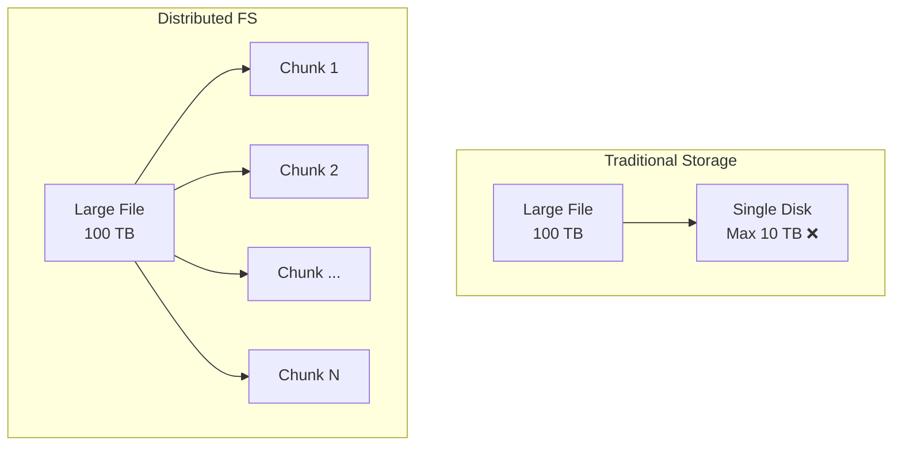
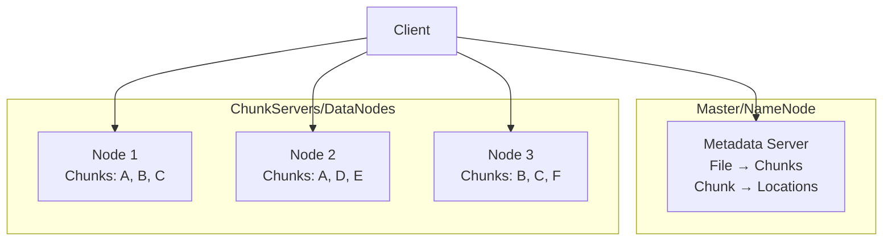
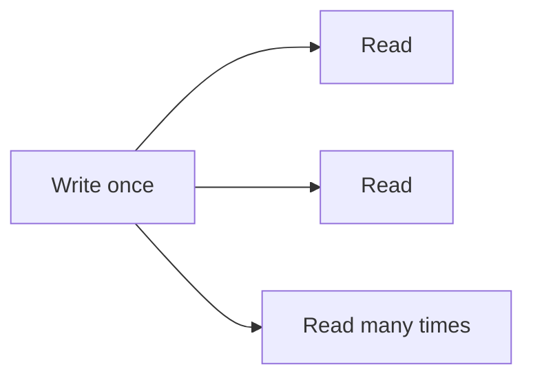
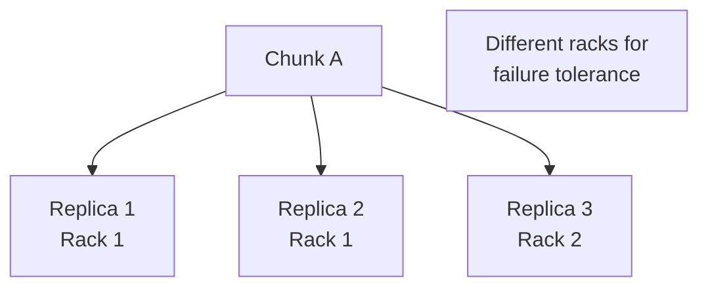
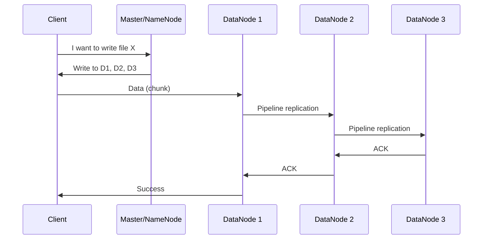
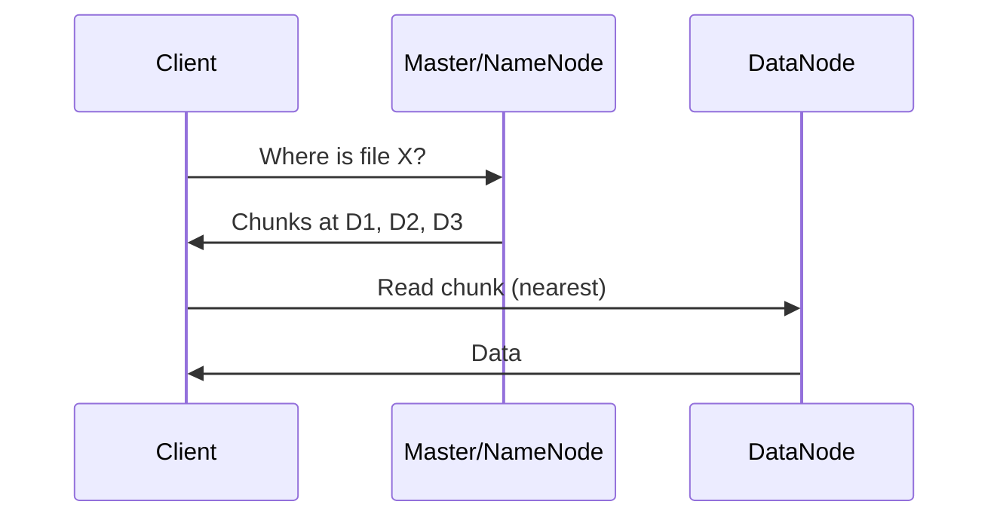
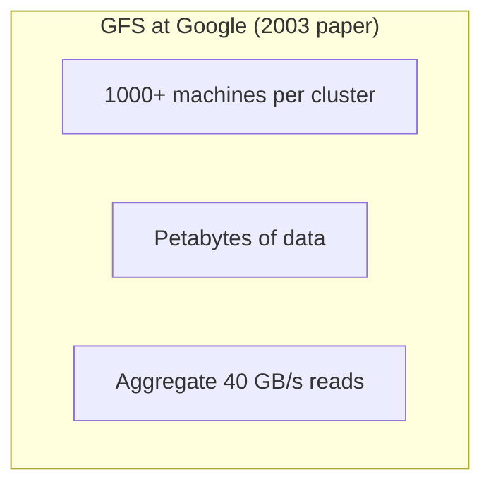
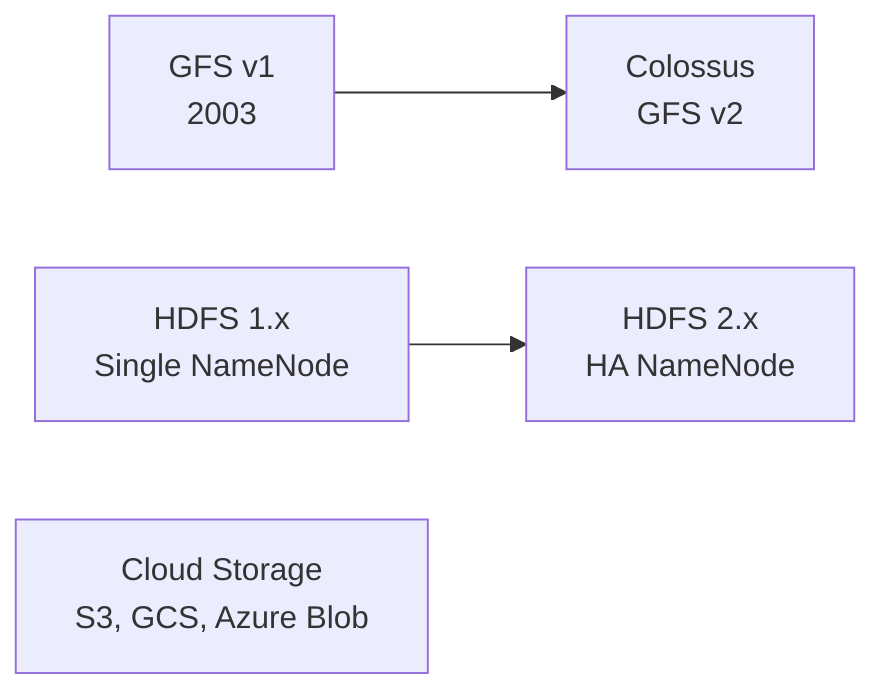

# HDFS and GFS (Distributed File Systems)

> Storing massive files across thousands of machines.

---

## 📚 **Library Analogy**

Imagine a book so large it can't fit on one shelf:

| Problem | Library Solution | Distributed FS |
|---------|------------------|----------------|
| Book too big | Split into volumes | Split into chunks |
| Volume might be lost | Keep copies | Replication |
| Finding a volume | Card catalog | Namenode/Master |

---

## 🎯 The Challenge

---

## 🏗️ GFS/HDFS Architecture

---

## 📋 Key Design Decisions

### Large Chunk Size (64MB - 128MB)

| Small Chunks | Large Chunks |
|--------------|--------------|
| More metadata | Less metadata ✅ |
| More seeks | Fewer seeks ✅ |
| | Wastes space for small files |

### Write-Once, Read-Many

**Why?** Simplifies consistency — no concurrent writes to same chunk.

### Replication (Default: 3 copies)

---

## 🔄 Write Flow

**Pipeline replication**: Data flows through chain, not from client to each.

---

## 📖 Read Flow

**Optimization**: Read from nearest replica!

---

## 🔥 Real-World: Google Scale

---

## 📊 HDFS vs GFS Comparison

| Aspect | GFS (Google) | HDFS (Hadoop) |
|--------|--------------|---------------|
| Origin | Google (2003) | Open-source clone |
| Chunk size | 64 MB | 128 MB (default) |
| NameNode HA | Yes | Added later |
| Use | Google internal | Big Data ecosystem |

---

## ⚠️ Limitations

| Issue | Description |
|-------|-------------|
| **Single master** | Bottleneck, SPOF (mitigated in v2) |
| **Small files** | Inefficient (lots of metadata) |
| **Random writes** | Not supported |
| **Low latency** | Not designed for (batch processing) |

---

## 🏢 Modern Evolution

---

## ✅ Key Takeaways

1. **Split large files** into chunks across machines
2. **Replicate chunks** (default 3x) for durability
3. **Master/NameNode** stores metadata only
4. **Pipeline replication** for efficient writes
5. **Optimized for** large sequential reads/writes
6. **Not for** small files, random access, low latency

| Remember | Analogy |
|----------|---------|
| Chunks | Book volumes |
| NameNode | Card catalog |
| Replication | Multiple library copies |
| Pipeline write | Bucket brigade |

---

[← Previous: Kubernetes](./06-kubernetes.md) | [Back to Module →](./README.md)
