# Failure Handling Patterns

> Building resilient distributed systems that gracefully handle failures.

---

## 🎯 Why This Matters

In distributed systems, failures are **normal**, not exceptional.


---

## 🔄 Retry Pattern

### Simple Retry

```mermaid
sequenceDiagram
    participant C as Client
    participant S as Service
    
    C->>S: Request
    S--xC: ❌ Failure
    C->>C: Wait...
    C->>S: Retry
    S->>C: ✅ Success
```



### Exponential Backoff


```python
def retry_with_backoff(func, max_retries=5):
    for attempt in range(max_retries):
        try:
            return func()
        except TransientError:
            wait = (2 ** attempt) + random.uniform(0, 1)  # Jitter
            time.sleep(wait)
    raise MaxRetriesExceeded()
```

**Jitter**: Random delay to prevent thundering herd.

---

## 🔌 Circuit Breaker

Prevent cascading failures by "breaking the circuit."


### States

| State | Behavior |
|-------|----------|
| **Closed** | Normal operation, count failures |
| **Open** | Fail fast, don't call service |
| **Half-Open** | Allow one test request |


---

## ⏱️ Timeout Pattern

Never wait forever!


```python
# Good: Multiple timeout levels
requests.get(url, 
    connect_timeout=5,    # 5 seconds to connect
    read_timeout=30,      # 30 seconds to read
    total_timeout=60      # 60 seconds total
)
```

---

## 🌊 Bulkhead Pattern

Isolate failures to prevent system-wide impact.


---

## 🔙 Fallback Pattern

Provide degraded functionality instead of failure.


---

## 🔥 Real-World: Netflix Hystrix

```mermaid
graph TB
    subgraph "Netflix Resilience"
        H[Hystrix<br/>(now Resilience4j)]
        
        H --> CB[Circuit Breaker]
        H --> BH[Bulkhead]
        H --> TO[Timeout]
        H --> FB[Fallback]
    end
```

**Netflix uses all these patterns** to handle 2B+ API requests/day!

---

## 📊 Pattern Summary

| Pattern | Purpose | When to Use |
|---------|---------|-------------|
| **Retry** | Handle transient failures | Network blips, temporary issues |
| **Circuit Breaker** | Prevent cascading failures | Dependent service down |
| **Timeout** | Don't wait forever | Every remote call |
| **Bulkhead** | Isolate failures | Multiple dependencies |
| **Fallback** | Graceful degradation | When partial answers OK |

---

## ✅ Key Takeaways

1. **Retries with backoff + jitter** for transient failures
2. **Circuit breaker** to fail fast and prevent cascading failures
3. **Timeouts** on every external call
4. **Bulkheads** to isolate failure domains
5. **Fallbacks** for graceful degradation
6. **Combine patterns** for robust systems

---

[← Back to Module](./README.md) | [Next: Data Synchronization →](./02-data-synchronization.md)
