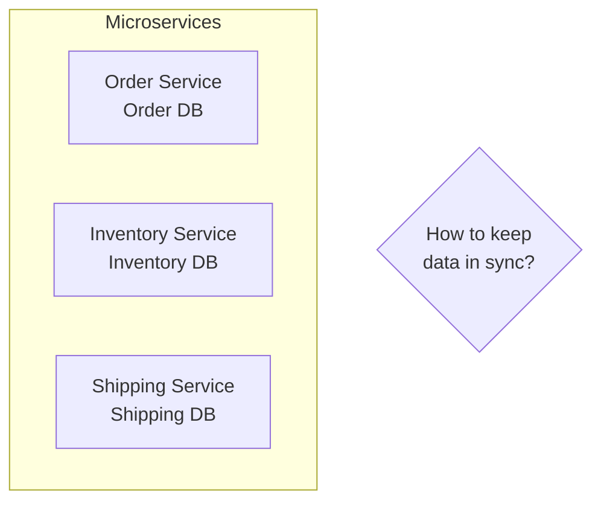
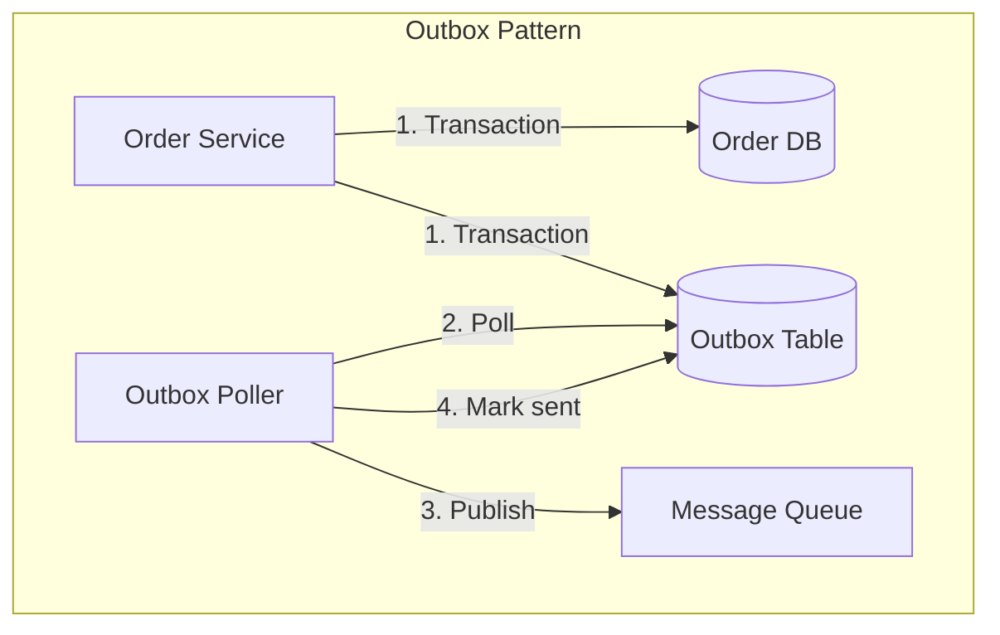
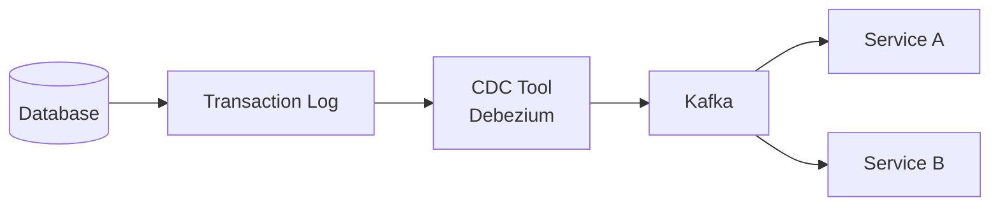
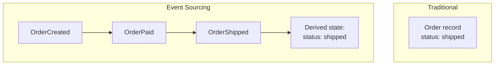
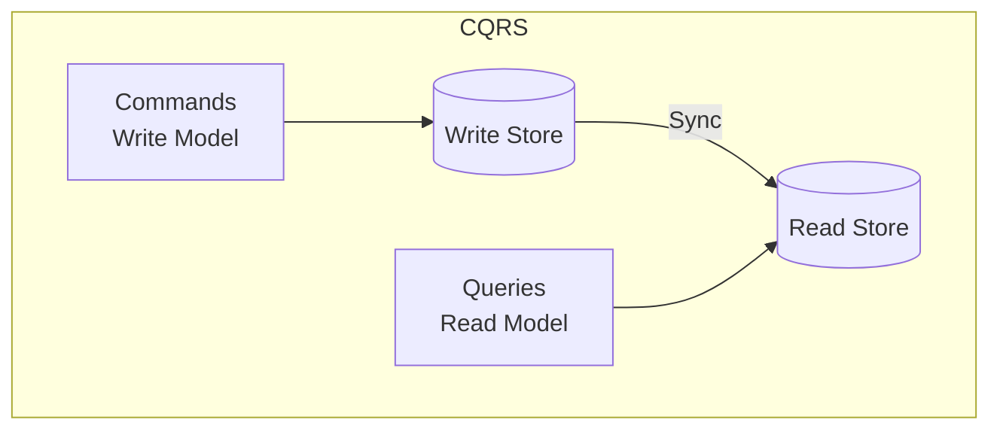
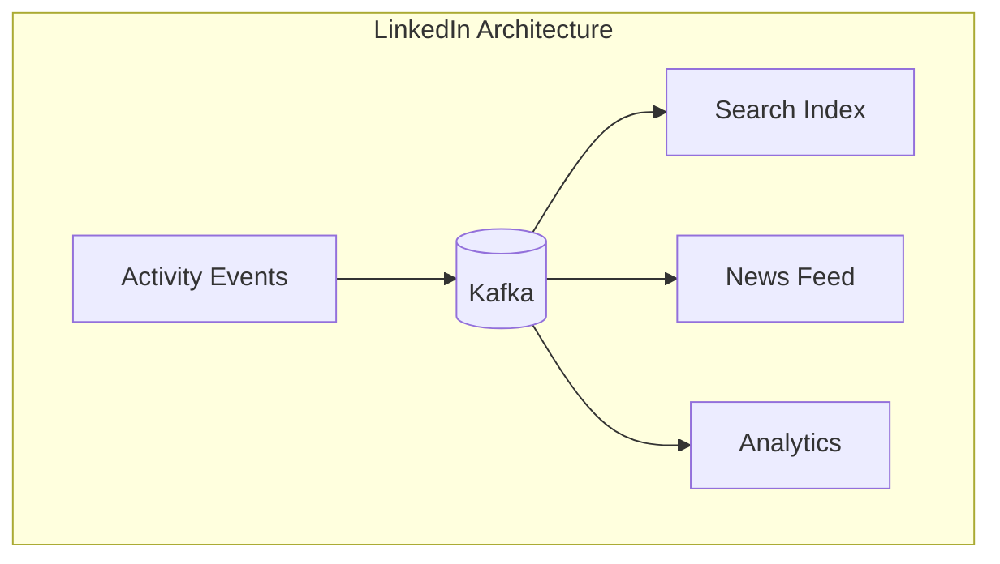

# Data Synchronization Patterns

> Keeping data consistent across distributed services.

---

## 🎯 The Challenge



---

## 📤 Outbox Pattern

Ensure atomic writes to DB and message queue.



**Key insight**: Write to outbox table in same DB transaction as business data!

```sql
BEGIN TRANSACTION;
  INSERT INTO orders (id, ...) VALUES (...);
  INSERT INTO outbox (event_type, payload) 
    VALUES ('OrderCreated', '{"id": 123}');
COMMIT;
```

---

## 🔄 Change Data Capture (CDC)

Capture database changes and stream them.



**How it works**:
1. Database writes to transaction log (WAL)
2. CDC tool (e.g., Debezium) reads log
3. Converts to events, publishes to Kafka
4. Other services consume changes

---

## 📝 Event Sourcing

Store events, not current state.



### Benefits

| Benefit | Description |
|---------|-------------|
| **Full audit log** | Every change recorded |
| **Time travel** | Replay to any point |
| **Event replay** | Rebuild views from events |
| **Decoupling** | Services react to events |

### Example: Bank Account

```python
# Events
events = [
    {"type": "AccountOpened", "amount": 0},
    {"type": "MoneyDeposited", "amount": 100},
    {"type": "MoneyWithdrawn", "amount": 30},
    {"type": "MoneyDeposited", "amount": 50}
]

# Derive current state
balance = 0
for event in events:
    if event["type"] == "MoneyDeposited":
        balance += event["amount"]
    elif event["type"] == "MoneyWithdrawn":
        balance -= event["amount"]
# balance = 120
```

---

## 🔀 CQRS (Command Query Responsibility Segregation)

Separate read and write models.



**Why CQRS?**
- Different data shapes for reads vs writes
- Scale read and write independently
- Optimize each for its purpose

---

## 🔥 Real-World: LinkedIn Event Sourcing



LinkedIn uses event sourcing for activity feeds!

---

## 📊 Pattern Comparison

| Pattern | Use Case | Complexity |
|---------|----------|------------|
| **Outbox** | Reliable event publishing | Low |
| **CDC** | Stream all DB changes | Medium |
| **Event Sourcing** | Full audit, replay capability | High |
| **CQRS** | Different read/write needs | Medium |

---

## ✅ Key Takeaways

1. **Outbox pattern** for reliable DB + message atomicity
2. **CDC** streams database changes to other systems
3. **Event sourcing** stores events as source of truth
4. **CQRS** separates read and write models
5. **Often combined**: CDC + Outbox, Event Sourcing + CQRS

---

[← Previous: Failure Handling](./01-failure-handling.md) | [Next: Communication Patterns →](./03-communication-patterns.md)
