# Communication Patterns

> How services talk to each other in distributed systems.

---

## 📞 **Phone vs Email Analogy**

| Pattern | Like | Characteristics |
|---------|------|-----------------|
| **Synchronous** | Phone call | Wait for response |
| **Asynchronous** | Email | Send and continue |

---

## 🎯 Synchronous Communication

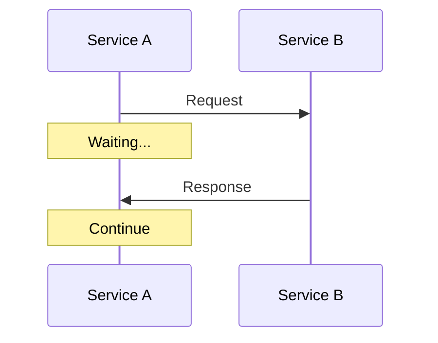

### Request-Response (REST, gRPC)

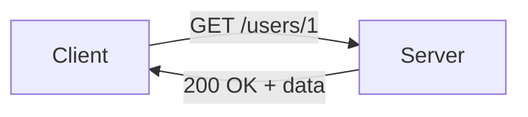

**Pros**: 
- Simple mental model
- Immediate feedback

**Cons**:
- Tight coupling
- Cascading failures
- Blocks the caller

---

## 📬 Asynchronous Communication

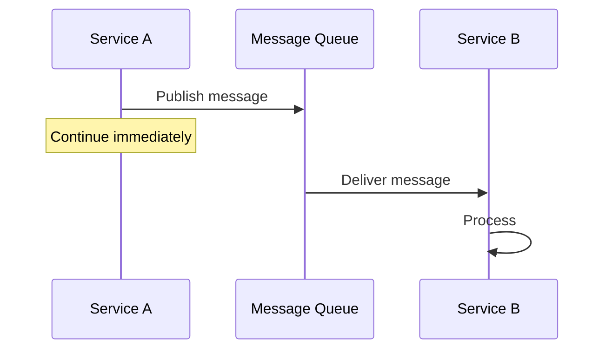

### Message Queues

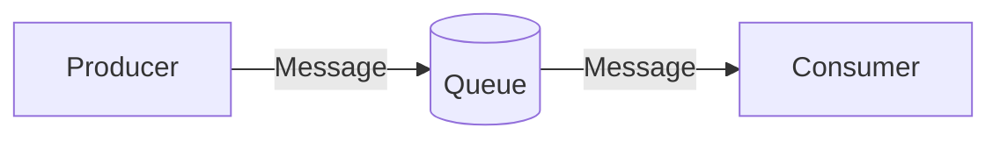

**Examples**: RabbitMQ, Amazon SQS, Redis

### Event Streaming

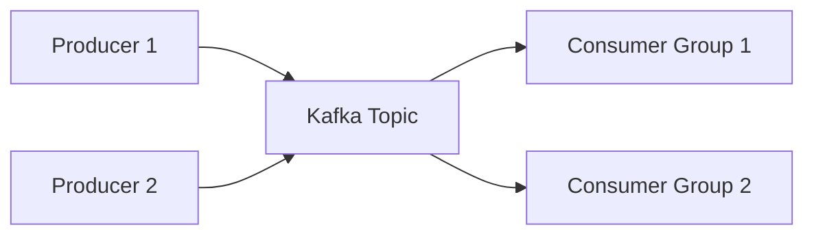

**Examples**: Kafka, Pulsar, Kinesis

---

## 📊 Sync vs Async Comparison

| Aspect | Synchronous | Asynchronous |
|--------|-------------|--------------|
| **Coupling** | Tight | Loose ✅ |
| **Latency** | Depends on downstream | Immediate return ✅ |
| **Failure handling** | Caller fails if callee fails | Retries possible ✅ |
| **Complexity** | Lower ✅ | Higher |
| **Debugging** | Easier ✅ | Harder |

---

## 🔄 Common Patterns

### 1. Request-Reply

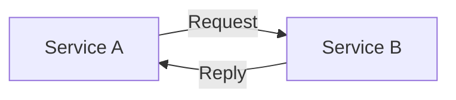

### 2. Publish-Subscribe

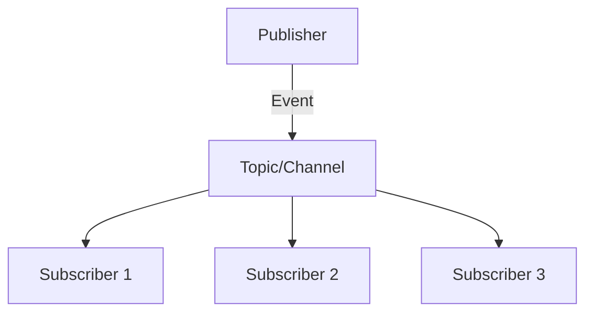

**One-to-many**: Publisher doesn't know subscribers.

### 3. Point-to-Point Queue

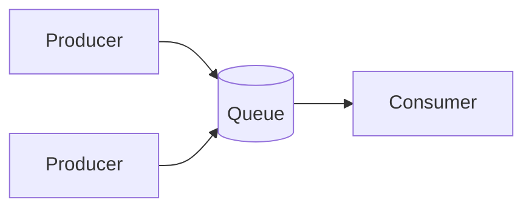

**Each message consumed once** by one consumer.

### 4. Event-Driven

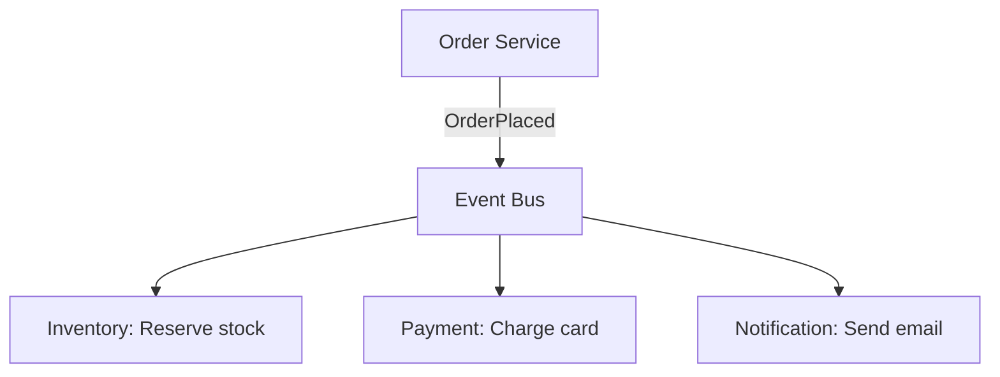

---

## 🍕 **Pizza Delivery Analogy**

| Pattern | Pizza Analogy |
|---------|---------------|
| **Sync** | Wait at counter for pizza |
| **Async (queue)** | Get buzzer, wait elsewhere |
| **Pub-sub** | Pizza tracker notifies all watchers |
| **Event-driven** | Each station starts when previous done |

---

## 🔧 Choosing the Right Pattern

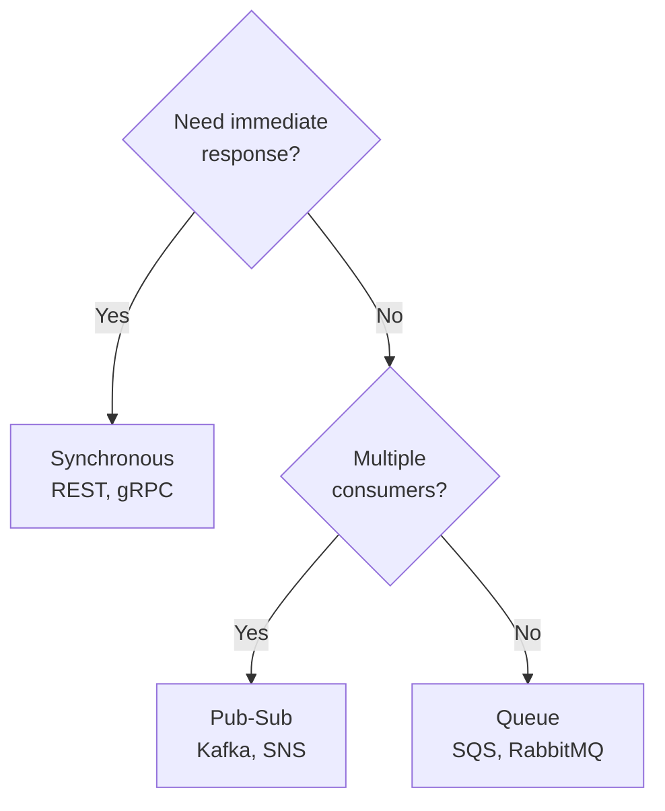

---

## 🔥 Real-World: Uber Architecture

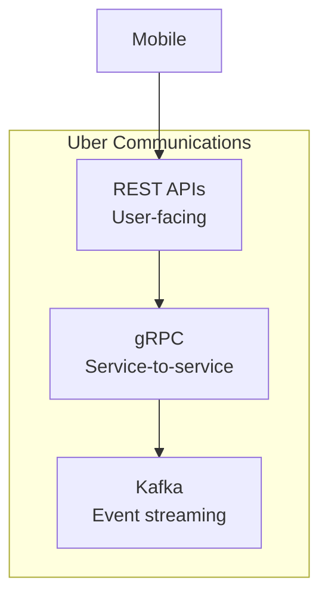

**Uber uses all patterns**:
- REST for mobile apps
- gRPC between services
- Kafka for event-driven workflows

---

## ⚠️ Anti-Patterns

| Anti-Pattern | Problem | Solution |
|--------------|---------|----------|
| **Sync for everything** | Cascading failures | Add async where possible |
| **Fire and forget** | Lost messages | Use acknowledgments |
| **Huge messages** | Queue bloat | Use references, not data |
| **No idempotency** | Duplicate processing | Idempotent handlers |

---

## ✅ Key Takeaways

1. **Synchronous** = Wait for response (simpler, tighter coupling)
2. **Asynchronous** = Don't wait (resilient, complex)
3. **Pub-Sub** = One-to-many broadcast
4. **Queues** = One-to-one, processed once
5. **Mix patterns** based on requirements
6. **Always plan for failures** — retries, dead-letter queues

| Remember | Analogy |
|----------|---------|
| Sync | Phone call |
| Async | Email |
| Queue | DMV ticket |
| Pub-Sub | Newsletter |

---

[← Previous: Data Synchronization](./02-data-synchronization.md) | [Back to Module →](./README.md)
