# 📚 Distributed Systems Knowledge Base

> A comprehensive guide to distributed systems concepts, algorithms, and real-world applications.

---

## 🗺️ Learning Path

```mermaid
graph LR
    A[1. Fundamentals] --> B[2. Partitioning & Replication]
    B --> C[3. Consistency & CAP]
    C --> D[4. Distributed Transactions]
    D --> E[5. Consensus Algorithms]
    E --> F[6. Time & Ordering]
    F --> G[7. Networking & Security]
    G --> H[8. Real-World Systems]
    H --> I[9. Patterns & Practices]
```

---

## 📁 Modules

| Module | Description | Key Topics |
|--------|-------------|------------|
| [01-fundamentals](./01-fundamentals/) | Core concepts | Fallacies, Failures, Safety/Liveness |
| [02-partitioning-and-replication](./02-partitioning-and-replication/) | Scaling data | Sharding, Consistent Hashing, Quorums |
| [03-consistency-and-cap](./03-consistency-and-cap/) | Trade-offs | CAP, PACELC, Consistency Models |
| [04-distributed-transactions](./04-distributed-transactions/) | Atomicity | 2PC, 3PC, Saga Pattern |
| [05-consensus-algorithms](./05-consensus-algorithms/) | Agreement | Paxos, Raft, Leader Election |
| [06-time-and-ordering](./06-time-and-ordering/) | Causality | Lamport Clocks, Vector Clocks |
| [07-networking-and-security](./07-networking-and-security/) | Communication | TLS, OAuth, Network Layers |
| [08-real-world-systems](./08-real-world-systems/) | Case Studies | Kafka, Cassandra, Spanner, K8s |
| [09-patterns-and-practices](./09-patterns-and-practices/) | Best Practices | Failure Handling, CDC, Retries |

---

## 🔥 Real-World Incidents Referenced

| Incident | Year | Related Concept | Module |
|----------|------|-----------------|--------|
| GitHub MySQL Outage | 2018 | Replication Lag | 02 |
| AWS S3 Outage | 2017 | Cascading Failures | 09 |
| Cloudflare etcd Outage | 2020 | Raft/Leader Election | 05 |
| Slack Database Issues | 2022 | Consistency | 03 |
| Facebook Cassandra | 2009+ | Eventual Consistency | 03, 08 |

---

## 🏢 Systems & Companies Covered

- **Amazon**: DynamoDB, S3, Aurora
- **Google**: Spanner, BigTable, GFS, Chubby
- **Apache**: Kafka, Cassandra, ZooKeeper, HBase, Flink
- **Netflix**: Chaos Engineering
- **Uber**: Ringpop, Cadence
- **Meta**: Cassandra origins

---

## 🚀 Quick Start

1. **New to distributed systems?** Start with [01-fundamentals](./01-fundamentals/)
2. **Interview prep?** Focus on [03-consistency-and-cap](./03-consistency-and-cap/) and [05-consensus-algorithms](./05-consensus-algorithms/)
3. **Building systems?** Jump to [08-real-world-systems](./08-real-world-systems/)

---

## 📖 Source
Based on [Educative: Distributed Systems for Practitioners](https://www.educative.io/courses/distributed-systems-practitioners) with additional real-world context and diagrams.
