# Lambda Architecture - Comprehensive Interview Guide

> **Created by Nathan Marz (LinkedIn, Twitter) in 2011** for handling massive-scale data processing with combined batch and real-time capabilities.

This document covers everything you need to answer Lambda Architecture questions in depth.

---

## 📖 Table of Contents

1. [Origin Story & Problem Statement](#origin-story--problem-statement)
2. [Core Principles](#core-principles)
3. [The Three Layers - Deep Dive](#the-three-layers---deep-dive)
4. [Data Flow - Step by Step](#data-flow---step-by-step)
5. [Technology Choices](#technology-choices)
6. [Trade-offs & Challenges](#trade-offs--challenges)
7. [Lambda vs Kappa vs Delta Architecture](#lambda-vs-kappa-vs-delta-architecture)
8. [Azure/Databricks Implementation](#azuredatabricks-implementation)
9. [Interview Questions - 40+ Q&A](#interview-questions---complete-qa)
10. [When to Use & When to Avoid](#when-to-use--when-to-avoid)

---

## Origin Story & Problem Statement

### Who Created Lambda Architecture?

**Nathan Marz** created Lambda Architecture while working at **Twitter** to solve their massive data processing challenges. He later co-authored "Big Data: Principles and Best Practices of Scalable Realtime Data Systems" with James Warren.

### The Problem It Solves

```mermaid
graph TB
    subgraph "The Dilemma"
        B[Batch Processing] --> BA[✅ Accurate\n✅ Complex Logic\n❌ High Latency]
        S[Stream Processing] --> SA[✅ Low Latency\n❌ Limited Logic\n❌ Hard to Reprocess]
    end
    
    BA --> Problem[How do we get BOTH\naccuracy AND low latency?]
    SA --> Problem
    
    Problem --> Lambda[Lambda Architecture:\nCombine both approaches!]
```



### Real-World Scenario

> *"LinkedIn has 900M+ members. We need:*
> - *Real-time feed updates (who viewed your profile, new connections) - seconds*
> - *Weekly analytics (profile views trend, job market insights) - accurate*
> - *Anomaly detection for security - real-time*
> - *Machine learning recommendations - batch computed*"

**No single system can do ALL of this optimally. Lambda Architecture combines specialized systems.**

---

## Core Principles

Nathan Marz defined these fundamental principles:

### Principle 1: Human Fault-Tolerance


**Key Insight**: If you keep raw data immutable, you can ALWAYS recompute any view if there's a bug.

### 💡 Deep Dive: Why "Human" Fault Tolerance?

The biggest risk to data isn't hard drive failure (RAID handles that). **The biggest risk is bad code deployed by a human.**

*   **Scenario A (Mutable / SQL)**: You deploy a bug that calculates `revenue = price * 0.5` instead of `price * 1.0`. You run this UPDATE on the production database.
    *   **Result**: Your data is permanently corrupted. You cannot "undo" easily without a full database restore.
*   **Scenario B (Immutable / Lambda)**: You deploy the same bug. The Batch View is created with wrong revenue. The Raw Events (Master Dataset) are untouched.
    *   **Recovery**: You fix the bug, re-run the Batch Job, and overwrite the View.
    *   **Result**: 100% recovery with zero data loss.

**Conclusion**: The system tolerates *human mistakes* because it strictly separates **Data (Immutable)** from **Views (Derivable)**.

### Principle 2: Data Immutability

| Traditional | Lambda (Immutable) |
|-------------|-------------------|
| `UPDATE users SET name = 'John' WHERE id = 1` | `APPEND {id: 1, name: 'John', timestamp: T2}` |
| Previous value LOST | Previous value PRESERVED |
| Cannot answer "what was the name at time T1?" | Can answer any historical question |

### 💡 Deep Dive: The "Time Travel" Superpower

Because we never overwrite data, the master dataset is essentially a **log of every state change in history**.
*   **Question**: "What was the user's address on Jan 1st?"
*   **Method**: Replay all `APPEND` events up to Jan 1st. Ignore everything after.
*   **Benefit**: This makes debugging complex issues (like "Why did the recommendation engine show this ad last Tuesday?") possible. In a traditional DB, that state is gone forever.

### Principle 3: Recomputation


### 💡 Deep Dive: Functional Programming for Data

Lambda Architecture applies **Functional Programming** concepts to Big Data:
> **View = Function(All Data)**
        IoT[IoT Sensors]
        Web[Web Events]
        App[Mobile Apps]
        DB[Databases]
    end
    
    subgraph MQ["Message Queue Layer"]
        Kafka[Apache Kafka\nEvent Hub\nKinesis]
    end
    
    Sources --> Kafka
    
    subgraph Batch["Batch Layer"]
        direction TB
        Master[(Master Dataset\nImmutable, Append-only)]
        BatchProc[Batch Processing\nSpark, Hadoop]
        BatchViews[(Batch Views\nPre-computed)]
        
        Master --> BatchProc
        BatchProc --> BatchViews
    end
    
    subgraph Speed["Speed Layer"]
        StreamProc[Stream Processing\nSpark Streaming, Flink]
        SpeedViews[(Speed Views\nReal-time)]
        
        StreamProc --> SpeedViews
    end
    
    Kafka --> Master
    Kafka --> StreamProc
    
    subgraph Serving["Serving Layer"]
        Merge[Merge Engine]
        API[Query API]
        
        Merge --> API
    end
    
    BatchViews --> Merge
    SpeedViews --> Merge
    
    API --> Users[Users/Applications]
```

---

### Layer 1: Message Queue (Unified Log)

#### What Is It?

A distributed, durable buffer that decouples data producers from consumers.

#### Why Do We Need It?


### 💡 Deep Dive: Why does Batch Layer read from Kafka?

*"Why not write files directly to S3/ADLS?"* This is a top interview question.

1.  **The "Small Files" Problem**:
    *   If 10,000 sensors write directly to ADLS every second, you get millions of tiny 1KB files.
    *   **Result**: This crashes the Distributed File System (NameNode memory limits) and makes analytics incredibly slow.
    *   **Solution**: Kafka acts as a buffer. The "Batch Ingestion" job reads from Kafka and writes **ONE large, optimized Parquet file** (e.g., every 15 min) to ADLS.

2.  **The "Dual Consumer" Capability**:
    *   Kafka allows multiple **Consumer Groups** to read the *same data* at *different speeds*.
    *   **Speed Layer Consumer**: Reads Tip of Stream (Latest).
    *   **Batch Layer Consumer**: Reads continuously to archive to "Master Dataset" (Bronze).
    *   Neither blocks the other.


#### Key Concepts

| Concept | Explanation | Why It Matters |
|---------|-------------|----------------|
| **Partitions** | Queue divided into parallel segments | Partitions = max parallelism. 100 partitions = 100 parallel consumers |
| **Offsets** | Position marker in a partition | Consumers track progress. Can reset to replay. |
| **Retention** | How long messages kept | Typically 7 days. Longer = more replay capability. |
| **Consumer Groups** | Set of consumers sharing load | Each group gets full copy. Multiple groups = multiple independent consumers. |
| **Ordering** | Messages ordered within partition | Use partition key to ensure related events in order |

#### Interview Deep Dive: Partitioning Strategy

```mermaid
graph TB
    subgraph "Partition by User ID"
        U1[User 123 events] --> P1[Partition 1]
        U2[User 456 events] --> P2[Partition 2]
        U3[User 789 events] --> P3[Partition 3]
        
        Benefit1[✅ All events for a user in order\n✅ Parallel processing across users]
    end
```



```python
# Kafka Producer - Partition by key
from kafka import KafkaProducer
import json

producer = KafkaProducer(
    bootstrap_servers=['broker1:9092', 'broker2:9092'],
    value_serializer=lambda v: json.dumps(v).encode('utf-8'),
    key_serializer=lambda k: k.encode('utf-8')
)

# Events for same user go to same partition (in order)
event = {"user_id": "123", "action": "click", "timestamp": "2024-01-15T10:30:00Z"}
producer.send(
    topic='user-events',
    key=event['user_id'],  # Partition key!
    value=event
)
```

#### Interview Questions: Message Queue

| Question | Expected Answer |
|----------|----------------|
| *Why message queue instead of direct writes?* | Decoupling (producer/consumer independent), Buffering (handles spikes), Replay (reprocess if needed), Multiple consumers (batch + speed from same data) |
| *How to ensure ordering?* | Partition by key. All events with same key go to same partition and are ordered. |
| *What if Kafka is down?* | Multi-broker replication. Producers buffer locally. Kafka cluster is highly available. |
| *How many partitions?* | Partitions = parallelism ceiling. Too few = bottleneck. Too many = overhead. Typically 10-100 per topic. |
| *What's the right retention?* | Based on reprocessing needs. 7 days typical. Critical data: longer or also persist to ADLS. |

---

### Layer 2: Batch Layer

#### What Is It?

The batch layer manages the **master dataset** (immutable, append-only) and precomputes **batch views** through expensive but accurate transformations.

#### Architecture Detail


#### Why Immutable Master Dataset?


| Benefit | Explanation |
|---------|-------------|
| **Reprocessing** | Found bug in logic? Recompute entire view from raw data. |
| **Auditing** | Compliance needs? Every raw record preserved. |
| **Time Travel** | What was state at time T? Query master dataset at that point. |
| **Multiple Views** | Same raw data → different aggregations for different use cases |
| **Debugging** | Compare raw vs processed to find issues |

#### What Makes Batch Processing Different?

| Aspect | Batch | Streaming |
|--------|-------|-----------|
| **Data Scope** | ALL historical data | Only recent data |
| **Processing Time** | Hours acceptable | Seconds required |
| **Complexity** | Any complexity OK | Must be simple/fast |
| **Accuracy** | 100% accurate | May have approximations |
| **Cost** | Run only when needed | 24/7 cluster cost |
| **Late Data** | Naturally handled (waits) | Needs watermarks, may drop |

#### Batch Processing Code Pattern

```python
from pyspark.sql import SparkSession
from pyspark.sql.functions import *
from datetime import date, timedelta

spark = SparkSession.builder.appName("DailyBatch").getOrCreate()

# Configuration
BATCH_DATE = (date.today() - timedelta(days=1)).strftime("%Y-%m-%d")

# ============================================
# STEP 1: Read from Master Dataset (Bronze)
# ============================================
# Only read required partition - CRITICAL for performance!
master_data = spark.read.format("delta") \
    .load("/bronze/events") \
    .filter(f"event_date = '{BATCH_DATE}'")

print(f"Processing {master_data.count()} records for {BATCH_DATE}")

# ============================================
# STEP 2: Complex Transformations
# ============================================
# These are TOO EXPENSIVE for streaming but fine in batch

# Multi-table enrichment
customers = spark.read.format("delta").load("/bronze/customers")
products = spark.read.format("delta").load("/bronze/products")

enriched = master_data \
    .join(broadcast(customers), on="customer_id", how="left") \
    .join(broadcast(products), on="product_id", how="left")

# ML model inference (expensive)
from mymodels import fraud_model_udf

with_predictions = enriched \
    .withColumn("fraud_score", fraud_model_udf(
        col("amount"), col("customer_age"), col("product_category")
    ))

# Complex window functions
from pyspark.sql.window import Window

customer_window = Window.partitionBy("customer_id").orderBy("event_time")

with_features = with_predictions \
    .withColumn("customer_order_rank", row_number().over(customer_window)) \
    .withColumn("customer_running_total", sum("amount").over(customer_window))

# ============================================
# STEP 3: Create Batch Views (Gold)
# ============================================
# Daily summary
daily_summary = with_features.groupBy("event_date", "product_category").agg(
    count("*").alias("order_count"),
    sum("amount").alias("total_revenue"),
    avg("amount").alias("avg_order_value"),
    countDistinct("customer_id").alias("unique_customers"),
    sum(when(col("fraud_score") > 0.8, 1).otherwise(0)).alias("flagged_orders")
)

# ============================================
# STEP 4: Write to Batch Views (Idempotent!)
# ============================================
# Replace only this partition - safe to re-run
daily_summary.write.format("delta") \
    .mode("overwrite") \
    .option("replaceWhere", f"event_date = '{BATCH_DATE}'") \
    .save("/gold/daily_summary")

print(f"✅ Batch completed for {BATCH_DATE}")
```

#### Interview Questions: Batch Layer

| Question | Expected Answer |
|----------|----------------|
| *Why is master dataset immutable?* | Enables reprocessing after bugs, auditing, time travel, multiple views from same data |
| *How often does batch run?* | Depends on SLA. Daily for cost efficiency, hourly for fresher data. |
| *What if batch takes too long?* | Parallelize (more partitions), optimize (broadcast joins, caching), incremental processing |
| *How do you handle late data in batch?* | Batch naturally waits. Define cutoff time. Very late data goes to next batch. |
| *Can you reprocess?* | Yes! Clear batch views, re-run job. Master dataset is unchanged. |
| *Why not just use real-time for everything?* | Complex logic hard, reprocessing impossible, 24/7 cluster cost, late data challenging |

---

### Layer 3: Speed Layer

#### What Is It?

The speed layer compensates for batch layer's latency by processing RECENT data in real-time with SIMPLE transformations.

#### Architecture Detail


#### Key Principle: Simplicity for Speed


#### Speed Layer Data Lifecycle


**Critical Insight**: Speed layer data only needs to cover the GAP since last batch run. Once batch runs, speed data for that period can be discarded.

#### Speed Layer Code Pattern

```python
from pyspark.sql import SparkSession
from pyspark.sql.functions import *

spark = SparkSession.builder.appName("SpeedLayer").getOrCreate()

# ============================================
# Read Streaming Data
# ============================================
raw_stream = spark.readStream \
    .format("kafka") \
    .option("kafka.bootstrap.servers", "broker:9092") \
    .option("subscribe", "user-events") \
    .option("startingOffsets", "latest")  # Only new data! \
    .load()

# Parse JSON
schema = "user_id STRING, action STRING, amount DOUBLE, event_time TIMESTAMP"

events = raw_stream \
    .select(from_json(col("value").cast("string"), schema).alias("data")) \
    .select("data.*")

# ============================================
# SIMPLE Aggregations Only!
# ============================================
# Watermark: Events up to 5 minutes late are accepted
# Window: Aggregate in 1-minute tumbling windows

realtime_metrics = events \
    .withWatermark("event_time", "5 minutes") \
    .groupBy(
        window("event_time", "1 minute"),
        "action"
    ) \
    .agg(
        count("*").alias("event_count"),
        sum("amount").alias("total_amount"),
        approx_count_distinct("user_id").alias("unique_users")  # Approximate for speed!
    )

# ============================================
# Write Speed Views
# ============================================
query = realtime_metrics.writeStream \
    .format("delta") \
    .outputMode("append") \
    .option("checkpointLocation", "/checkpoints/speed_metrics") \
    .trigger(processingTime="10 seconds") \
    .start("/speed/realtime_metrics")

# This runs continuously, updating every 10 seconds
query.awaitTermination()
```

#### Why Is Speed Layer "Temporary"?

| Aspect | Speed Layer | Batch Layer |
|--------|-------------|-------------|
| **Accuracy** | May be approximate | 100% accurate |
| **Coverage** | Recent hours only | All history |
| **On Failure** | May lose recent data | Can recompute |
| **Purpose** | Cover latency gap | Source of truth |

**When batch runs**, it produces accurate data for the period that speed layer was covering. Speed layer data for that period becomes obsolete.

#### Interview Questions: Speed Layer

| Question | Expected Answer |
|----------|----------------|
| *Why keep speed layer simple?* | Latency requirement. Complex logic adds seconds/minutes. Real-time must be fast. |
| *How long do you keep speed view data?* | Only since last batch. Typically 1-24 hours. Batch covers everything before. |
| *What if speed layer has wrong results?* | It's temporary. Next batch will produce correct data and supersede speed layer. |
| *What's a watermark?* | Time threshold. Events older than (MAX(event_time) - watermark) are dropped. Limits state. |
| *Why approx_count_distinct?* | Exact count requires storing all IDs (memory). HyperLogLog approximation is fast and small. |
| *What happens if speed layer fails?* | Lose real-time view temporarily. Batch still has all data. Restart stream from checkpoint. |

---

### Layer 4: Serving Layer

#### What Is It?

The serving layer indexes batch views and speed views and merges them to answer queries.

#### Architecture Detail


#### The Merge Logic

```sql
-- Serving Layer Query
CREATE VIEW unified_metrics AS

-- Batch views: Complete data through last batch
SELECT 
    window_start,
    window_end,
    action,
    event_count,
    total_amount,
    unique_users,
    'batch' as source
FROM gold.daily_metrics
WHERE window_end <= (SELECT MAX(batch_timestamp) FROM gold.batch_runs)

UNION ALL

-- Speed views: Data AFTER last batch (filling the gap)
SELECT 
    window.start as window_start,
    window.end as window_end,
    action,
    event_count,
    total_amount,
    unique_users,
    'speed' as source
FROM speed.realtime_metrics
WHERE window.start > (SELECT MAX(batch_timestamp) FROM gold.batch_runs)
```

#### Query Flow


#### Interview Questions: Serving Layer

| Question | Expected Answer |
|----------|----------------|
| *How do you merge batch and speed?* | UNION with time-based filter. Batch covers historical, Speed covers recent gap. |
| *What if they overlap?* | Shouldn't overlap if time filter correct. If overlap, batch wins (more accurate). |
| *How to handle batch being late?* | Speed layer covers longer window. Eventually batch catches up. |
| *Is query fast?* | Yes! Batch views are pre-computed. Speed views are small. Merge is simple. |

---

## Data Flow - Step by Step

### Complete Flow Diagram

```mermaid
sequenceDiagram
    participant IoT as IoT Device
    participant MQ as Message Queue
    participant BL as Batch Layer
    participant SL as Speed Layer
    participant SV as Serving Layer
    participant User
    
    Note over MQ: Retention: 7 days
    
    IoT->>MQ: Event: {temp: 25°C, device: 123}
    
    par Parallel Processing
        MQ->>BL: Append to Master Dataset
        Note over BL: Stored in Bronze\n/bronze/iot/date=2024-01-15/
        
        MQ->>SL: Process in real-time
        Note over SL: Window aggregate\nUpdate speed view
        SL->>SV: Write to speed table
    end
    
    Note over BL: Later (2 AM daily)...
    
    BL->>BL: Batch job runs
    Note over BL: Complex aggregations\nML models\nMulti-joins
    
    BL->>SV: Write to batch views
    
    Note over SV: Speed view for yesterday\nnow superseded
    
    User->>SV: Query: Yesterday's avg temp
    SV->>User: 23.5°C (from batch view)
    
    User->>SV: Query: Current avg temp
    SV->>User: 25.1°C (batch + speed merged)
```



---

## Technology Choices

### Technology Stack by Layer


### Azure/Databricks Stack

| Layer | Technology | Why |
|-------|------------|-----|
| Message Queue | Event Hub | Azure-native, scales automatically, AAD integration |
| Batch Processing | Databricks (Spark) | Managed Spark, Delta Lake, Unity Catalog |
| Speed Processing | Databricks Structured Streaming | Same codebase as batch, exactly-once |
| Master Dataset | Delta Lake (ADLS Gen2) | ACID, time travel, versioning |
| Serving | Delta Lake + Synapse | SQL interface, Power BI integration |

---

## Trade-offs & Challenges

### Challenge 1: Code Duplication


**Solution**: Use the same framework (Spark) for both. Delta Live Tables can unify the logic.

### Challenge 2: Operational Complexity

| Component | Needs Monitoring |
|-----------|------------------|
| Message Queue | Lag, partition health |
| Batch Layer | Job duration, failures |
| Speed Layer | Throughput, latency |
| Serving Layer | Query performance |

### Challenge 3: Eventual Consistency

Speed layer may have slightly different results than batch will compute later. Users see real-time first, then accurate later.

---

## Lambda vs Kappa vs Delta Architecture

### Comparison


### When to Use What

| Architecture | Use When | Avoid When |
|--------------|----------|------------|
| **Lambda** | Need 100% accuracy audit (finance), batch logic complex | Team is small, latency > 5 min acceptable |
| **Kappa** | Logic simple, Kafka retention high, team loves Stream code | Need complex historical joins |
| **Delta** | On Databricks/Azure. Simplified Lambda. Best of both. | Not using Lakehouse |

---

## Azure/Databricks Implementation

### The "Lakehouse" Simplification (Delta Architecture)

Modern Databricks stack simplifies Lambda:
1.  **Unified Tables**: Batch and Stream both write to **Delta Lake**.
2.  **Unified Code**: Spark Structured Streaming for both.
3.  **No Separate Views**: Serving layer queries Delta Tables directly.

```python
# Delta Architecture Pattern
# Both Batch and Stream write to SAME Path

# Stream (Speed)
stream_df.writeStream.format("delta") \
    .outputMode("append").start("/tables/events")

# Batch (Correction/Backfill)
batch_df.write.format("delta") \
    .mode("overwrite") \
    .option("replaceWhere", "date = '2024-01-01'") \
    .save("/tables/events")
```

---

## Interview Questions - Complete Q&A

### Conceptual Questions

1.  **What problem does Lambda Architecture solve?**
    *   *Answer*: It balances high latency/high accuracy (Batch) with low latency/low accuracy (Speed). It solves the "CAP theorem for Data" by having two systems.

2.  **Why is the Batch Layer called the "Source of Truth"?**
    *   *Answer*: It processes ALL historical data from the immutable master dataset. If there are bugs, you can fix code and reprocess history. Speed layer is temporary.

3.  **What is the "Code Duplication" problem?**
    *   *Answer*: Maintaining two codebases (e.g., Hadoop for batch, Storm for speed) for the same business logic leads to logic drift and bugs. Solved by Unified Compute engines like Spark.

### Design Questions

4.  **Design a system for a Real-time Dashboard + Monthly Report.**
    *   *Answer*: Step 1: Ingest to Kafka. Step 2: Speed Layer (Spark Stream) aggregates to Redis for Dashboard. Step 3: Batch Layer (Spark Daily) aggregates to Data Warehouse for Report. Step 4: Serving layer unions them.

5.  **How do you handle a bug in the code?**
    *   *Answer*: Fix the bug. Re-deploy Batch Layer code. Re-run the batch job for affected dates. This overwrites the Batch Views with correct data. Speed layer fixes itself eventually (data expires).

6.  **How do you handle Late Data?**
    *   *Answer*: Speed layer uses Watermarks to drop very late data or update state. Batch layer naturally handles late data by processing everything available at run time (e.g., 2 AM).

### Technical Deep Dive

7.  **What happens to Speed Layer data after Batch runs?**
    *   *Answer*: It is discarded or ignored by the Serving layer filter (timestamp < last_batch_run).

8.  **Can I use the same DB for Batch and Speed Views?**
    *   *Answer*: Yes, but be careful with locking. Batch writes are heavy (bulk load). Speed writes are frequent (single row). Better to use specialized stores (e.g., Cassandra for Speed, DW for Batch) or a Lakehouse (Delta Lake).

9.  **Why use Kafka? Why not file upload?**
    *   *Answer*: Kafka allows multiple consumers (Batch and Speed) to read the SAME data at DIFFERENT speeds without blocking each other.

10. **What is "Human Fault Tolerance"?**
    *   *Answer*: The ability to recover from human errors (bugs) by recomputing views from the immutable master dataset. Most DBs (Updates) destroy the original state, making recovery impossible.

---

## When to Use & When to Avoid

### ✅ USE Lambda When:
1.  **Accuracy is critical** (Billing, Financial reporting).
2.  **Algorithms are complex** (Heavy ML models retraining nightly).
3.  **Reprocessing is frequent** (Business logic changes often).
4.  **Latency requirement** is mixed (Real-time view + Historical view).

### ❌ AVOID Lambda When:
1.  **Small team**: Maintaining 2 stacks is expensive.
2.  **Logic is simple**: Just use Streaming (Kappa).
3.  **Modern Stack available**: Use Delta Architecture (Lakehouse) which unifies this natively.
