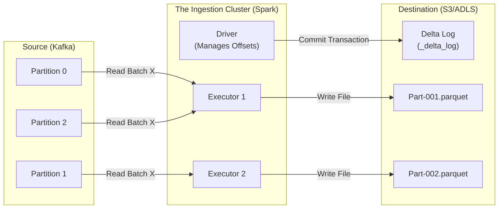

# Deep Dive: Kafka to Data Lake Ingestion (Layer 1 -> Layer 2)

> **The "Ingestion Job" Specification**
> How to move data from the Message Queue (Kafka/Event Hub) to the Master Dataset (S3/ADLS) reliably.

---

## 1. 🟢 The Core Concept

We are bridging the gap between **Streaming** (Kafka) and **Storage** (Data Lake).
*   **Source**: Distributed Log (Kafka). 100 partitions. millisecond latency.
*   **Destination**: Distributed File System (S3/ADLS). Delta Lake tables. high-throughput files.
*   **The Job**: A Spark Structured Streaming job that acts as the "bridge".

### The "Auto Loader" Pattern (Databricks)
In modern Azure/Databricks stacks, we use **Spark Structured Streaming** with the **Delta** sink.

---

## 2. 📡 Layer 0: The Edge (IoT to Kafka)

**"Does the IoT device write to S3?" -> NO.**

If 1 million devices try to write to S3 simultaneously, the latency and cost are prohibitive. Also, devices usually speak **MQTT**, not the S3 HTTP API.

### The Real Flow
1.  **Sensor**: Sends JSON payload (`{"temp": 21}`) via **MQTT**.
2.  **Gateway** (Azure IoT Hub / AWS IoT Core): Accepts the MQTT message.
3.  **Routing**: The Gateway forwards the message directly to **Kafka / Event Hub**.

**Key Architectural Truth**: The data exists in the **Message Queue (Layer 1)** milliseconds after creation. It does NOT exist in S3 (Layer 2) yet. The "Ingestion Job" (Step 3 below) is responsible for putting it there.

---

## 3. 🏗️ Architecture & Component Setup



### 🔐 Setup Checklist (What you configure)
1.  **Kafka/Event Hub**:
    *   **Retention**: Set to 7 days (Give enough buffer for bugs).
    *   **Partitions**: E.g., 50. (Determines max Spark parallelism).
2.  **Storage / Unity Catalog**:
    *   Create a "Bronze" Volume or Managed Table.
    *   Path: `abfss://container@storage.dfs.core.windows.net/bronze/events/`

---

## 3. 💻 Code Structure Deep Dive

This is the exact code pattern used in production for the Ingestion Job.

### The Standard Pattern: `readStream` -> `writeStream`

```python
from pyspark.sql import SparkSession
from pyspark.sql.functions import *

# 1. READ STREAM (Lazy)
# We read the raw bytes. We do NOT parse JSON yet (Schema-on-Read later).
# Why? Because parsing errors crash the stream. We want RAW data safely in Bronze first.
df_raw = spark.readStream \
    .format("kafka") \
    .option("kafka.bootstrap.servers", "host:9092") \
    .option("subscribe", "topic_name") \
    .option("startingOffsets", "latest") \
    .option("failOnDataLoss", "false") \
    .load()

# 2. TRANSFORM (Add Metadata)
# Add ingestion metadata (source_file, timestamps)
df_bronze = df_raw.select(
    col("key").cast("string"),
    col("value").cast("string").alias("raw_json"), # Keep payload RAW
    col("topic"),
    col("partition"),
    col("offset"),
    col("timestamp").alias("event_enqueued_timestamp"),
    current_timestamp().alias("ingestion_timestamp"),
    current_date().alias("ingestion_date") # Useful for partitioning
)

# 3. WRITE STREAM (Orchestration Logic)
# We use TRIGGER AVAILABLE NOW for cost-efficient batch processing of streams.
query = df_bronze.writeStream \
    .format("delta") \
    .outputMode("append") \
    .partitionBy("ingestion_date") \
    .option("checkpointLocation", "/mnt/bronze/_checkpoints/events_job") \
    .trigger(availableNow=True) \
    .start("/mnt/bronze/events")

query.awaitTermination()
```

---

## 4. 🔧 Orchestration Details (How it runs)

You have two choices for running this code. This is a major trade-off.

### Option A: The "Always On" Stream (ProcessingTime)
*   **Config**: `.trigger(processingTime='1 minute')`
*   **Behavior**: Cluster runs 24/7. It sleeps for 55s, works for 5s.
*   **Cost**: $$$$ (Updates are instant, but you pay for idle time).
*   **Use Case**: Fraud Detection, Critical Alerts (< 5 min SLA).

### Option B: The "Micro-Batch" Trigger (AvailableNow) - **RECOMMENDED**
*   **Config**: `.trigger(availableNow=True)`
*   **Behavior**:
    1.  Job starts (e.g., triggered by ADF every hour).
    2.  Spark talks to Kafka: "Give me *everything* since my last checkpoint."
    3.  Kafka says: "Here is 10 GB of data."
    4.  Spark processes the 10 GB in one massive batch (high efficiency).
    5.  Spark shuts down the cluster.
*   **Cost**: $ (You only pay for the 10 mins usage).
*   **Use Case**: Standard Analytics, Bronze Ingestion.

---

## 5. 💡 Deep Dive: How Checkpointing Works

The **Checkpoint** is the most critical part. It lives in S3/ADLS/DBFS.
Path: `/_checkpoints/job_name/`

It contains two folders:
1.  **offsets/**: "Batch 10 ended at Kafka Offset 5000."
2.  **commits/**: "Batch 10 was successfully written to Delta."

**The Orchestration Flow:**
1.  **Start**: Driver reads `commits/` folder. Finds last commit was Batch 9.
2.  **Plan**: Driver asks Kafka for offsets. "Current end is 6000."
3.  **Work**: Driver tells Executors: "Read offsets 5001 to 6000."
4.  **Write**: Executors write Parquet files to S3.
5.  **Commit**: Driver writes `Batch 10` to `commits/` folder.

**Failure Handling**:
*   If the job crashes at Step 4, the `commit` file is never written.
*   On restart, Driver sees Batch 9 is last. It *replays* logical Batch 10 (Offsets 5001-6000).
*   **Result**: Exactly-Once Semantics (via Idempotent writes).

---

## 6. ⚖️ Partitioning Strategy (Critical)

**Kafka Partitions vs Spark Partitions vs S3 Files**

*   **Scenario**: Kafka has 50 partitions.
*   **Spark Read**: Spark creates 50 Tasks (one per partition) by default.
*   **S3 Write**: Ideally, we want fairly large files (128MB - 1GB).

**The Problem (Small Files)**:
If you run the job every minute, and each task writes a file, you get 50 files per minute.
$50 \times 60 \times 24 = 72,000 \text{ files/day}$. Too many!

**The Solution**:
1.  **Trigger Less Often**: Run every hour (AvailableNow).
2.  **Repartition**: `.repartition(5)` before writing.
    *   (Cost: Requires a Shuffle/Network Exchange).
3.  **Auto Optimize (Databricks)**: Automatically compacts small files during write.

---

## 7. 🎤 Interview Question Bank

**Q: "How do you handle schema changes in the raw stream?"**
*   **A**: We do logic-less ingestion. We read the value as a generic STRING or BINARY column. We do *not* expand the JSON in Bronze. We parse it downstream (Silver). This prevents the Ingestion Job from crashing if a field changes type.

**Q: "What happens if the job fails and is down for 3 days?"**
*   **A**: The next time it runs (Recover), it will ask Kafka for "Offset X to Current". This might be huge (TB of data). We might need to scale up the cluster for that specific run (Backpressure), or set `.option("maxOffsetsPerTrigger", "100000")` to process it in chunks.

**Q: "Why Delta Lake instead of raw Parquet?"**
*   **A**: Transactional guarantees. If the job fails mid-write, Delta ensures no partial "trash" files are visible to readers. Parquet leaves partial files.
