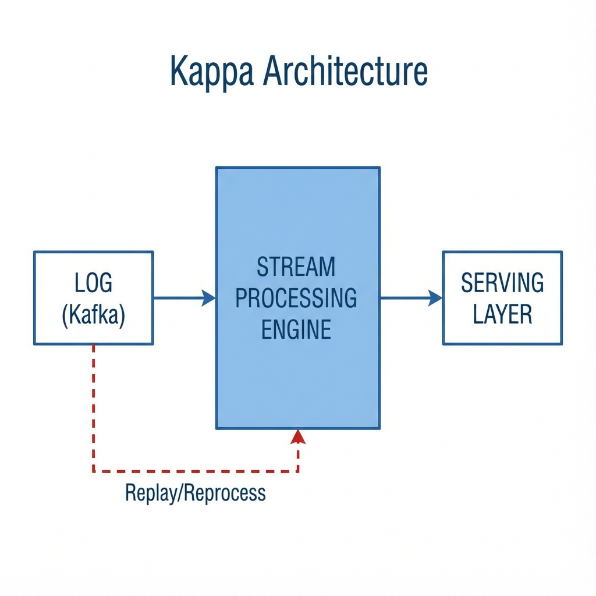
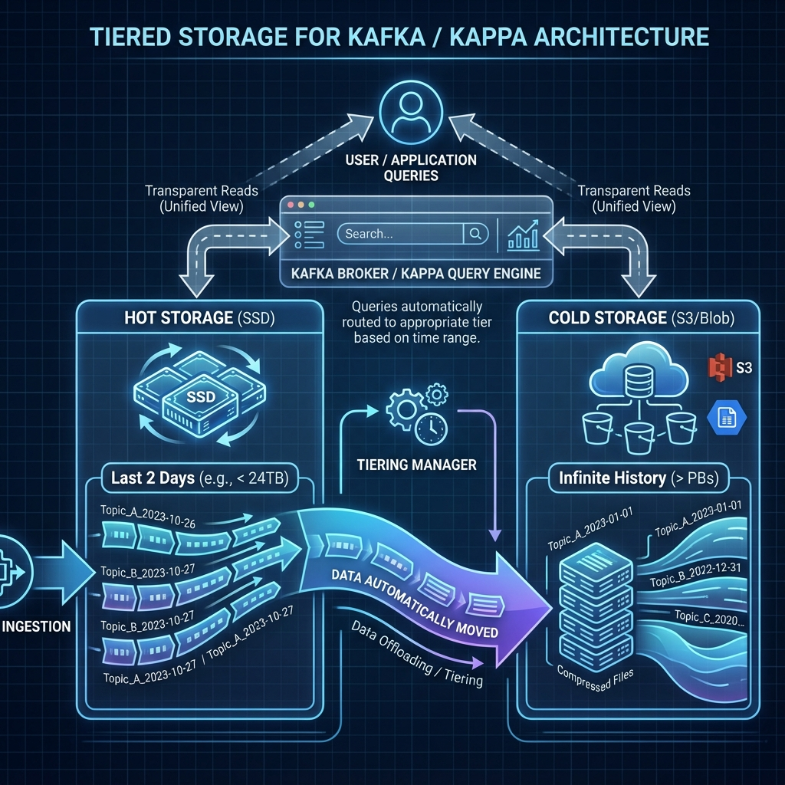
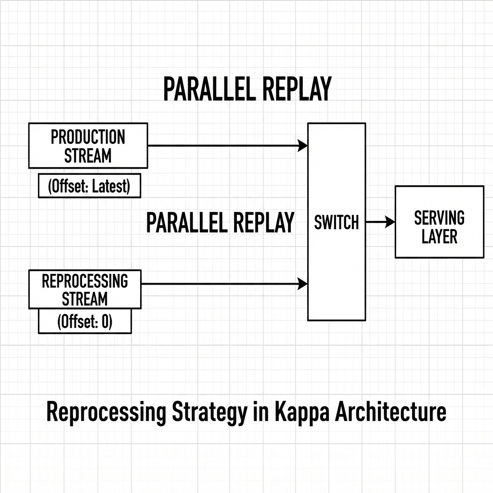
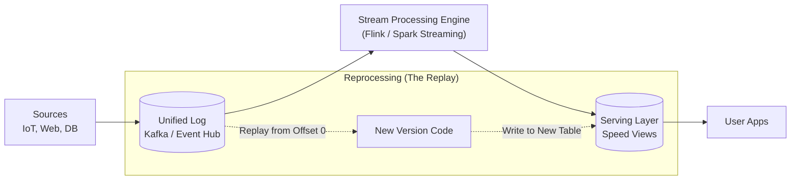

# Kappa Architecture - Comprehensive Interview Guide

> **The "Stream Everything" Evolution**
> Simplification of Lambda Architecture by removing the Batch Layer entirely.

---

## 📖 Table of Contents

1.  [Concept & Evolution](#concept--evolution)
2.  [Core Principles](#core-principles)
3.  [Architecture Deep Dive](#architecture-deep-dive)
4.  [Kappa vs Lambda](#kappa-vs-lambda)
5.  [The "Backfill" Challenge](#the-backfill-challenge)
6.  [Technology Choices](#technology-choices)
7.  [Interview Questions](#interview-questions)

---

## Concept & Evolution

### The Problem with Lambda
Lambda Architecture is robust but **complicated**. You maintain two codebases:
1.  **Batch Code** (e.g., Spark SQL running nightly)
2.  **Streaming Code** (e.g., Spark Streaming or Flink running continuously)
3.  **Serving Merge Logic** (Complex SQL to union them)

**Kappa Architecture** asks: *"If our stream processing engine is fast and accurate, why do we need a separate batch layer at all?"*

### The Kappa Solution
Treat **everything** as a stream.
*   Real-time data? It's a stream.
*   Historical data? It's just a stream that started a long time ago.
*   **Result**: One single code path for everything.

### 🍎 The Analogy: The DVR (Netflix) vs VHS
**Lambda** is like having a closet full of **VHS Tapes** (Batch) and a **Live TV Antenna** (Speed).
*   To see history, you search the tapes (Batch).
*   To see now, you watch the antenna (Speed).
*   *Problem*: You need two different devices to watch the same show.

**Kappa** is like a **Modern DVR (or Netflix)**.
*   "Live" is just the latest second of the stream.
*   "History" is just rewinding the stream.
*   **Key**: You use the **same player** (Codebase) for both. To fix a mistake, you just "Rewind and Replay".

---

## Core Principles

### 1. Everything is a Stream (Unbounded Log)

Instead of thinking of "Daily Batches" files, Kappa thinks of an **Event Log** (Kafka) that retains data for a long time (or forever).

### 2. Single Codebase
You write your business logic **ONCE** using a stream processing framework (like Flink or Spark Structured Streaming). You run this code against real-time data or replay it against historical data.

## 🔬 Deep Dive: The Reprocessing Pattern

The hardest part of Kappa is **"How do I fix a bug in my code?"**

In Lambda, you just re-run the Batch Job.
In Kappa, you must **Replay the Stream**.

### 🛠️ The Parallel Replay Strategy
You cannot stop the Production Job to replay history (you'd lose real-time uptime). Instead:

1.  **Keep Production Running**: Old code (V1) continues to process `Latest` data to `Serving_Table_V1`.
2.  **Start V2 (Parallel)**: Launch New Code (V2) with a new Consumer Group.
    *   **Config**: `auto.offset.reset = earliest` (Start from Offset 0).
    *   **Output**: Write to a temporary table `Serving_Table_V2_Backfill`.
3.  **Catch Up**: V2 processes 5 years of data at max speed (limited only by CPU/IO).
4.  **Cutover**:
    *   Once V2 lag is 0 (caught up to Now), stream V2 writes to `Serving_Table_V2`.
    *   Update the **App Config** to read from `Serving_Table_V2`.
    *   Shut down V1.

**"Code is cheap. Storage is cheap. Uptime is priceless."**

---

## Architecture Deep Dive

### The Workflow
1.  **Ingest**: All data goes to Kafka (Log). Retention must be high (or tiered to S3).
2.  **Process**: A single stream job reads Kafka and updates the Serving Layer (e.g., updating a Redis counter or a Delta Table).
3.  **Serve**: The Serving Layer is simple. It just holds the calculated view. No complex "Merge" logic needed.

---

## Kappa vs Lambda

| Feature | Lambda | Kappa |
| :--- | :--- | :--- |
| **Complexity** | High (2 Codebases, Merge Logic) | Low (1 Codebase) |
| **Historical Data** | Batch layer (S3/Parquet) is source of truth | Kafka (Log) is source of truth* |
| **Reprocessing** | Run Batch Job (Easy, Standard) | Replay Stream (Harder at scale) |
| **Latency** | Mixed (Real-time + Batch) | Pure Real-time |
| **Cost** | Batch is cheap (transient clusters) | Streaming is 24/7 (always on) |

*\*Note: Modern Kappa often uses "Tiered Storage" where Kafka offloads old data to S3, so you don't actually keep petabytes on local disks.*

---

## The "Backfill" Challenge (The Kappa Weakness)

The #1 interview question against Kappa is: **"How do you reprocess 5 years of data?"**

### The Problem
Replaying 5 years of data through a Stream Processor (row-by-row) is **SLOW**. Batch jobs (vectorized, columnar) are much faster at crunching history.

### The Solution: "Hybrid" Replay
1.  **Code**: Write code using a unified API (e.g., Apache Beam or Spark Structured Streaming).
2.  **Execution**:
    *   For **History**: Run the code in "Batch Mode" against cold storage (S3).
    *   For **Now**: Run the *same* code in "Streaming Mode" against Kafka.
3.  **Result**: You get the simplicity of one codebase (Kappa) with the performance of Batch (Lambda). This is often called **"Lambda-less"** or **Delta Architecture**.

---

## Technology Choices

### 1. The Engine (Must handle Stream & Batch)
*   **Apache Flink**: The purest Kappa engine. True streaming, powerful state management.
*   **Spark Structured Streaming**: "Everything is a table". Great for the Hybrid approach.
*   **Kafka Streams**: Lightweight, code-only, runs inside your apps.

### 2. The Storage (Must support Replay)
*   **Apache Kafka**: With Tiered Storage enabled.
*   **Azure Event Hubs**: With "Capture" (Archive) enabled.
*   **Delta Lake**: Often used as the "Log" in modern architectures (Delta Architecture), replacing Kafka for the long-term history.

---

## Interview Questions

### Q: "When would you CHOOSE Lambda over Kappa?"
**A**: When the algorithms are fundamentally different.
*   Example: **Machine Learning Training**.
*   You cannot "stream" the training of a Deep Learning model efficiently. You need a massive Batch of static data to train (Lambda Batch Layer), while you perform Inference in real-time (Lambda Speed Layer). Kappa doesn't fit well here.

### Q: "How does Kappa handle late data?"
**A**: Since it's a stream engine, it handles late data natively using **Watermarks**.
*   The system keeps "State" (e.g., aggregation windows) open for a duration (e.g., 1 hour).
*   If data arrives 30 mins late, it updates the window logic correctly.
*   In Lambda, the Batch layer would just pick it up the next day. In Kappa, the Stream engine must be smart enough to handle it.

### Q: "Is Kappa cheaper?"
**A**: Usually **No**.
*   Streaming clusters run 24/7 (CPU/RAM reserved).
*   Batch clusters run transiently (Spin up, crunch, shut down).
*   Kappa optimizes for *Developer Time* (maintenance), not *Compute Cost*.
