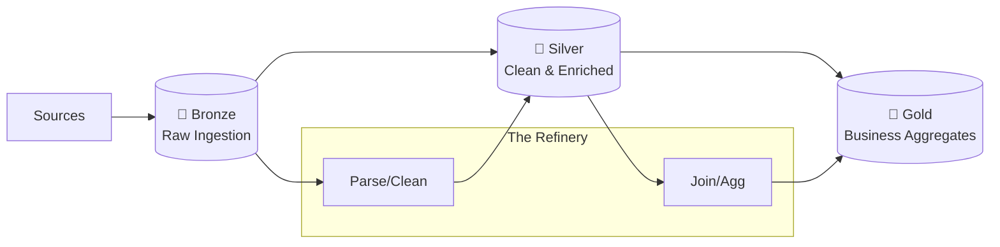

# Medallion Architecture - Comprehensive Interview Guide

> **The "Data Quality" Pipeline**
> A design pattern to organize data in a Lakehouse effectively, moving from Raw to Curated.

---

## 📖 Table of Contents

1.  [Concept & Goals](#concept--goals)
2.  [The Three Layers](#the-three-layers)
3.  [Why Medallion?](#why-medallion)
4.  [Implementation (Spark/Delta)](#implementation-sparkdelta)
5.  [Medallion vs Data Warehouse](#medallion-vs-data-warehouse)
6.  [Interview Questions](#interview-questions)

---

## Concept & Goals

**Medallion Architecture** (coined by Databricks) is a data design pattern used to logically organize data in a Lakehouse.
It is **NOT** a processing engine (like Lambda/Kappa). It is a **Data Structure Strategy**.

**The Goal**:
*   To solve the **"Data Swamp"** problem (dumping everything into S3 with no structure).
*   To provide different levels of data validation for different users (Data Scientists want Raw; Analysts want Aggregated).

---

## The Three Layers



### 🥉 Bronze Layer (Raw Ingestion)
*   **Definition**: The landing zone for all raw data.
*   **Format**: Usually Delta or Parquet (but structure matches the Source system).
*   **Rules**:
    *   **Keep Everything**: Do not filter or aggregate.
    *   **Immutable**: Append-only. A history of every event ever received.
    *   **Schema-on-Read**: Often stores payload as a generic `JSON` column to avoid breaking on schema drift.
*   **User**: Advanced Data Scientists (who need original raw signals), Debugging engineers.

### 🥈 Silver Layer (Cleaned & Enriched)
*   **Definition**: The "Enterprise Truth". Filtered, cleaned, and augmented data.
*   **Actions**:
    *   **Deduplication**: Remove duplicate records.
    *   **Validation**: Enforce schema (e.g., `age` must be `> 0`).
    *   **Enrichment**: Join with reference tables (e.g., Look up `Product Name` from `Product ID`).
*   **Format**: Optimized Delta Tables (Partitioned, Z-Ordered).
*   **User**: Data Analysts, Ad-hoc Querying, ML Training.

### 🥇 Gold Layer (Business Aggregates)
*   **Definition**: Consumption-ready data for specific business use cases.
*   **Actions**:
    *   **Aggregation**: Daily Sales Usage, Monthly Active Users.
    *   **Modeling**: Star Schema (Fact/Dim) optimized for reporting.
*   **Rules**: Very strict governance. High read performance.
*   **User**: Business Intelligence (Power BI, Tableau), C-Level Executives.

---

## Why Medallion?

### 1. Incremental ETL
Instead of "rebuilding the warehouse" nightly, every layer streams into the next.
*   New data hits Bronze.
*   Triggers update to Silver.
*   Triggers update to Gold.
*   **Result**: Fresh data in minutes, not hours.

### 2. Time Travel & Replay
Since **Bronze** is immutable, if you make a mistake in your logic for Silver:
1.  Fix the code.
2.  `DELETE FROM Silver`.
3.  Re-read `Bronze` and re-process.
4.  No data loss.

### 3. ACID Transactions
Using **Delta Lake**, operations between layers are transactional. Readers (BI Reports) never see "half-written" data in the Gold layer.

---

## Implementation (Spark/Delta)

### Example: Bronze to Silver Logic

```python
# 1. Read Raw Bronze
bronze_df = spark.readStream.table("bronze_events")

# 2. Apply "Silver" Logic (Clean & Enriched)
silver_df = bronze_df \
    .filter(col("status") == "ACTIVE") \
    .withColumn("processed_time", current_timestamp()) \
    .dropDuplicates(["event_id"])  # Critical Step

# 3. Write to Silver
silver_df.writeStream \
    .format("delta") \
    .outputMode("append") \
    .option("checkpointLocation", "/checkpoints/silver") \
    .table("silver_events")
```

---

## Medallion vs Data Warehouse

| Feature | Medallion (Lakehouse) | Traditional DW (Kimball) |
| :--- | :--- | :--- |
| **Storage** | Cheap Object Storage (S3/ADLS) | Expensive SSD/Compute-coupled |
| **Data Types** | Structured (Tables) + Unstructured (Images/Logs) | Structured Only |
| **History** | Bronze keeps infinite raw history | Staging area usually truncated |
| **AI/ML** | Native support (read from Silver) | Difficult (Extract to CSV first) |
| **Speed** | Decoupled (Bronze is fast) | Coupled (ETL must finish) |

---

## Interview Questions

### Q: "Where does Schema Validation happen?"
**A**: Between **Bronze and Silver**.
*   Bronze accepts *everything* (prevents data loss if schema changes).
*   The job writing to Silver enforces constraints (e.g., `CHECK (age > 0)`). Bad records are sent to a **Dead Letter Queue (DLQ)**, not the Silver table.

### Q: "Does Gold have to be in the Lakehouse?"
**A**: Not always.
*   Common Pattern: Bronze and Silver are in Databricks/S3.
*   **Gold** is sometimes pushed to a dedicated Serving Layer like **Snowflake** or **Azure SQL** for low-latency dashboards if the BI tool requires it. However, modern Databricks SQL is fast enough to serve Gold directly.

### Q: "How is this different from Lambda?"
**A**:
*   Lambda is about **Processing Paths** (Speed vs Batch).
*   Medallion is about **Data Quality Stages**.
*   You can use Lambda *within* Medallion (e.g., A real-time stream updates Gold "Speed" layer, while a batch job updates Gold "History" layer).
